深圳以前在刚开发的时候，并没有什么旅游资源，当地为了扩展旅游收入，新建了许多人文景观，例如世界之窗、锦绣中华、中国民俗文化村、欢乐谷、明思克航母世界、大小梅沙等。

世界之窗通常采用一两个标志性建筑来展现各国风采，只是有些建筑实在太矮，还没有到人的膝盖，总觉不过瘾，还是有机会去实地感受一下才生动。此外，每天有几个时间段会表演节目，还有游客互动环节，只要参与就有一个小奖品。

[接着上一篇文章](https://www.jfsay.com/archives/75.html "从这里看世界（1）")，继续看世界风景。

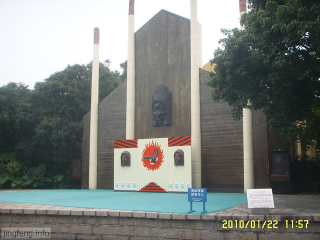

<!--more-->供游客体验的射箭场。这些[非洲](https://www.jfsay.com/archives/186.html "一百多年前的非洲什物")打扮的小人物还是蛮可爱的哦。以前看到过的[非洲展](https://www.jfsay.com/archives/185.html "奇趣非洲展")和这里的感觉不太一样。

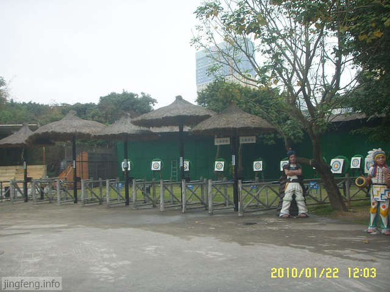

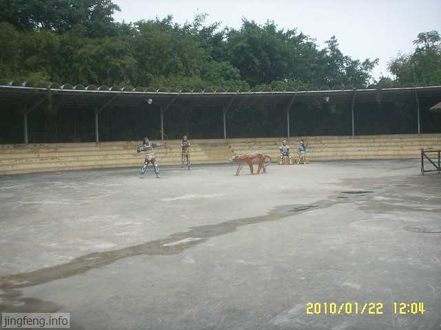

很多民族风格的图腾，有些彩色的还是挺漂亮的。

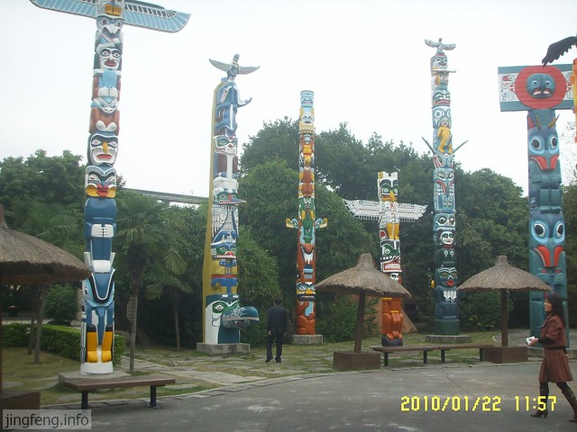

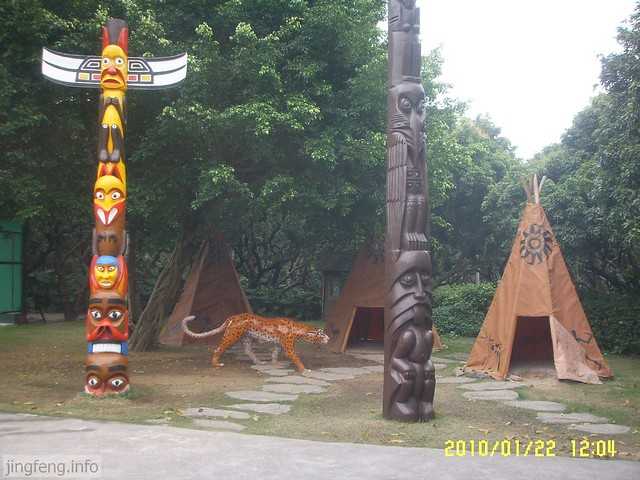

亚马逊丛林穿越。

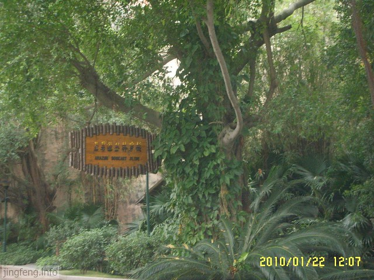

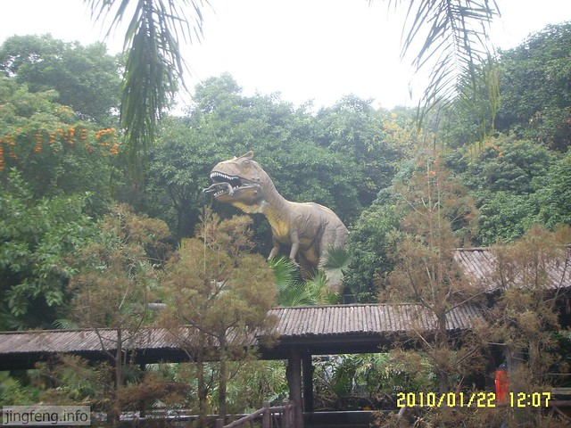

世界雕塑园。

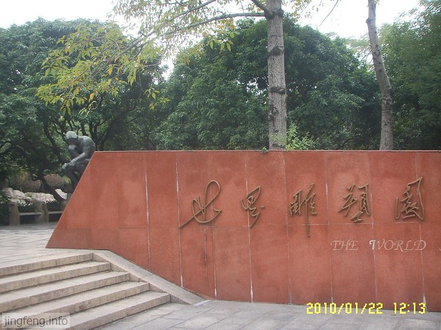

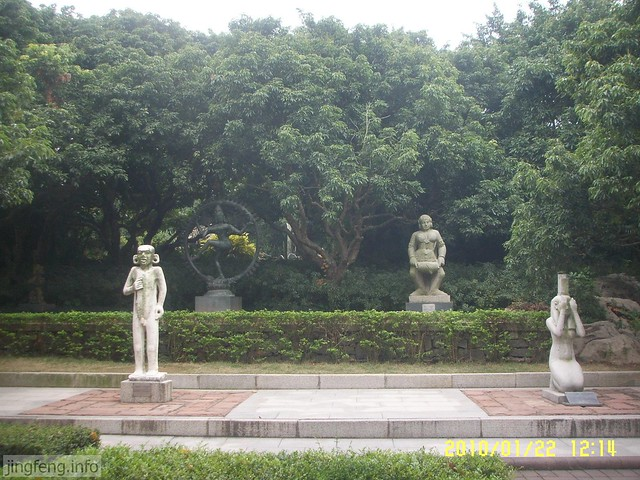

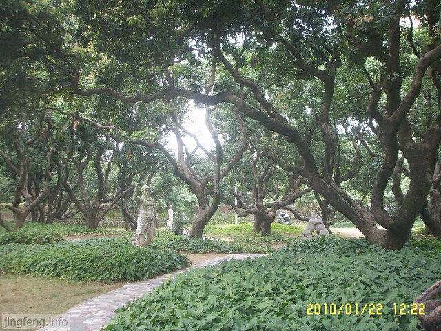

恐龙的地盘，不时播放吓人的叫声，声形并茂，哎呀，赶紧撤。

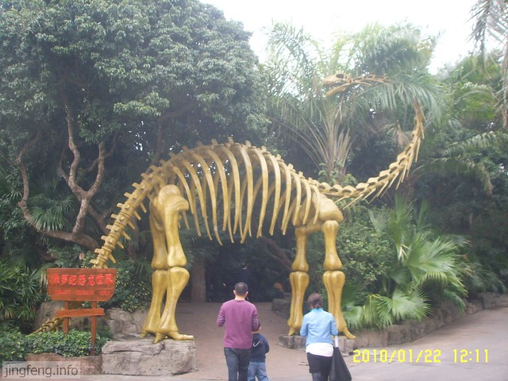

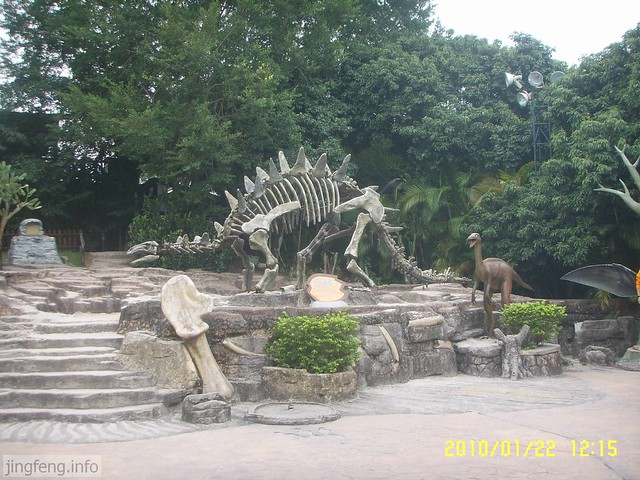

走了一上午，总算到了欧洲啦。

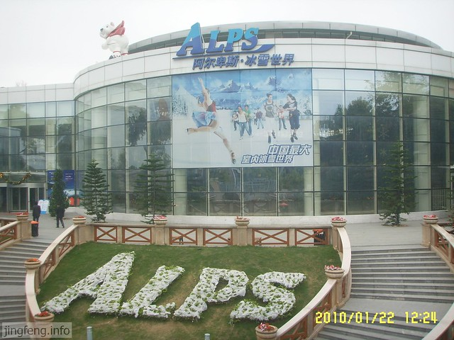

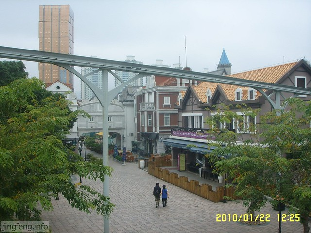

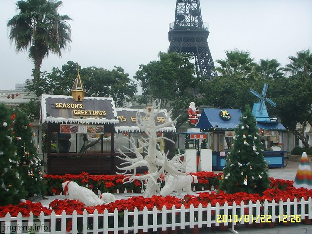

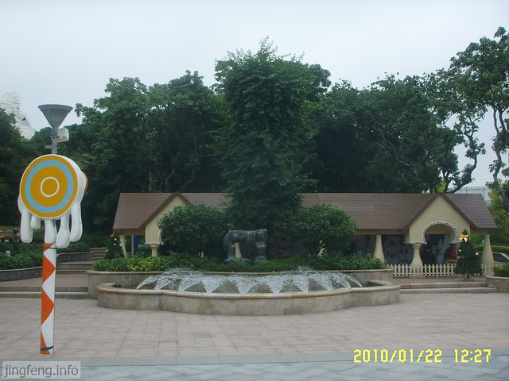

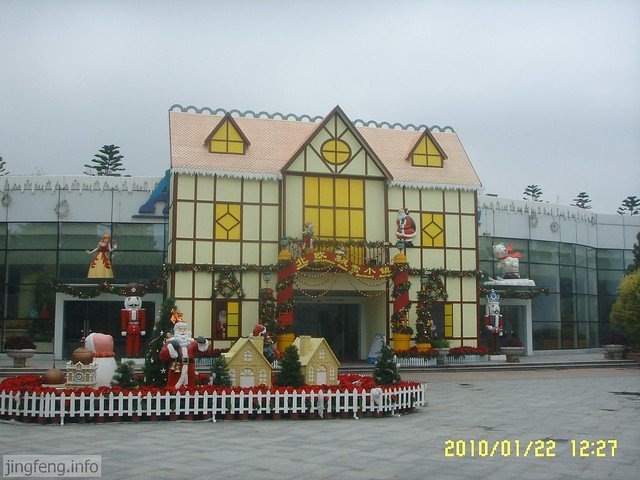

罗马假日广场。

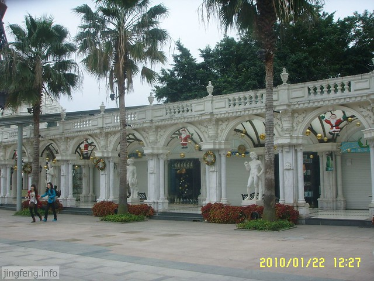

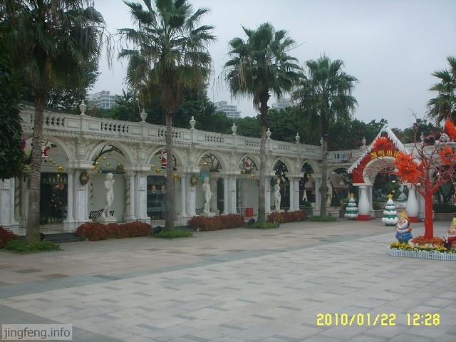

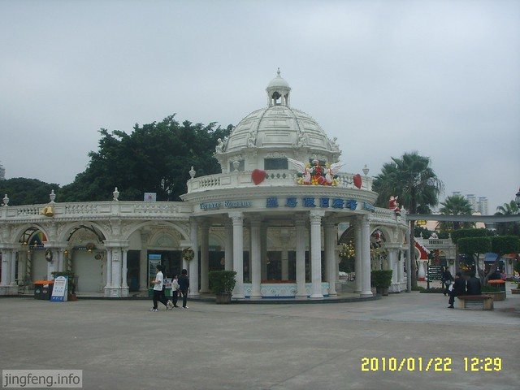

巴黎凯旋门。

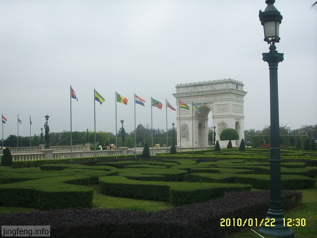

来张近景。

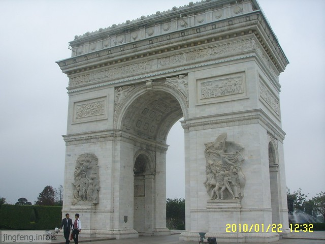

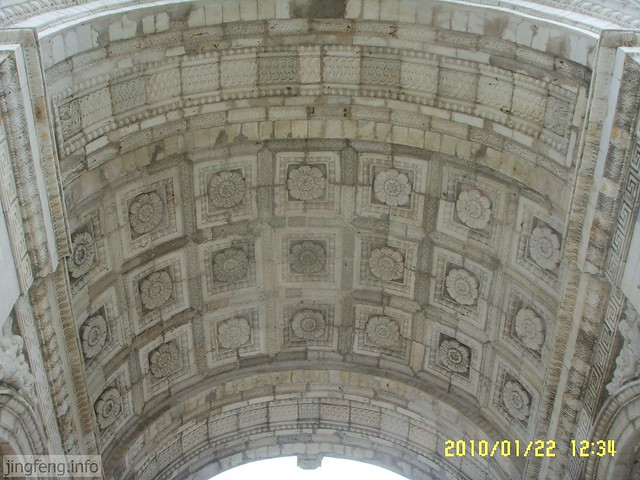

广场中间的埃菲尔铁塔，到晚上的时候，上面悬挂的“世界之窗”四个字不停地闪烁。

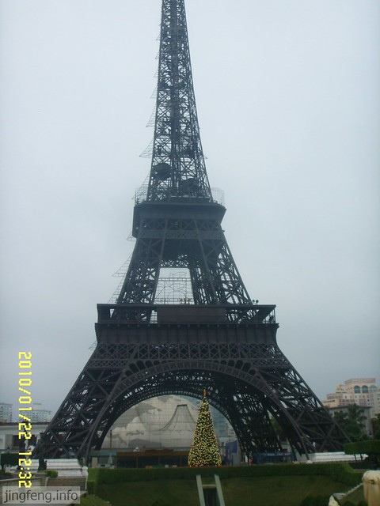

再发一张它们俩在一起的样子。

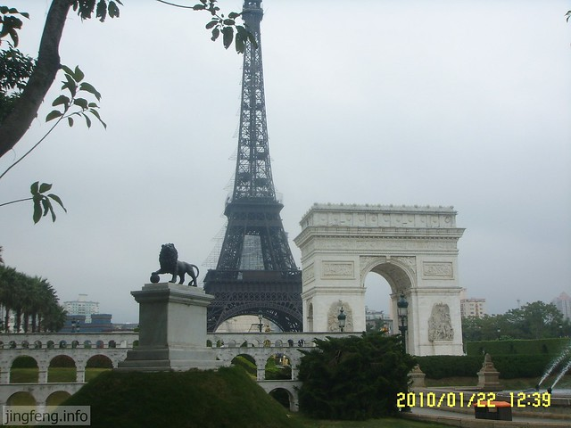

穿过凯旋门往里走。

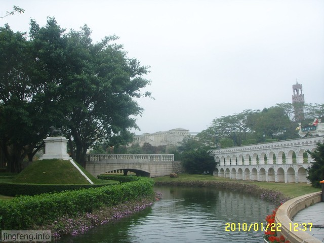

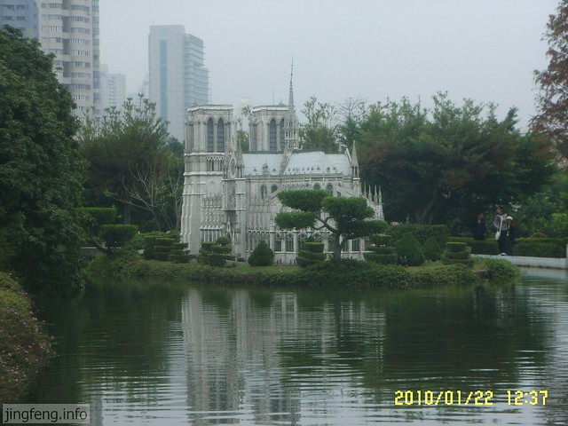

可爱的雪人和罗马斗兽场放在一起，是不是有些风格不搭哦？不过倒是有些喜感。

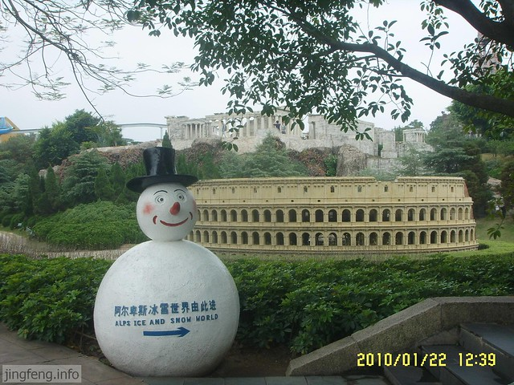

看看它的背面。

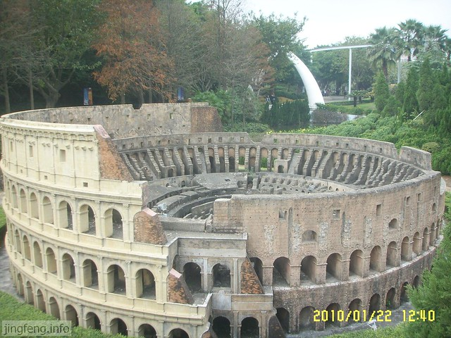

雅典庙宇，多亏那次奥运会，让我记住了这个建筑。

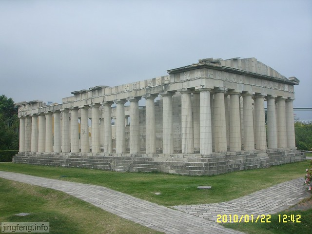

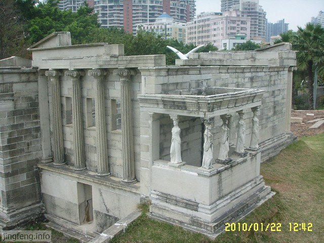
