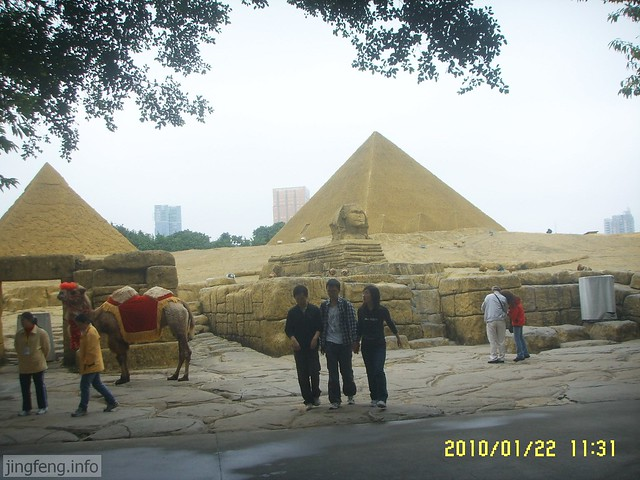
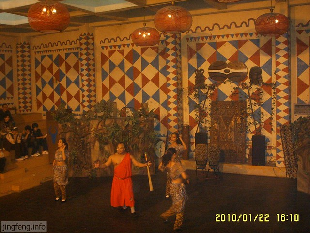

小舅盛情邀请我去深圳游玩，趁着放寒假，开始了广州之行。

人们常说，去深圳一定要去世界之窗才不枉此行，我同样十分期待里面的风景，准备好了干粮和饮料，背着背包，带着相机，开始一个人的世界之窗之旅，门口可爱的白雪公主和七个小矮人在喜迎游客的到来，我按捺不住自己的兴奋之情，在门口匆忙地拍完几张照片就开始入园参观啦。

<!--more-->

从这里高高的台阶上去就是入口啦。

一进门是颇具埃及风格的建筑。

球形舞台，每天晚上在这里有演出，在下午的时候到取票口取票即可入内观看，那段时间的主题是《天地浪漫》，演了好几个经典爱情故事的片段，有埃及艳后、灰姑娘、罗密欧与朱丽叶、钢铁是怎样炼成的、卡门等等。服装道具十分精美，以歌舞剧的形式呈现，十分精彩。

中国特色的牌坊，右边窗户就是看晚会的取票口。

供游客观赏景物用的代步车。

这个亭子是起点站。

这一块儿主要是亚洲东南亚风景区。

这里是日本的入口。

这个是仿造的富士山，里面其实是一个3D的电影院，下午有免费的电影观看。第一次看这种3D电影，还挺新鲜，影片是动画版的海底探险，座椅可以上下移动，前面的座椅有个小洞，会根据情节需要往后排观众的脸上吹气，吓了一跳。最惊险的是遇到海蛇、老鼠之类的东西，仿佛都要爬到自己的脸上来了，全身毛骨悚然，我的心脏呀，吓得我后来把3D摘掉了，唉，也算是开了眼界了吧。

世界之窗里有很多颇具特色的表演，隔一段时间就会有一次，生动展现当地风俗。

悉尼歌剧院。

毛里求斯人表演草裙舞，还有游客互动环节。

丹麦小美人鱼，个人认为她还不够美。

威尼斯水城。

漂亮的荷兰风车。

这是我最喜欢的一处城堡，充满梦幻与童真，它用很多颜色的碎瓷砖拼出漂亮的图案。

这是它前面的小房子。

再来一张近景。

风格大变，欢迎来到埃及。

金字塔与狮身人面像。

还有金字塔探秘，可惜本人胆小，没敢进去。

非洲欢迎您。

下午的时候刚上非洲舞蹈表演，没有想象中的狂野奔放。奇怪的是中间那个胖男人总是用手上的道具打三个豹纹女的屁屁，不知道想表达什么内涵。

接下来是两处相邻的瀑布。

格陵兰岛地心探险，由于同样原因，没有进去。

这里是玩漂流的地方，十元每人。架在下面的水炮可以投币，瞄准船里的人发射，纯属恶搞。

美国的总统山。

自由女神像。

