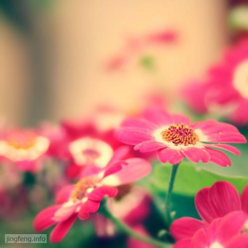

《闲情偶寄》这本书奠定了李渔在中国文学史地位。内容不仅涉及戏曲理论，饮食、营造、园艺、养生等方面也多有个人独到的见解与阐释。

先通过其中的两篇文章来看李渔对生活品质的追求吧：

李渔在《闲情偶寄·种植部》记载下这样一件事情：

> “记丙午之春，先以度岁无资，衣囊质尽，迨水仙开时，则为强弩之末，索一钱不得矣。欲购无资，家人曰：‘请已之。一年不看此花，亦非怪事。’予曰：‘汝欲夺吾命乎？宁短一岁之寿，勿减一岁之花。且予自他乡冒雪而归，就水仙也，不看水仙，是何异于不返金陵，仍在他乡卒岁乎？’家人不能止，听予质簪珥购之。”

生活窘迫的李渔，为了一盆水仙花，既然当掉妻妾的首饰来换。

> 《闲情偶寄·器玩部》记载：“予尝梦酣睡足，将觉未觉之时，忽嗅腊梅之香，咽喉齿颊尽带幽芬，似从脏腑中出，不觉身轻欲举，谓此身必不复在人间世矣。既醒，语妻孥曰：‘我辈何人，遽有此乐，得无折尽平生之福乎？’妻孥曰：‘久贱常贫，未必不由于此。’”

也就是在床帐之内做托板供花，以便夜晚睡眠时可享受花香。

李渔对于生活的品质的要求可见一般。用现在的话讲，李渔的生活真是小资。而这种处处考究的生活态度，恐怕也不是所有的小资可以达到的境界。

经济宽裕之时，李渔便过着享乐奢华的生活，在经济窘迫，捉襟见肘之时，仍不忘创造条件提升生活的品味。不仅自己身体力行，在金华兰溪时，还教导当地的躬耕于田野的百姓如何布置自家的住所。比如在春来花发之际，农忙之后，在田野采一些好看的野花野草带回家中，插入容器，摆放一两处，既增添了房间的美感与朝气，又可以赏心悦目，愉悦身心。

田野中野花野草随处都是，李渔的这个建议在操作方面来讲其实不难做到。但是，我在想，每天忙于农耕的老百姓是不是都能有一份像他那样的闲情雅致呢？

难的不是按照别人的建议去制造美，而在有一个审美的心境、懂得审美。

