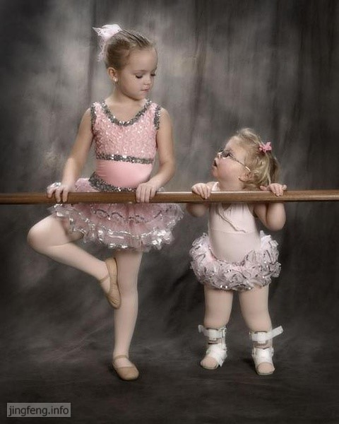

其实人无所谓得到与失去，在得到的同时也在失去，在失去的时候又再得到。只是有时候我们知道了，有时候连知道的机会都没有。

成长本身只是一种生命的历程而已，一路上我们年岁渐增，阅历逐加，收获着亲情，爱情与友情。体验着人间的温暖与隐晦。其中所改变的是我们的心境。

纯真并不消逝，只是迁徙。这就如同南飞的燕子，它们没有拒绝季节的寒冷，而是奋力飞向适于生存的乐土，生命在成长着、延续着----在这一片广袤与辽阔的土地上。

余华在《活着》的韩文版序言中说的那样：“活着，在我们中国的语言中充满了力量，它的力量不是来自于呼喊，也不是来自于进攻，而是忍受。去忍受生命所赋予我们的责任，去忍受生命所赋予我们的苦难与幸福，无聊与平庸。”

生活有着很多的痛苦、坎坷与无奈，但是会让我们更有意义、更为充实的经营自己的人生。只要我认真来做好自己的每一件事情，不仅为了自己，也许会有无数的眼睛在注意你。

