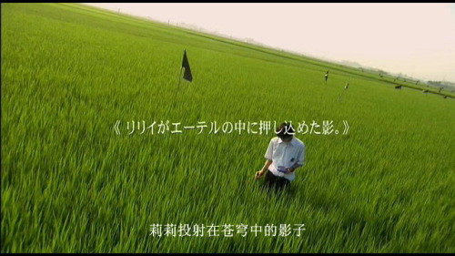

> 麦田里的青春
> 
> 是颓败的花
> 
> 如此残酷凄美的青春

空余时间看了《关于莉莉周的一切》，这部电影到现在也有些年月了，呵呵，是否有些落伍？好歹看了，像是了却了一番心事。和我想象的不同，但是那种颓废而又挣扎的痛苦、哀伤的旋律却刺激了我的神经。这不是我喜欢的电影风格。

这里面的青春大大迥异于自己的，这是一群生活在边缘的孩子。迷惘、痛苦的挣扎，带着未知的邪恶与人性的弱点，试图追寻一种精神力量来支撑自己的信仰，可惜，颓败终究会引导迷惘走向更深的颓败。

仔细想来，自己的中学时代也有着不可回避的，类似的情节。压抑、痛苦甚至绝望。但，总算一切都过去，现在，安好。

无法愈合的伤口，在时间的存在中，慢慢遗忘。

很喜欢影片开头的画面，一个穿着白色衬衣的少年，听着CD，站在一片无边的，麦田中。那是一片充满生机的绿色，还有蓝色的天空，很美。但似乎，有总让人感到伤感。是因为麦田里的青春太美了吗？因为青春里的不和谐，而美的让人有些心痛。

其实生活中处处都有很美的，能够拨动心弦的景物和人，只是看你有没有发现的眼睛。这个影片中有很多非专业的镜头，像是没有任何摄影基础的孩子在自拍身旁的故事。纵然是这样，也让人感触颇多。时光流逝，我们的欢聚，我们的青春，在慢慢走远。

这样最好，我讨厌成长的痛，我喜欢日渐成熟的生活。

算了，不想再写下去了。

这个电影，不是我想要感受的生活。

也不想再看了。
