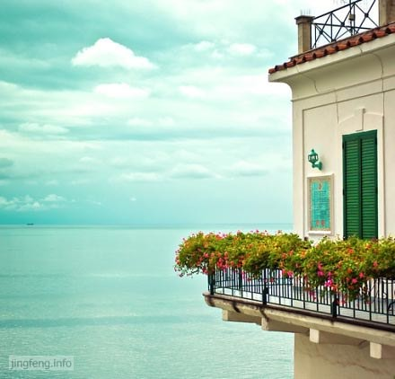

写下这篇出游记，以此来记录下自己去过的地方和心得。

在初三毕业的那个暑假，算是我第一次出远门，去了省会郑州。那时候的我对大城市充满了无限的期待，记得当时去了二七广场，动物园，又逛了超市。在表哥的带领下吃了一盘牛蛙。

后来郑州有陆陆续续去过几次，因为各种事情。这个城市对于我来说有着很深的记忆。

06年5月和几个同学去了开封，游玩了开封府，龙亭。本想着多玩几天的，因为学校有事，几个同学就匆忙回去了。很怀念开封的夜市，很热闹，逛起来应接不暇，很有趣。作为古都有很多的历史建筑，挺有特色，以后有机会还会再去的。

08年3月份因为参加河师大的招聘会去了一趟新乡。呆了两天，游玩是没有的，忙着投简历，试讲呀，打道回府。

08年4月从金华返校，顺便去了南京，找在那里读研的堂兄，一起去了人们常常提起的秦淮河和夫子庙，地方找到了，可是却找不到那种感觉了。

08年的暑假去了上海的表姐那里，我和表姐讲我来的路上激动的不得了，她当时还嘲笑我有什么好激动的。唉，不知道我从来没有去过国际性的大都市吗？坐了地铁，游览了南京路，外滩，徐家汇，七宝镇等等等等的景点之后，感到很充实。也激发了我要为了金钱而努力的斗志。

后来就来到金华，一呆就是三年。

在这几年里，去了很多的地方。先是09年3月室友和她男友邀请去了[无锡](https://www.jfsay.com/archives/269.html "烟雨濛濛在无锡")，游览了[锡惠公园和灵山大佛](https://www.jfsay.com/archives/269.html "烟雨濛濛在无锡")。之后紧接着去了永康和台州的同学家。感受了浙江的风俗习惯，看了斗牛和婺剧，在[台州吹了海风，一起去捉泥螺，饱了海鲜福](https://www.jfsay.com/archives/91.html "滩涂大冒险")。

10年春节前，小舅盛情邀请去深圳玩，然后再去香港和澳门开开眼界。在深圳去了[大梅沙海滩](http://www.jfsay.com/archives/270.html "到深圳看海")，[世界之窗](https://www.jfsay.com/archives/75.html "从这里看世界（1）")，看了[俄罗斯的航空母舰](http://www.jfsay.com/archives/270.html "到深圳看海")，还有去了人头攒动的华强北的批发市场。澳门和香港之行是报团去的，因为小舅临时有事，我便开始了[一个人的港澳之行](https://www.jfsay.com/archives/28.html "一个人的港澳游")，呵呵，倒是独有一番滋味与乐趣的。

今年春天和hillway一起去了金华的[黄大仙](https://www.jfsay.com/archives/53.html "赤松黄大仙之游")。游玩了杭州的[河坊街](https://www.jfsay.com/archives/275.html "河坊街的小店铺")和[西湖](https://www.jfsay.com/archives/276.html "艾衲居士与西湖")，还有义乌的[国际商贸城](https://www.jfsay.com/archives/57.html "见识义乌小商品城")以及破旧的[宾王市场](https://www.jfsay.com/archives/57.html "见识义乌小商品城")。

总体看下来发现，自己的生活越来越充实与精彩，日子也越来越好的。以前总是很羡慕别人比自己好的地方，现在想想其实也不必，有些东西只要自己去努力，总会拥有的，只是有时时间稍微晚了一些罢了，这样也很开心了。

向着目标奋斗吧！！！

