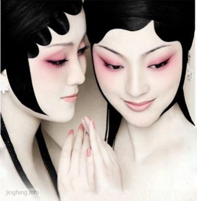

李渔最获赞誉的就是其戏曲成就。在李渔的戏曲生涯里，不得不提到他的李渔家庭戏班。而家庭戏班不得不提的是两个台柱：乔姬和王姬。她们不仅是戏班演员，也是班主李渔的妾。

明末清初，家庭戏班在江南达官显贵之间十分流行。这种戏班区别于当时的民间戏班，一般仅供自己和亲朋赏乐，在旨趣和艺术上也较高。李渔酷爱戏曲，组建自己家庭戏班的想法由来已久，万事俱备，只缺两位中意的主角。

根据李渔的《乔复生王再来二姬合传》记载，康熙五年丙午（1666），56岁的李渔游秦，于平阳获得乔姬。当时平阳太守陈质夫出金为其购买一女，即乔姬。康熙六年丁未（1667），李渔游甘肃兰州时，获赠王姬。

巧的是，这两位北方女子尽然对南方的戏曲十分的着迷，主动学唱。李渔回忆说二姬当时窃听伶工演奏《凰求凤》，乔姬过耳不忘，“自观场以后，歌兴勃然，每至无人之地，辄作天籁自鸣，见人即止，恐贻笑也。未几，则情不自禁，人前亦难扪舌矣。”乔姬请求学曲，李渔聘请旧肃王府苏州老优教二姬。数旬之后，乔姬即为客度曲，“客有求听者，以罘　隔之，无不食肉忘味。”从此，乔姬为旦，王姬为生，成立家班。

不幸的是，在1672年秋冬之际，乔姬夭亡。半年之内，李渔伤心惨目，不忍听曲。1673年冬，王姬夭亡。两人病逝时均年仅19岁。两位台柱已亡，李渔家班便解散了，前后不过五、六年的时间。
