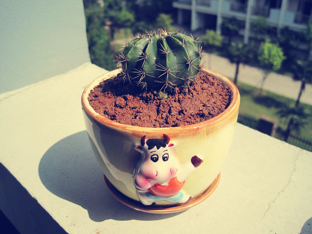

呵呵，防辐射的仙人球。在一个老大爷那里买来自己种的，不小心把自己的手也扎痛了。

记得有次和室友去楼下小花园去挖土种吊兰和芦荟，我有事情先上楼了。那个小胖妮上来和我讲，她挖土的时候有两个男生在后面小声议论：

“你看那女生挖土干什么呀？”

“估计她想吃咸鸭蛋了吧，挖土自己腌蛋呗！”

天呀，本来种花种草这么文雅的事情，竟然有人会和咸鸭蛋联系上，真是的，我看是他自己想了吧。

也可能是那个小胖妮长的实在是太圆圆滚滚的了。
