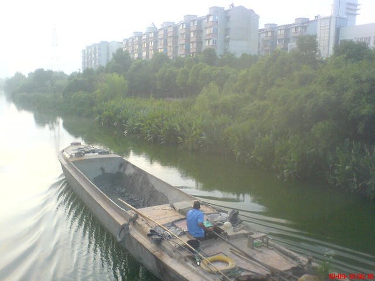
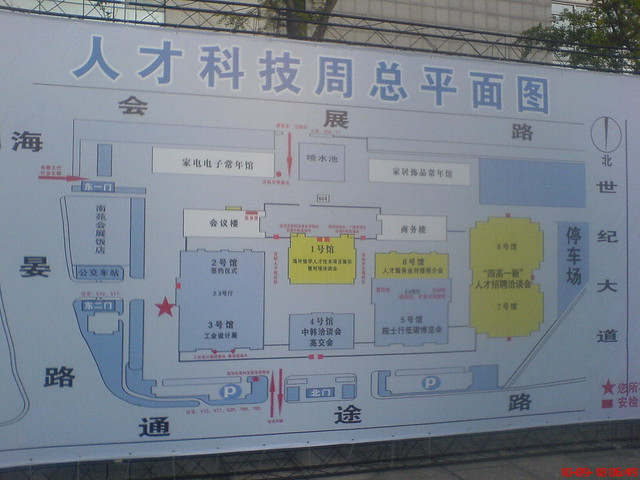
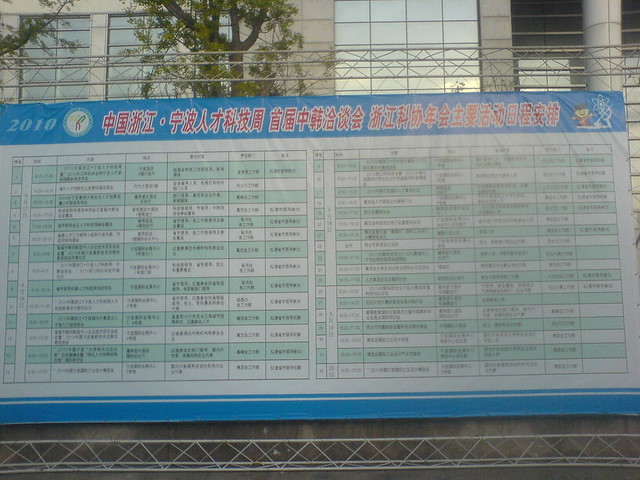
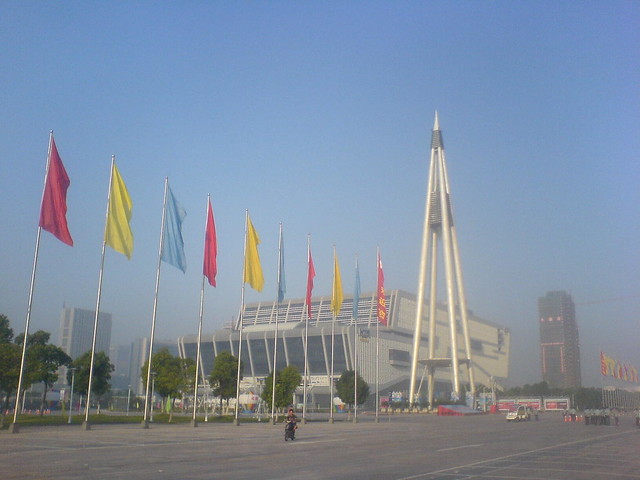
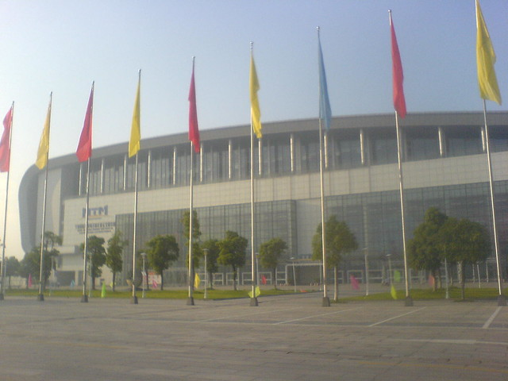

9.18我没有去游行，几个人到了宁波，参加高洽会�?
什么是宁波高洽会，全称是“高层次人才智力技术项目引进洽谈会”，通俗来讲就是一个高级点的招聘会，主要面向的对象是高级的人才，比如它所宣称的“高学历、高职称、高技能、高级经营管理”等等。从后来了解到的知道，这次去的人确实都是高学历，清一色的研究生以上学历�?
我们也是想去凑凑热闹，反正来回的车票有人报销，搞不好还有赚的�?
> 由市政府为前来参加应聘洽谈的符合条件的各类人才发放交通补贴，具体标准为省�?宁波市除�?200�?人，华东地区(浙江省除�?500�?人，其他地区(华东地区、浙江省除外)800�?人�?
坐的是夜里火车，早上5点钟到达宁波东站。从下火车到广场，一路凌乱，车站还在维修。出来发现外面的天差不多要亮了。好久没有见到天刚亮的天了，也好久没有起得这么早�?

在路上看到了“小桥流水”，我喜欢老房子，在繁华的大都市这样的建筑已经很少了�?

遇到一条小河，刚好有条船穿桥而过�?

河的两边种着郁郁葱葱的灌木，有早起的人在树丛中的平地上晨练�?

到了会展中心，才七点。先找块展板看看分布图�?

密密麻麻的日程安排�?

看塔不是�?

这里就是入口了�?

要八点才会开馆，找了份招聘广告，坐在地上等开门�?
后面就是无聊地寻找招聘单位部门，投递简历了。参加招聘的绝大部分需要的是机电、电子、车床、经理、嵌入式以及硬件什么的，看来宁波这里底层加工业发展的还行。不过这次来的都是些小公司以及小作坊企业，没看到几家大公司。可是有几家事业单位门口是人山人海，挤不进去，我们没有掺和�?
从八点到十一点半，热热闹闹的几个小时很快就结束了，折腾下来投了四五份简历。想着找个吃饭的地方，真难，人太多太多。没有办法我们几个买了碗泡面泡就泡就就算午饭了�?
通知上说会场到下午两点或四点结束。吃过饭返回，零零落落的没有几个人，看来他们吃过饭也不会回来了。于是我们也就打道回府�?