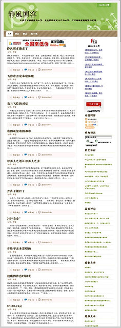
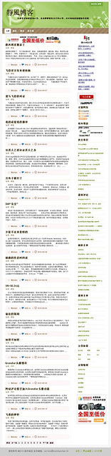
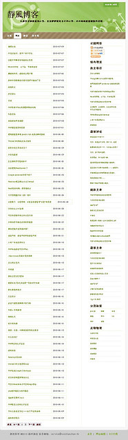
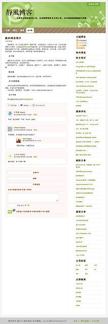
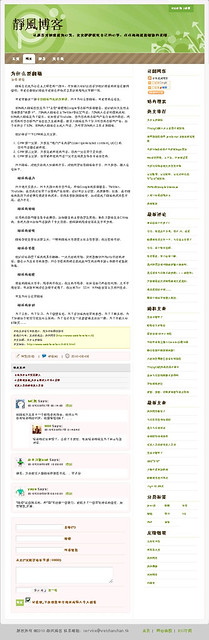
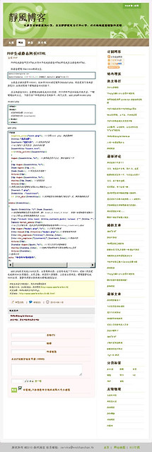

我是一个喜欢记录和怀念的，觉得发生的事情总有它的价值，不管是好的还是坏的。

下面记录下以前的博客系统，也当划清界限（已经投入到WordPress的怀抱了）。

当时一时兴起，写了个简简单单的博客。通过这个过程慢慢地熟悉了CSS、JS、SEO的知识，也提升了自己对PHP的认识。

这个Changelog前面一部分是后来回忆时写出的，可能漏掉了些东西。每一个小功能的实现都花费了不少的时间，就是因为这样才觉得值得回忆，也是因为这样才感觉到力不从心，于是之后就启用了Wordpress.

> 二〇一〇年八月二十日 实现Gravatar头像缓存到本地服务器
> 
> 二〇一〇年八月十九日 网站评论留言加入Gravatar头像功能，优化了代码高亮
> 
> 二〇一〇年八月十九日 优化了留言板评论CSS
> 
> 二〇一〇年八月十六日 使用数据库随机函数实现随机文章显示
> 
> 二〇一〇年八月十一日 使用Google friend connect实现网站更新日志
> 
> 二〇一〇年八月十日 实现回复留言之邮件通知的功能
> 
> 二〇一〇年八月九日 Feedburner不能更新之512K以及修复
> 
> 二〇一〇年八月一日 TinyMCE实现插入并上传图片的功能
> 
> 二〇一〇年七月二十五日 网站主机空间从AtbHost迁移到Sitefrost
> 
> 二〇一〇年七月十九日 自定义网站的404错误页面
> 
> 二〇一〇年七月十八日 登录密码使用加密函数Authcode
> 
> 二〇一〇年七月十八日 留言添加验证码
> 
> 二〇一〇年七月十七日 实现留言的中文字符个数验证、邮箱验证、输入字符个数验证
> 
> 二〇一〇年七月十三日 网站系统时区设置为北京时间
> 
> 二〇一〇年七月十二日 Admin登录界面使用Google验证码
> 
> 二〇一〇年七月一日 实现留言回复功能
> 
> 二〇一〇年六月三十日 TinyMCE实现代码高亮显示
> 
> 二〇一〇年六月二十六日 开始使用Feedburner替换Feedsky
> 
> 二〇一〇年六月二十五日 Google adsense申请下来了
> 
> 二〇一〇年六月二十五日 使用Feedsky烧制Feed
> 
> 二〇一〇年六月二十三日 网站优化H1标签以及Title标签
> 
> 二〇一〇年六月二十四日 实现回复留言时记住用户信息
> 
> 二〇一〇年六月二十一日 网站实现伪静态
> 
> 二〇一〇年六月十八日 网站添加.htaccess文件保护
> 
> 二〇一〇年六月十日 实现文章的全文输出
> 
> 二〇一〇年六月十四日 网站添加Robots文件
> 
> 二〇一〇年六月十三日 网站生成Google Sitemaps
> 
> 二〇一〇年六月十二日 实现主页内容的截取输出
> 
> 二〇一〇年六月十一日 网页Title左边显示网页的logo图标
> 
> 二〇一〇年六月九日 静风博客网站开张了

这两个是首页

列表页和关于页

下面的就是文章页了

 
