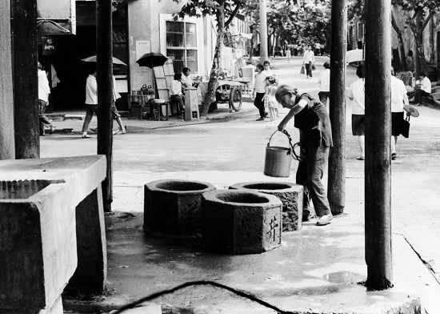
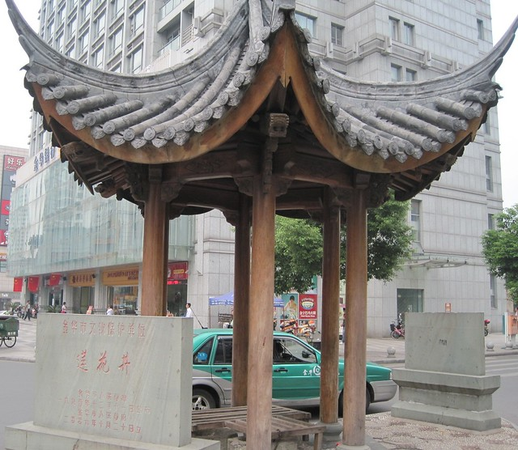

一座城市的风景随着时代的发展在不断变迁，而影像资料可以让我们重新浏览那些旧街景，品味流走的岁月，别有一番味道。

和hillway在金华有两年多的时光了，想着在空余的时间里拍一些金华的风景，记录下我们的生活。

就像现在网络上有很多80后用动画、照片等影像资料来重现我们小时候的生活，那不光是我们那个年代的游戏、零食、课本与流行音乐本身，这些东西里有着我们很多成长的经历与心情，会让我们想起以往的朋友与往事，所以看了以后会鼻子酸酸的。

因此，我们俩开始写 “金华印象”这个专题。

用金华莲花井的两张不同时期的照片进行对比：

莲花井初建于宋代，为三眼井，井壁用红砂岩条石砌筑，有八角青石井圈三只，井圈上阴刻“莲花古井”四字；到了清代，县衙、县学、玉泉庵均在古井附近，文脉浓厚。据光绪《金华县志》载：“莲花井，《戚志》在弦歌坊内，泉为诸井第一。”大意为在明清时期，莲花井一直为金华诸井之首。

现在的莲花井位于金华市中心的繁华地带，四处高楼林立，车水马龙。三眼井已经被木框盖上，早已不再使用，现在主要是作为文物而存在了。市民从这里经过此处，并没有多少人去留心。不知会有多少人会记下它的历史，又有多少人会记住它曾经为周边居民提供日常饮水的便利。
