近几年里游览了很多的小园林。在金华，黄宾虹公园是我喜欢去的地方，每次进园，总有欢喜。黄宾虹公园在金华江中的一个江心岛上，占地18000平方米，从1996年10月开始动工兴建，于1999年3月落成。三面环水，风景怡人，园内楼台亭阁，山水奇石，分布于花木绿草之中。

黄宾虹公园的面积不大，但景色优美，有着浓郁文化韵味，让我想起了去年春天和同学一起去的无锡的寄畅园，这里就像很多的江南园林一样，曲径通幽，玲珑雅致，具有古朴幽静之气韵。

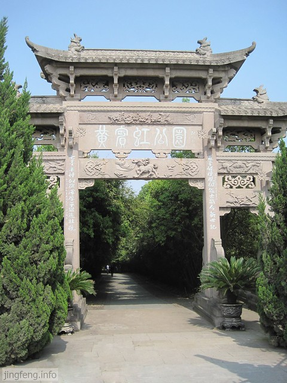

在我国近现代绘画史上，有“南黄北齐”之说，“北齐”指的是居住在北京的花鸟画巨匠齐白石，而“南黄”说的就是浙江的山水画大师黄宾虹，二人被美术界并列在一起，足见黄宾虹的艺术功力和成就非同一般。黄宾虹1865年生于浙江金华，卒于1955年。名质，字朴存，擅长山水、花卉并注重写生，但成名相对较晚。50岁以后，他的画风逐渐趋于写实，80岁以后，才真正形成了人们所熟悉的“黑、密、厚、重”的画风。黄宾虹晚年的山水画，所画山川层层深厚，气势磅礴，惊世骇俗，这一显著特点，也使中国的山水画上升到一种至高无上的境界。由于黄宾虹在美术史上的突出贡献，在他90岁寿辰的时候，被国家授予“中国人民优秀的画家”称号。公园外面关于黄宾虹的介绍。

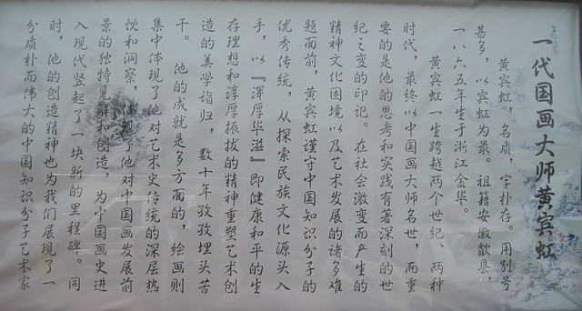

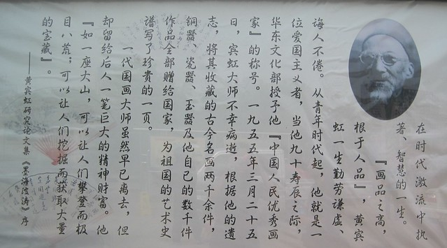

进入黄宾虹公园是一条竹林鹅卵石小路，在秋天里也满目翠绿，一进门就感受到幽静的氛围。

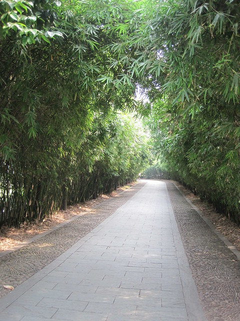

黄宾虹公园记，不过字迹不是很清晰。

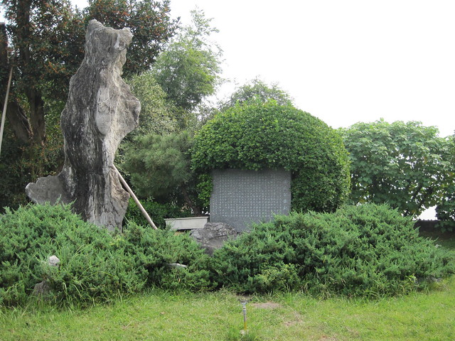

竹林小路通往清风楼。

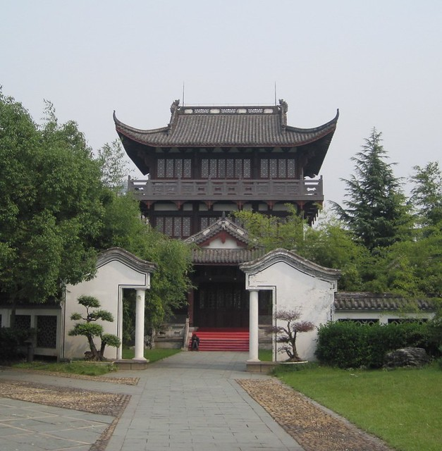

面朝婺江，江中有六尾金色鲤鱼的塑像。

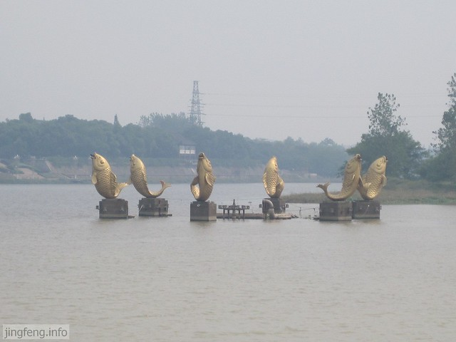

清风楼的另一面。

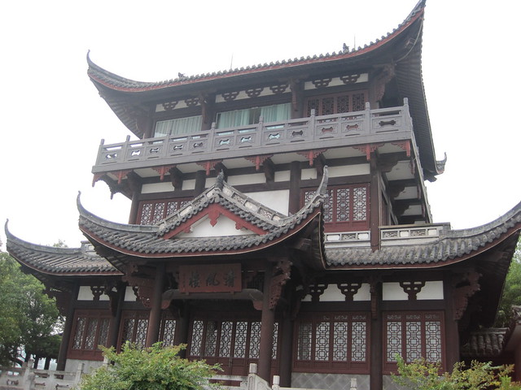

这里的建筑融合了徽、浙派的传统民居式建筑艺术特色，建筑面积1200平方米，坐北朝南，粉墙黛瓦。

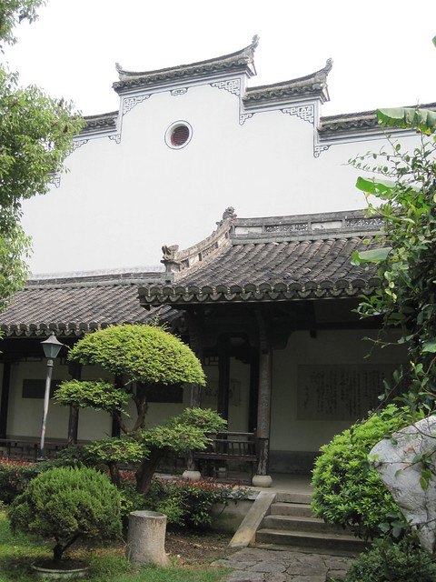

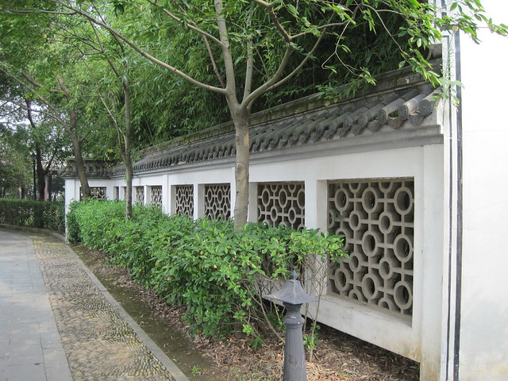

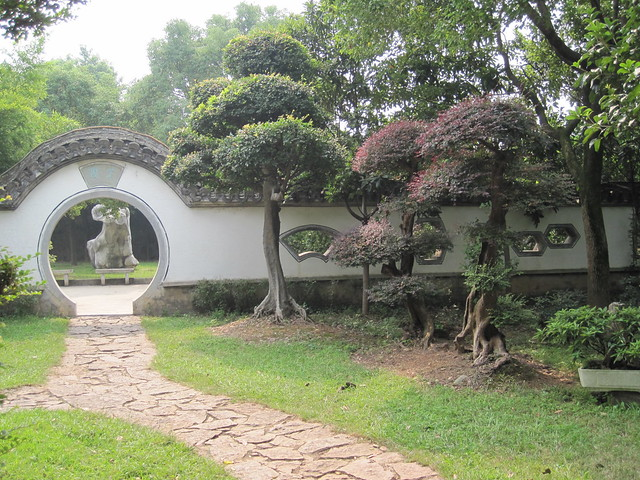

园里幽静的竹林，一扇院门。

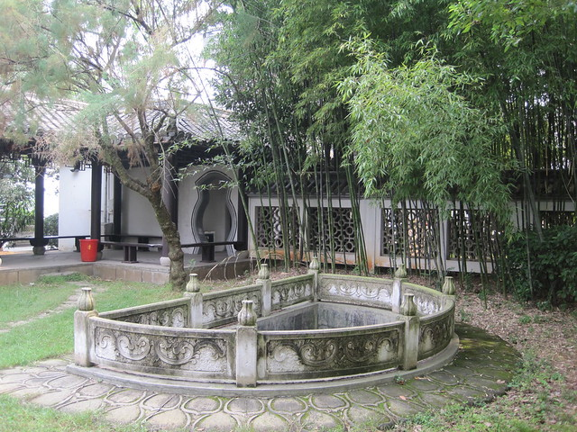

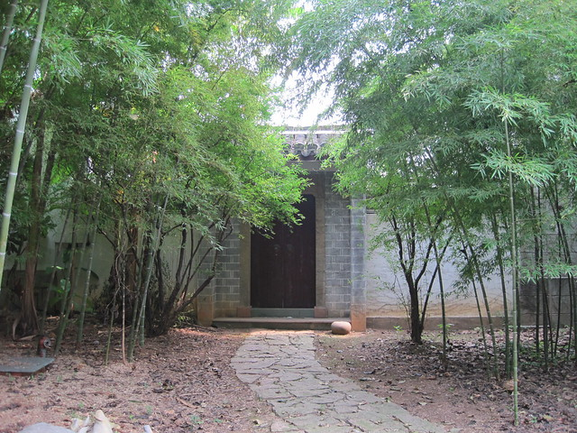

精美的小亭子前一处荷花池，很多江南的小园林也类似的布局，但我仍喜这一处。虽然已入秋，丹桂飘香的小园里，没有繁华的绚烂，这一池残荷倒是映衬出了它的幽静。

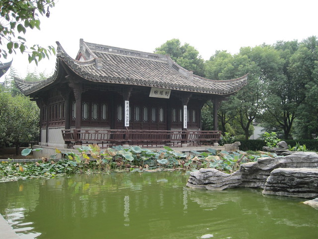

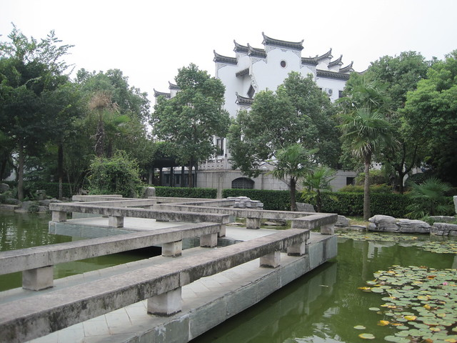

馆前两块绿地，照壁上刻有黄宾虹的墨迹“艺林展望”。照壁前是黄宾虹他老人家清瘦的雕像，看上去有些忧愁。

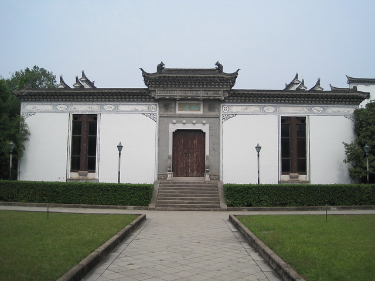

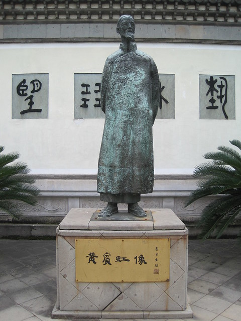

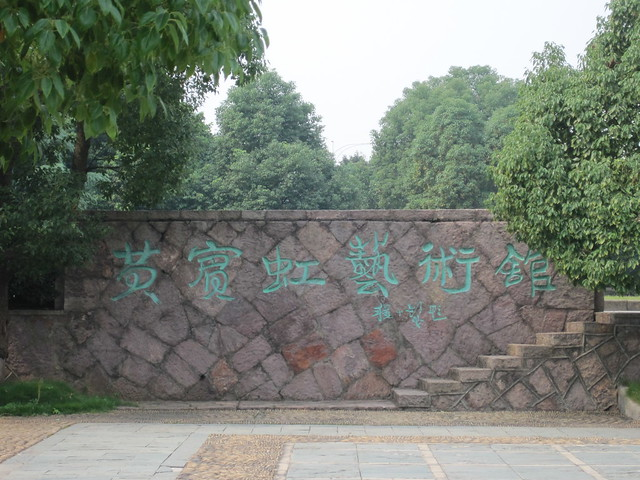

这一处估计是戏台吧，记得08年9月到这里，右边白墙前的大朵大朵的芙蓉花开的十分绚烂，可惜没有带相机拍下来。

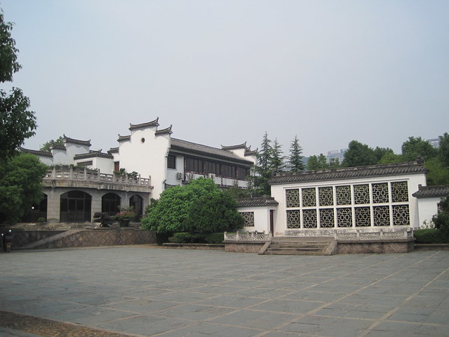

八咏路192号的黄宾虹故居。

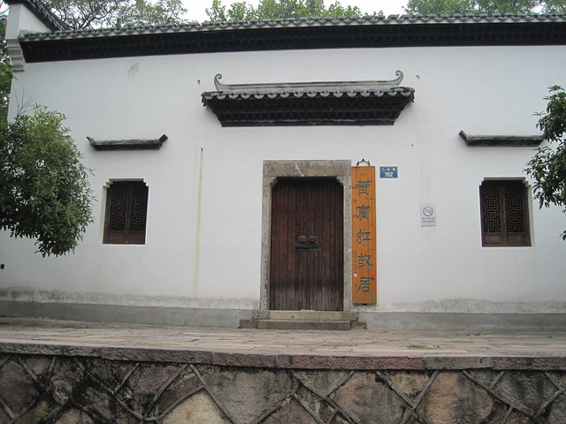
