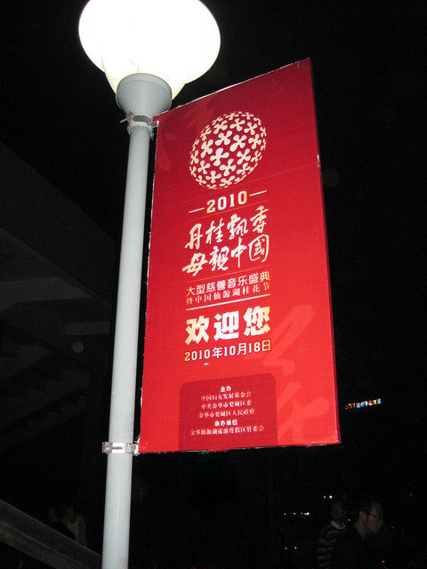
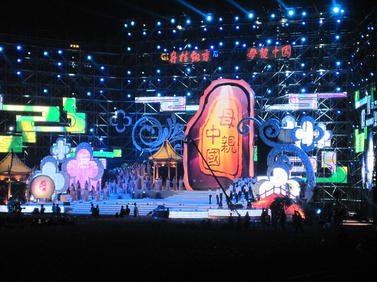
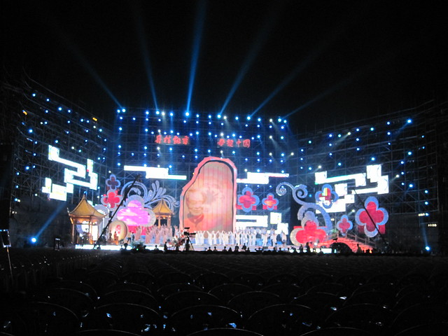
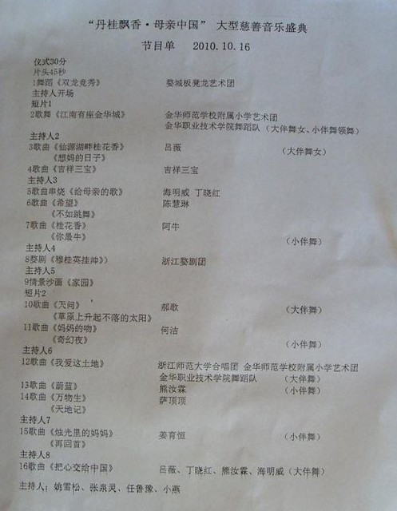

前几天听同学说到这样一条消息：

> 金华为了迎接桂花节，欢乐中国行在10月18号晚上七点在浙师大新体育场举行。萧亚轩、王力宏、陈奕迅、范冰冰、何润东等大牌明星到场助阵……

今天晚上是17号，吃过晚饭，我建议hillway一起去体育馆看看舞台搭建的怎么样。明天说不定就进不去了。在门口看到条幅上写的是“第二届中国仙源湖桂花节”，没有看到任何“欢乐中国行”的字眼。

挂在路灯杆上的标示为“丹桂飘香 母亲中国”大型慈善音乐庆典。

进了门看见他们正准备彩排。hillway很兴奋的给他们班上的几对小情侣打电话，要他们过来感受一下气氛。

在[《金华印象——婺江公园、古玩街》](https://www.jfsay.com/archives/163.html "金华印象——婺江公园、古玩街")中提到了来自金华的可圈可点的历史文化名人。彩排的第一个节目是歌舞类《假如我是一只鸟》，关于艾青的。各个地方的历史文化名人装点着各个城市的历史文化底蕴，仿佛也只有把他们提及出来方能显示与证明一个地方的文明，相互促进，互有收益。我在想那些名人在没有成为名人之前的生活是一副怎样的图景，公众会有多大的认知呢？人活世上，最好还是要尽量发挥自己的价值的，而且最好能在生前被人认知，取得一定的肯定才好。像曹雪芹那样优秀的作家，又怎一个凄凉二字了得？

这个《假如我是一只鸟》的节目来回彩排了几次，后来等到第二个节目《把心献给祖国》，又是反复排，中间还有各部门协调问题出现的中断，实在是没有 兴趣了，就去图书馆继续看书。之前以为是一场连贯的彩排了，想象和现实有差距了。

刚才从图书馆回来听同学讲，她们八点多听到《不如跳舞》，猜想是不是陈慧琳回来，后来在网上看到有人说：

> 在师大举行的并非“欢乐中国行”，只是慈善晚会。也没有什么大牌明星。相关演员介绍，晚会由任鲁豫等几人主持，无董卿。有陈慧琳、吉祥三宝、姜玉恒等但没有王力宏等一线明星参与。

还有一张节目单，根据晚上听到的彩排，看上去也有些可信。

