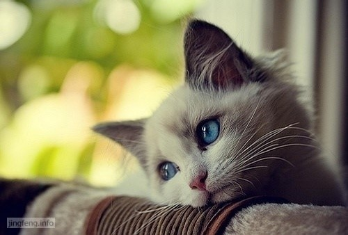

我有一个朋友，六年前认识的，属于率真无邪的那种，心地很善良。每天最喜好的三件事就是上网、吃饭和睡觉，于是乎，时间久了，就得一雅号：“猪孩”。

她在卧谈会时会讲起她小时候的趣事，有一件是关于喂猪的。她那时大概五、六岁的样子，自告奋勇端起喂猪的饲料盆，往猪圈走。

由于猪圈的墙和她的个子差不多，于是就站在石头上，端着盆就使劲往墙里面的饲料槽里倒，结果力度没有把握好，连人带盆都一头翻倒在饲料槽里，还被那些饥肠辘辘的猪们用大鼻子大嘴巴拱了两下。从此就有心理阴影。

有一次我把小时候的照片给hillway看，那皮肤比小麦色还要小麦色，hillway笑我像是从刚果来的。我说是因为本身皮肤就不白，估计加上小时候每天中午不睡觉在外面晒的。记得那时候住的是单位里统一的家属楼，用水都要到下面的院子里。那一排水龙头后面的空地被一家从农村来的工人改造成了猪圈，养了三、四头猪。

小时候我很喜欢玩水，大中午一个人在水池里自娱自乐，发现猪圈里的猪睡得呼呼响，便用水去喷它们，它们很迟钝的起身，在猪圈里哼哼叫着转了两圈又开始睡觉，我看到它们睡着了以后就再用水喷它们，感觉很好玩，这个游戏成为我那段时期的一大乐趣。

估计那群猪有些恨我，而且我还浪费了国家的水资源，所以我到现在还是小麦色。

