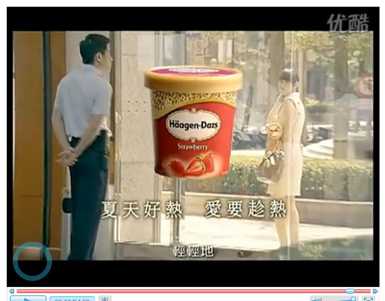

浏览人人网时，看到有个同学推荐了一个适合单身青年看的广告。是关于哈根达斯冰激凌的，叫《596號》，感觉很好奇，就点开来看。

时长4分钟的故事发生在酷暑时节，一个类似于银行营业厅的地方。来办理业务的人取完号后，便在旁边的座位等待。故事中的男主角便是营业厅的一名保安，在门口向顾客问好、鞠躬、维持秩序。工作是枯燥与单调的，只有号码在变。这样的保安，估计我们在生活中见了很多，可能不是太注意。不同于现实生活中那些偏向大叔级别的，这一位看上去二十出头，发型也挺酷。

有一位女孩子走了进来，取号后便一直坐在等候区，没有办理任何业务，到后来睡着了。工作人员从里面走出来询问，女主角支支吾吾，一时不知如何应对，这位保安看到后走过来解围说：她是我朋友，等我下班的。其实他知道她是来吹冷气的。

视频地址：[http://v.youku.com/v\_show/id\_XMTk1NjI1NjEy.html](http://v.youku.com/v_show/id_XMTk1NjI1NjEy.html)

我看到视频下面有一些网友的评论。

> 这条广告和哈根达斯的产品 挂不上什么钩 。就最后出现一个哈根达斯的冰激凌的模样， 就能让人把产品和这条广告联系到一起？ 不觉得镶嵌的很生硬么？ 不怪大家都在说吹空调赶人的事情 ，因为这条广告指向本来就不明确 ，信息的接受者很难达到共鸣吧。

有位网友还挺气愤，阐释了广告内涵之后，还对上面这位网友的品味加以界定：

> 整个广告的基调是温馨的、感人的。在炎炎夏日， 让人感觉一丝清凉。产商要表现的就是产品给人的这种感觉，你真的只适合看恒源祥广告了， SB~~~

对比之下，我发现上面有关故事情节的描述，也没有体现出一种温馨与浪漫的情调。我只是感到了刻意的做作，难道是因为自己年龄大了，感觉麻木了？一个男保安从外表与气质方面出发，喜欢上了一位走进营业厅吹冷气的女孩子；女孩子也因为男保安的解围之情，芳心所向。

爱情竟然就这样来临了！

至于让故事与产品挂钩还是可以做到的。这年头追女生哪有不买点小礼物的呢？既然是真心总要用一定的形式表达出来，让人家感觉的到那才行。行动与言语是一个方面，请吃东西之类的也必不可少。爱情本身就来的很世俗，不接受这个事实也不行。

这个广告语是告诉那写单身青年，看好了就要展开攻势，谈恋爱就要乘热打铁。广告暗示出既然芳心已动，那就赶紧给人家买哈根达斯吧。给你的那个她送去酷暑时节的一丝清凉与享受吧。

我最大的疑惑不在这里，而是在想：哈根达斯的定位是什么？

以前去市区看见西餐厅挂着大大的广告条幅：上面写着“爱她，就请她吃哈根达斯”。我就念给hillway听，他看了我一眼，说:“人家说什么就是什么呀，他要写的是：爱她就给她买宝马。那大家也要去买吗？”

在我们普通人的印象里，哈根达斯的定价与宝马当然相差悬殊，但是也不算便宜。偶尔奢侈一下，会经常去吃吧？

这个广告将消费人群定在了一个营业厅的保安身上，让我有些感到困惑了。现在都市生活压力这么大，就是所谓的小资们也会为买房还贷而发愁。以一个保安每月的工资，他会每年光顾哈根达斯几次呢？难道哈根达斯要走平民路线了吗？要努力开拓新的职业群体的潜力了？

那还是要看经济层面的。
