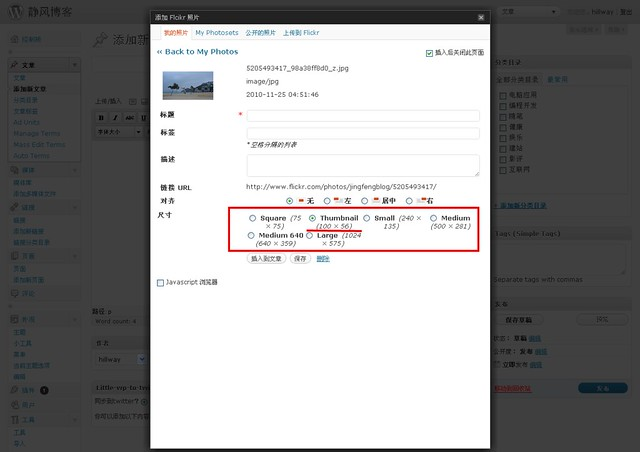
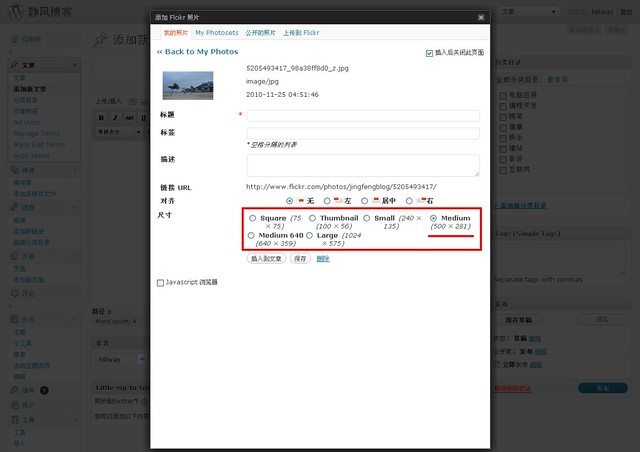

WordPress Flickr Manager是一款优秀的Filckr管理插件，它能够使得不离开Wordpress文本编辑器界面，就可以上传并插入Flickr的图片到文章中。

然而此插件的默认插入图片的大小是Thumbnail，而[静风博客](https://www.jfsay.com)通常需要图片的大小是Medium，所以每次插入图片都需要多点击一下按钮。为什么不能修改一下默认的插入图片的按钮呢。

来一张图，这是默认的插入图片的界面，注意到图片的默认尺寸是Thumbnail：



修改成为默认的尺寸为Medium的方法是，找到FlickrManager.php，修改1634行的thumbnail为medium：

修改前：

```
<input id="image-size-<?php echo strtolower($size['label']); ?>" type="radio" value="<?php echo strtolower($size['label']); ?>" name="flickr-size" <?php if(strtolower($size['label']) == 'thumbnail') echo 'checked="checked"'; ?> />
```

修改后：

```
<input id="image-size-<?php echo strtolower($size['label']); ?>" type="radio" value="<?php echo strtolower($size['label']); ?>" name="flickr-size" <?php if(strtolower($size['label']) == 'medium') echo 'checked="checked"'; ?> />
```

下面就是修改后的界面，可以看到插入图片的默认大小就是Medium了。当然你可以修改成自己想要的默认按钮。



另外，WordPress Flickr Manager 2.3可能对Medium 640支持的不好，根本就不能插入这种尺寸大小的图片。

查看一下插入Medium 640尺寸的图片后的代码显示为：

```

```

看来是得不到图片的链接。我查了一下代码发现没有插入Medium 640尺寸的设置（你如果发现了可以告诉我），转而求其次，这里给出一个简单的替换解法来插入Medium 640尺寸的图片。

找到FlickrCore.php文件的194行：

```
$sizes = array('square' => '_s', 'thumbnail' => '_t', 'small' => '_m', 'medium' => '', 'large' => '_b', 'original' => '_o');
```

因为Medium 640的值为’\_z’，假设你极少使用'square' => '\_s'，我们就把它给替换成'square' => '\_z'。当然你可以替换成其他的极少使用的尺寸。修改后的代码为：

```
$sizes = array('square' => '_z', 'thumbnail' => '_t', 'small' => '_m', 'medium' => '', 'large' => '_b', 'original' => '_o');
```

这样，以后在使用的时候记住Square按钮就是Medium 640大小的就行了。
