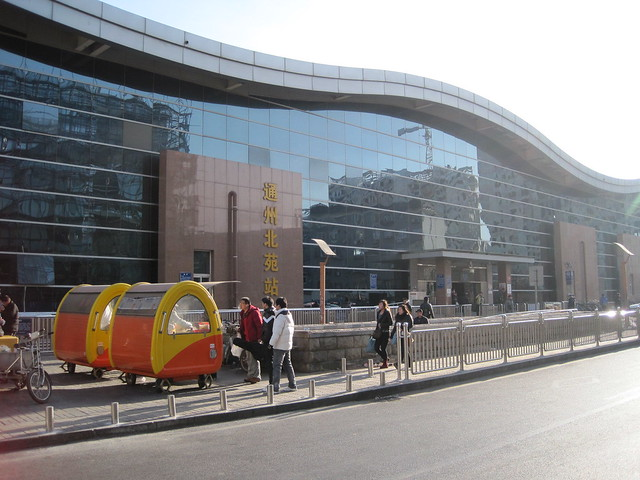

最近几年，我是越来越相信 “机缘”这个词语了。有些事情你也许不去留意，也想不明白。上天就会在冥冥之中安排你到某个地方，见到某个人，发生某段故事。

因为与北京这座城市的“机缘”，我坐上了19号的火车，带着我驶向了这座陌生的城市。怀着众多北漂们相似的希望与憧憬，焦虑与不安，跃跃欲试。

经过二十二个小时，火车驶入北京站。很幸运，有两个熟人过来接我。没有来得及欣赏北京火车站，便一起急忙去取随车托运的行李。问来问去，走了十几分钟，终于拐进了一个尘土飞扬，坑坑洼洼，荒凉破落的小路上。然后七拐八拐，来到办理手续的地下室，结果告知行李要等两个半小时以后才能拿到。实在不想再拖着箱子往回走，就在小土路上吹着北风，听着早我半年来的那位北漂讲述他的生活。漫长的等待中，想恶心一把宿舍的小胖妮，就给她回短信说：北风吹乱我那油乎乎的长发，夜色里，我在北京的小土路上凌乱……凌乱……

取完行李，赶上北京下班高峰，堵车，堵车。直到凌晨，在租的小屋里安顿睡下。几个小时也没有睡安稳。一早起来，赶往国贸附近的公司。第一天在京城里混，不断给自己打气，边走边问，总算找到目的地。在繁华的大街上看着匆匆忙忙的路人，熙来攘往的车辆，感受北京的气息。

出了公司，刚要坐公交回去，要去德胜门见一位熟人，便在地铁里转来转去，虽然不是上下班的高峰，但是却很难找到座位。即使在起点站，我也挤不过那些身强力壮的男人们，他们轻松而习惯性的用胳膊肘把你撞到一边。一整天里，在车里站着，或是赶路。2号线转1号线再转八通线。头天晚上到租房的地方天已经黑透了，早上匆忙坐公交出的门。等我回去出了地铁站，又不知道往哪里走了。问了房东，也没有说清楚，问了几个路人，慢慢摸索，终于到“家”了。

接下来的几天里，先不说工作这方面的事情。单是日常生活，我就发现自己原来是如此脆弱了。先是交了网费，上不了网，以为电脑系统出了问题，房东系统发现还是解决不了问题，反而把系统弄得一团糟，不说上网了，连正常使用和关机都有问题，平时电脑这一块儿依赖hillway惯了，电脑知识也没有学扎实，手足无措，心情烦躁。

接着是不小心把门钥匙弄断了，困在房间里出不去，煤气也没有办法用。然后是因为烧水，忽然房间里的电全都断掉了。晚上一个人睡在一个陌生的地方，房东有事晚上没有回来，房门也锁不上，感觉到很不安。担心别人会破门而入，担心煤气中毒……躺在床上，心一直在悬着。给hillway发短信，说着说着眼泪忍不住就往下掉，才发现原来自己就这样不堪一击，这些小事就会让我心神大乱，伤心难过。

躺在床上，黑漆漆的夜，空荡的房间，陌生的城市，想着现在的压力和遥远的未来，我无所适从。甚至想一走了之算了，不是谁让自己走，而是自己已经在退缩了。前几天临来的时候不是说的好好的吗？一个人毅然大包小包的赶过来，好好工作，努力攒钱，为将来奋斗，在外面好好锻炼、打拼。不怕辛苦、不怕被人笑话，好好锻炼自己的能力，磨练自己。可是现在呢，怎么成了这个样子了？

本来以为自己很独立，很坚强，一个人在陌生的地方可以很快适应，开始新的工作和生活。现在我才发现自己是如此的脆弱，如此的孤单和难过，是因为一直都这样的脆弱，还是因为和hillway在一起的几年里，一直习惯了他的照顾和呵护，而变得越来越柔软呢？

人躺在床上，心悬在半空。闭上眼睛，脑海里浮现很多和hillway在一起的场景。想起他盘着腿坐上床上，给我声情并茂的演唱“清晨我放飞一只白鸽”。他经常逗我开心，让我感觉到很轻松、很快乐。而我有时候却会故意去惹他，惹他着急，惹他生气。我下次再也不这样让你急匆匆的满世界找我了。

抱着枕头，想起以前他伸出胳膊抱着我，偎在他的怀里，安心的闭上眼睛，听他轻轻地在我耳边，讲他小时候的事情。hillway可能以为我渐渐睡着了，但是他还在我耳边继续轻轻地讲，而我一直在听，很幸福、很满足的在听，因为我很喜欢，所以关于他的所有故事我都感兴趣，愿意听。

可是现在，只有我一个人，听着窗外肆虐的的北风，猛烈的吹打着玻璃在咣咣荡荡不停的响。陪伴我的，只有脑海中的记忆，枕头湿了一片，慢慢的，看着天亮了。

新的一天开始了，这些又算得了什么了，圣诞节到了。我要振作起来，只有自己的心态调整好了，才能积极解决这些小事情。想想当初的梦想，继续奋斗吧。加油！

