小时候我一直在想，什么时候能去故宫看看就好了。来北京有一段时间了，一直想等到妈妈过来一起去看，今天我们两个的心愿都达成了。

以前在电视剧里看过很多皇帝的宫殿和园林，一直概叹不能身临其境，今天切身感受一番，总觉与想象有不少的差距。皇宫宏伟但是却很沉闷，空阔的广场、狭长的走廊、玲珑的御花园中盛满了寂寥。岁月剥蚀了绚丽的图画，留下了满目的斑驳与凋零，给人以压抑暗淡的感觉。

故宫现在是淡季，成人票40元，学生票20元。和全国其他地方的旅游景点门票比起来真是便宜，人流量也很大，到下午三点多我们出来的时候，还有很多游客结对往里进。从护城河进天安门已经可以感受到帝都的风格，午门外的广场有很多卖东西的商贩和摊位，现在交通发达了，商品也没有什么特色，到处都有。

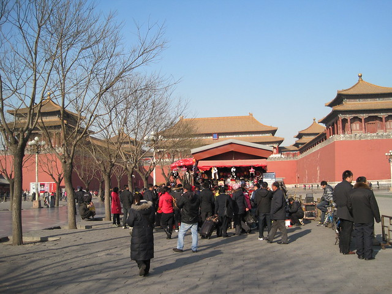

故宫博物院里面也有卖纪念品的商店，没有进去，估计价钱也不便宜。

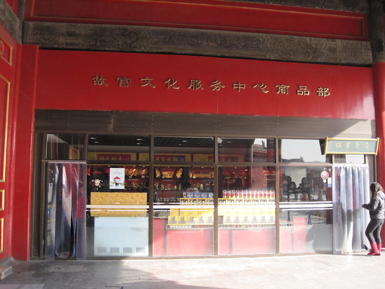

站在太和门往前看，主角登场啦，这就是传说中的太和殿，俗称金銮殿，这可是皇帝上朝、与大臣商讨国家大计的地方呢。

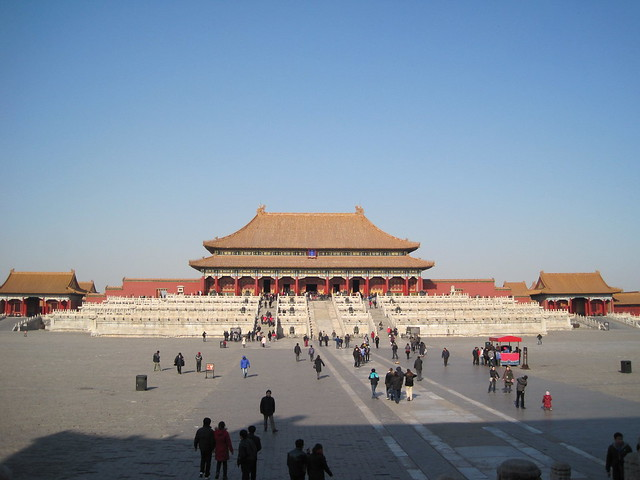

金銮殿前面的广场面积很大，很开阔，凸显出了主殿恢弘的气势。下一张是广场右边的景象。

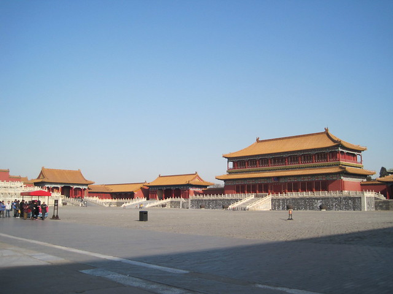

我们迫不及待的穿过广场走上大殿，门前有东西拦住，可以围在门外看里面的景象。以前在诸如《康熙微服私访记》等电视剧看到的金銮殿里面也是十分开阔的，众多大臣站在下面，而皇帝的座椅也十分气派，皇位前的台阶也挺高。但是我所看到的金銮殿完全不是电视剧演的那样。殿内光线昏暗，在历史的尘烟里，那龙椅也没有什么气派可言，前面的台阶只有很低的几级，供朝臣站立的空间也不大，估计左右站个十几人就显得十分拥挤了。大臣离皇帝的座椅很近，看皇帝的龙颜应该是比较清晰的，可能不敢细看而已，这完全不是距离的问题。

这个是金銮殿的背面，有一大排供休息的椅子，估计夏天坐在这里会比较凉快。

这两座是紧挨着太和殿的中和殿、保和殿，均为议事之所，不过分工不同。里面的景象与影视剧也是有着差距的，此外，除了太和殿外部被重新修葺刷漆之外，剩下的殿宇都显得比较沧桑与斑驳。

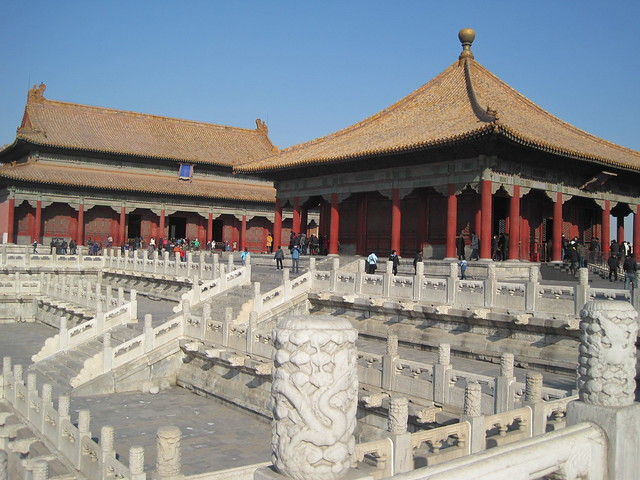

中和殿、保和左边的景象。

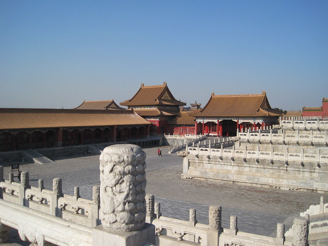

再往里走就是乾清门，鲜亮的油漆与斑驳的屋顶，形成鲜明的对比，里面有一些区域可能在整修，无法到达参观。

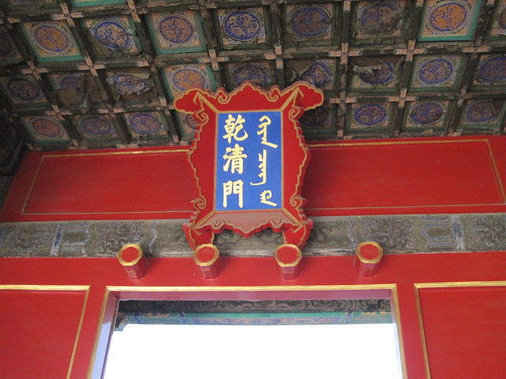

进了这个门往里走，里面有一处面积很小的御花园，一两处假山，差不多就进入那些帝王皇妃们的住宅区了，这些房子外面安装透明的玻璃，游客们都要趴在窗台上往里看，大家都是很好奇的样子。

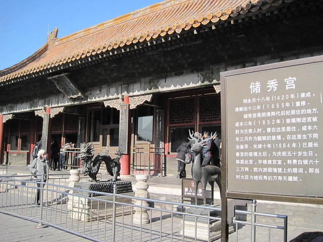

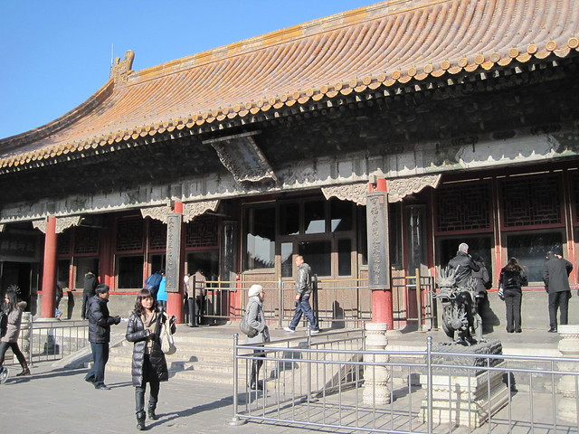

 

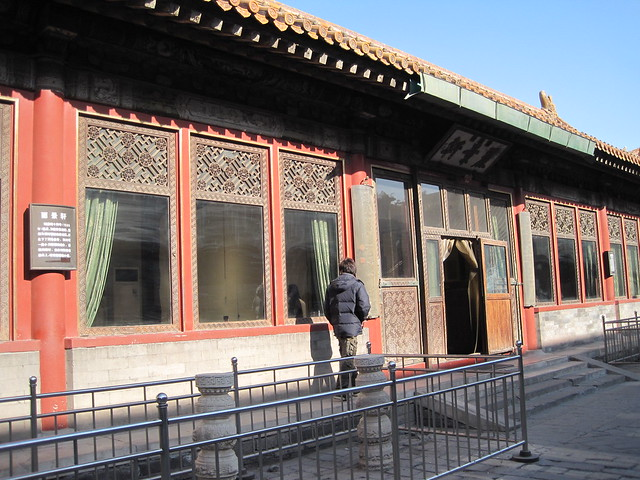

其中有一些房间摆设古物件，可供入内参观。

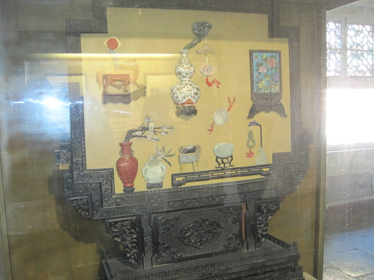

有关末代皇帝傅仪的生前物件。

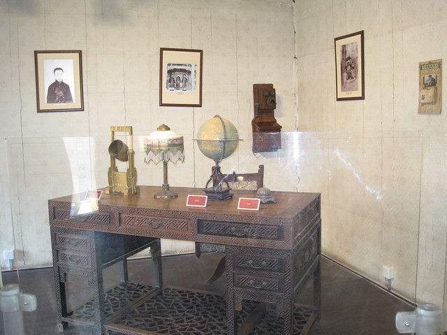

走到这里，故宫博物院差不多就走到头了，游览也就结束了。

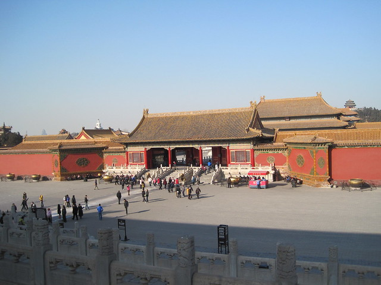
