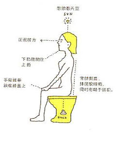
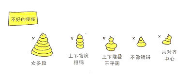
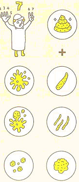
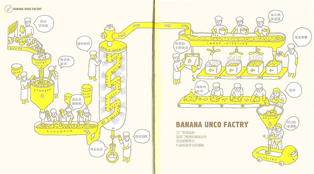
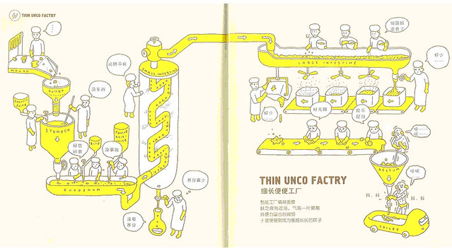
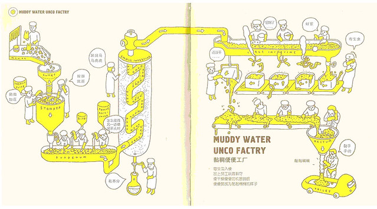
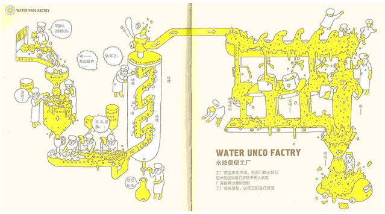
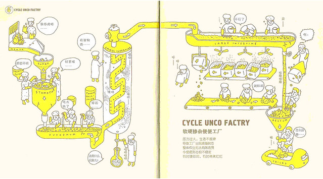
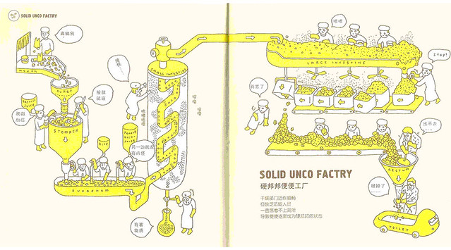
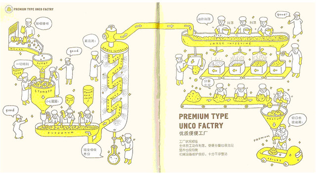

这是一本关于便便的书——《大便书》，它的副标题是“迈向优质便便的幸福生活”，看来这便便和大米一样也有优质的和劣质之分。

闲着没事打开看看，看着开头感觉有点反感，觉得这东西有什么好讲的，看到那些东西也有点恶心。可慢慢地看下去发现，原来便便里面还有这么博大的知识，掩书之后感觉收获颇多。

吃喝拉撒睡，每天都要经历一遍，只是人们一直以来太关注吃喝了，拉撒睡显然被怠慢了。人们常说，病从口入。管理好这个入口是理所当然的，可是出口往往又被忽视了。便便是身体的一部分，反映出身体的状况。没事多关照一下多受冷落的便便，为了您的健康。

下面是书中文字和图片的摘要：

> 越来越多的证据告诉我们，‘老化由肠道开始’、‘肠癌、乳癌、心脏病、高血压、老年痴呆等重大成人疾病皆与肠道健康密切相关’，但是现代人却忽视肠道健康，对便便嗤之以鼻。

> 由本书的图可领悟出有时吃多了肉或是便秘的时候，大便带有腐败的臭味，也是有害菌分解食物后的恶气。臭便中含有致癌的成分，以及加速老化的物质，因此应多加小心，想知道肠内菌的状态，或是肠老化的程度，可透过大便的颜色、味道、量、形状以及硬度来衡量，如颜色：愈近黄色愈佳，愈深褐色肠愈老；气味：愈刺鼻的酸臭味、焦臭味、腐败味、愈代表肠子老化；形状：成条形，直径约两到三厘米的大便形状是正常的，软便或如兔子般颗粒的大便，代表肠子老化；便量：每次的量以二到三条，一百到三百克最适宜，太多太少都不好；硬度：大便约含百分之七十五到八十的水分，排出无抵抗感或压迫感，如果干涩难排或一泻千里，均是肠内失调的现象。

> 便便其实就在自己身边，却似乎距离最遥远。

> 吃进去的东西在身体里被消化，变成便便，大约需要十到十二个小时。

> 人体消化液无法消化的食物纤维，能够刮除肠内多余的脂肪和毒素。因此摄取的纤维愈多，就能排出量多且漂亮的便便。

> 便便呈现的黄褐色来自于胆汁。便秘时，由于便便停留在倡导的时间变长，因此呈现红褐色、暗褐色。

> 积极的摄取富含纤维质的食物，有以下几种：芋头类、豆类、五谷类、蔬菜、菇藻类、海藻类、干货类、果仁类以及水果类等等。这些食物富含纤维质，吸收水分膨胀以后，形成了便便的骨架。

> 如果是黑色的便便，则代表食道、十二指肠、小肠等地方有出血的可能性。灰色的便便，则表示有胆结石或脾脏病变的产生。当婴儿排出绿色的便便，则是因为细菌令胆汁色素酸化。

正确的马桶坐姿，有利于排便。

认识一下健康的便便。

当然也要认识不好的便便。

这就是七种便便了，看看你自己的便便是哪一种吧。

把身体比作便便工厂，前半部分是消化，后半部分是便便的制成。

细长型的便便的形成，好发于为减肥以致食物摄入不足，腹部肌肉无力的年轻女性身上。

粘稠型的泥巴便的形成，水分没有被完全吸收。

水液型的便便，水分几乎完全没被肠道吸收，原因大多由于压力或是暴饮暴食。

软硬参杂型的便便，由于压力造成肠道运作不规律。

硬邦邦型的便便，水分过度被吸收，经常导致便秘和腹胀。

完美型的便便，分成三段，一气呵成。

生产出完美便便的三角关系式。

完美便便，健康身体：

1. 起床后尽量喝杯水。

3. 早餐很重要，要吃丰盛的早餐。

5. 有排便意识时，马上去，不要耽搁。

7. 排便时要专心一致，不要把玩手机及阅读报纸。

9. 便便的量、颜色、气味、形状、硬度最好要符合标准。

11. 吃饭时要细嚼慢咽。

13. 注意纤维膳食的摄入。

15. 保持心情舒畅。

17. 不熬夜，注意休息。

19. 多锻炼身体。
