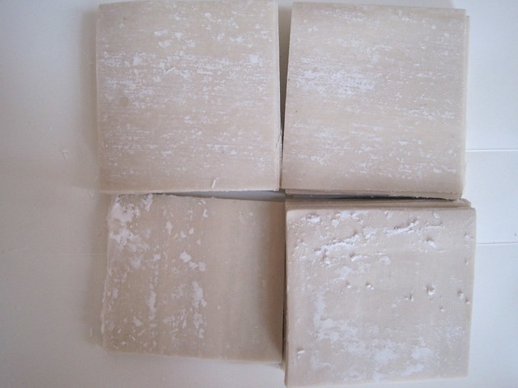
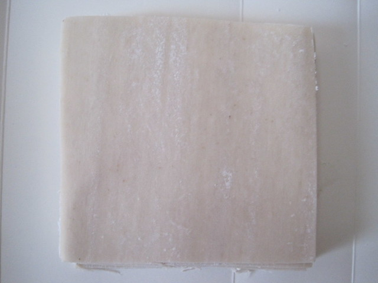
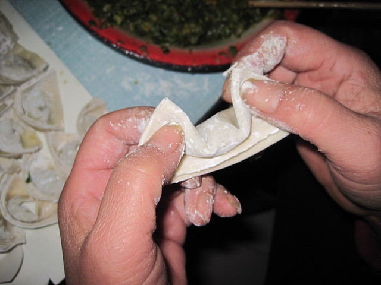
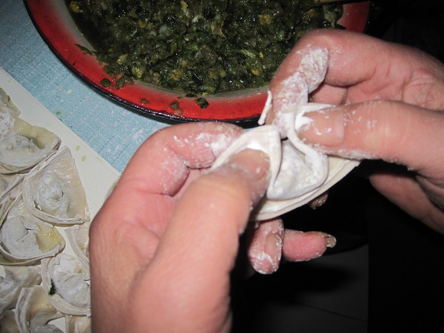
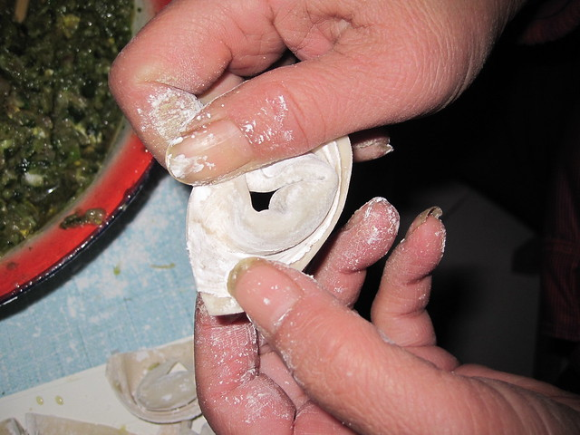
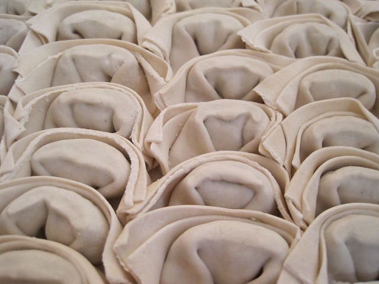
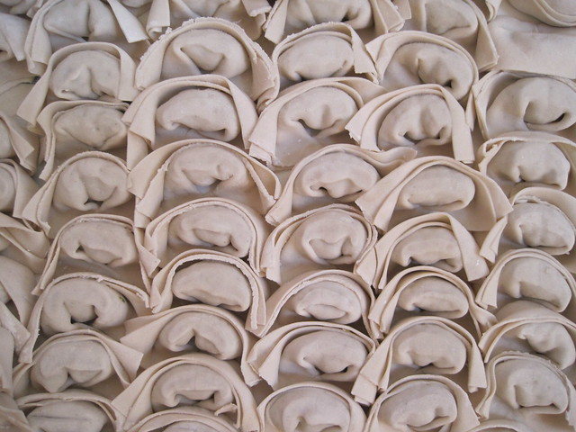
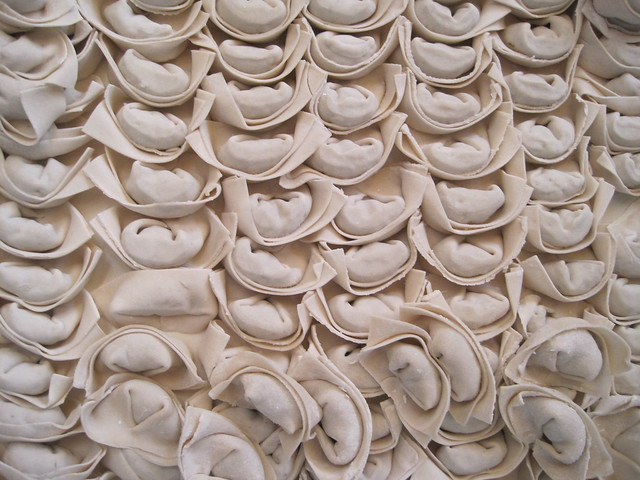
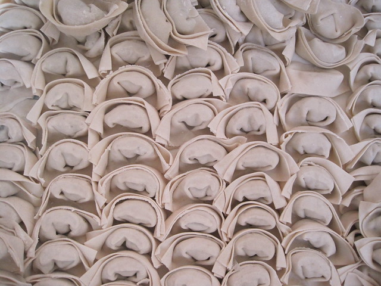

离开县城之前，以为全天下的饺子都是我们家的那种做法。之后去了北方，又辗转去了南方，怎么着都没有再见过家乡长得像元宝的饺子了。

我是很喜欢吃饺子的，每回出远门我妈就会做上一顿饺子吃，因为我妈常说“上次饺子，下车面”。我不知道这句话什么意思，就以为是饺子象征着亲人要走了以后会想得“揪心”，面象征着“见面”。之后听说是因为饺子是包起来的，象征着团聚，所以人走的时候吃饺子，表示希望再次团聚。

在学校和同学们一起包饺子，我说我们家乡的饺子是元宝样子的。他们这些来自祖国南北的没有一个听说过，都让我包一个出来看看。可每次我都会出丑，包的不好，得用丰富的想象才能看出来它是元宝。所以每次都抱怨说饺子皮不配套，我们家的饺子皮比较厚，而且是方块形的。

这就是饺子皮了。这些是从外面买的。我问过我妈，她说就是自己手工擀饺子皮，之后也会切成方块的。她们也一直以来包的是这样的饺子。

看到了吧，差不多是正方形的。

先对折，再对折。

然后两个角放到一起。

稍微使点劲儿，一摁，就成了。

元宝的饺子。

再上几张图。

