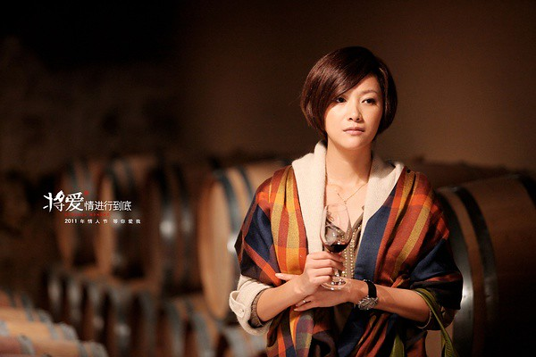

因为前期宣传很多，因为《因为爱情》，所以最近看了《将爱情进行到底》。

我没有看过同名电视剧，不知道其中的男男女女有着怎样的情感纠葛。直到和hillway一起看电影的时候，他跟我讲了几点剧情。

三个故事，三种人生模式。第一个的风格动漫奇怪；第二个低俗搞怪；第三个风景倒是不错，老徐的造型我喜欢。

这种拍电影的模式让我想起了《非诚勿扰2》，不知道是因为一个故事实在不能生发全篇；还是想让观众感觉性价比增高，一份钱可以看三个小电影，总觉得不够用力。电影的时间本来就很短，在一两个小时把一个中心陈述到位就不错了，竟然还有几个故事纷纷登场。

以前我们同学一起讨论如何将写不下去的作品再接着写下去的时候，就说最有效的方法就是加入新的人物，这样一来，就可以安排新人物与众多旧人物的爱恨情仇，生发出很多的故事情节来。还有一种方法就是上面讲的换模式了。

我没有到那个年龄，所以我现在还没有资格去感叹什么，要不然会有无病呻吟，搔首弄姿之嫌。三十几岁的爱情会是什么样？谁知道！

在看《因为爱情》的mv时，我想象这部片子大概是描写一段跨越很多年的爱情故事，有很多沧桑与感慨，让我们看到青春里的许多过往，起码比老徐以前演的电影要有厚重感。看了以后我才明白，老徐的电影就是老徐的电影，水平保持的十分一致。不过和刘德华出演的电影比起来，还是可以高出个一两分的。

虽然不是想象的样子，但是还是有些收获。

让我明白人生的选择很重要。三种模式的生活，天壤之别。

第一种模式的生活，物质富足，但缺少沟通，事业成功的男人将他以前心爱的女人定位成一个家庭主妇，在心里压根没有平等对待，自我感觉高人一等，故作抓狂的语句中透露出难以掩饰的优越。结了婚的女人还是要有自己的事业与交际圈，培养有意义的爱好，这也许只是一个前提而已。

第二种模式也很夸张，也许是因为人生苦短，现实暗淡，所以要用平庸搞笑的风格来呈现，以缓解小市民内心的悲苦。

第三种模式在国外拍摄，风景优美，这段是我喜欢的风格。女主人虽然遭受小三的困扰，但是仍然保持的十分优雅。

遇上一个人，也许以后的生活轨迹就全变了，站在人生的十字路口，到底何去何从，自己要去选择，到底怎么样走，谁也不敢告诉你，这本身就是一场大冒险，无法重新开始的赌博。我只能说，现在真的很迷茫。
