室友算是半个无锡人，两年前的今日，喊着“烟花三月上无锡”，我们浩浩荡荡开始了初春之旅。记得那晚到无锡时已近凌晨一点，兴奋劲十足，睡意荡然无存，在火车站前硬是要先拍了合影再上车。

天公不作美，第二天下起了中雨，一直停不下来，我们便冒雨前往锡惠公园，鞋子里进了不少的水，走起路来，在里面荡来荡去。

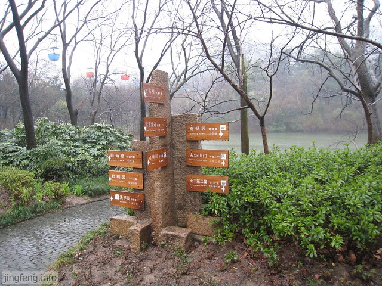

<!--more-->锡惠公园那天的游客很少，游船无人问津。

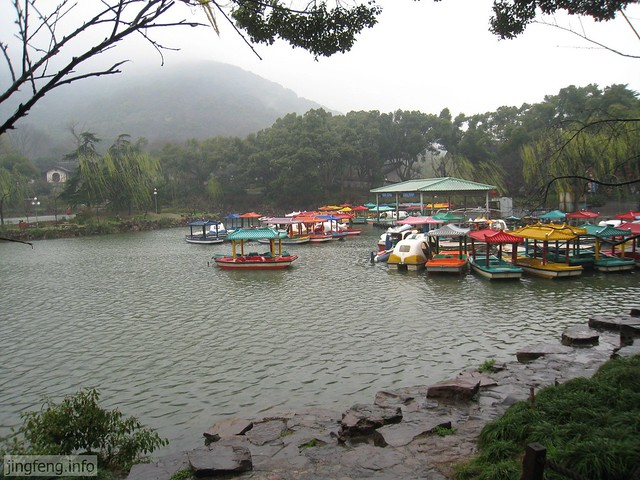

颇具创意的铁筒机器人。

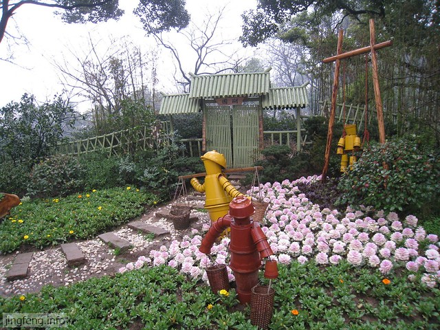

这就是天下第二泉了。

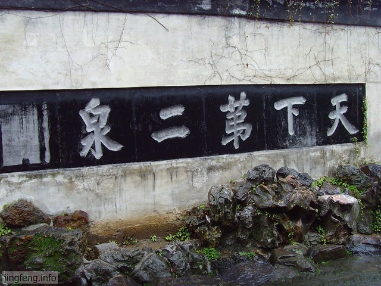

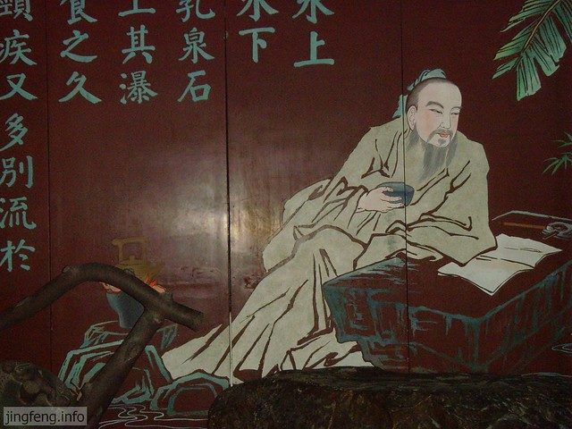

被春雨打湿的石阶。

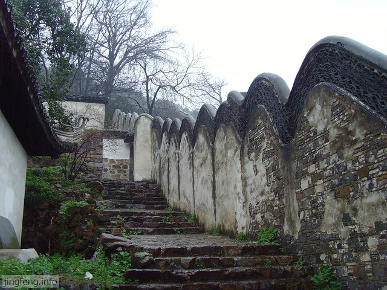

无锡惠山泥人之阿福。

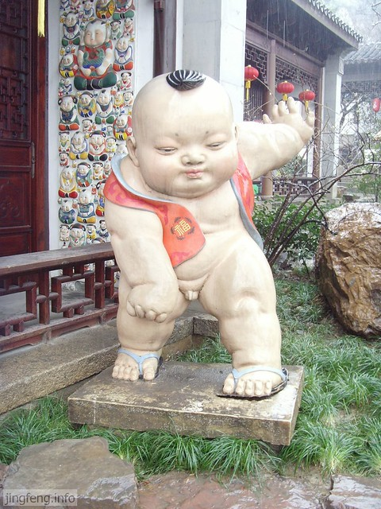

华孝子祠里有一家卖阿福阿喜的，自称惠山泥人第六代传人，我们各自采购一套回去收藏。

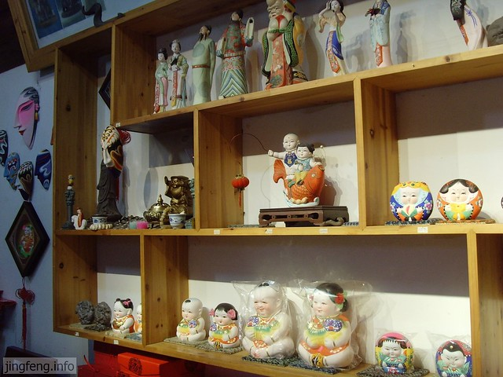

寄畅园，听室友说，这是乾隆皇帝十分喜爱的江南小园林，几乎每次下江南必来此处，并在北京颐和园仿建，可见其喜好之深。

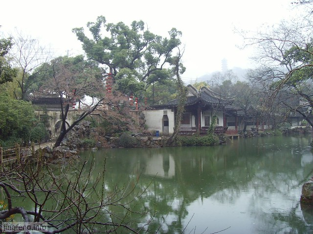

面积虽小，由于设计巧妙，曲径通幽，在里面绕来绕去，也颇费一份功夫。只可惜我们来的大早，早春时节还没有太多的景致，色彩略显单调，加之一直在下雨，匆匆忙忙，走马观花，现在回忆起来都有些困难了。这样的景物与建筑还是要静心慢慢体会、欣赏才好。

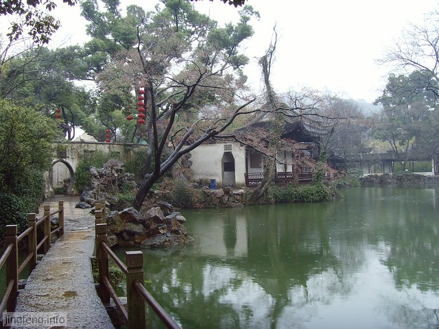

墙外难得几簇红花。

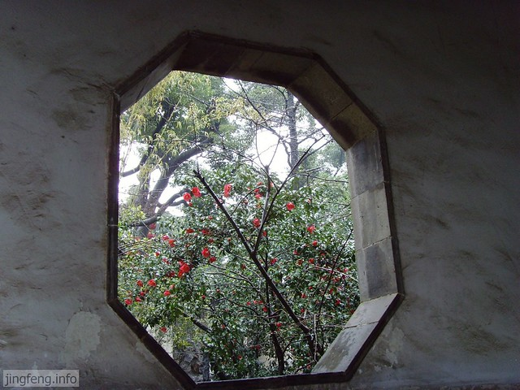

游览过园林，又去了锡惠公园中的动物园。说实话，雨天去动物园真没有多少漂亮景致可以看，很多动物之美正在于羽毛，春天的细雨淅淅沥沥下着不停，湿淋淋的羽毛结在一起，看上去惨兮兮的，样子也很丑。

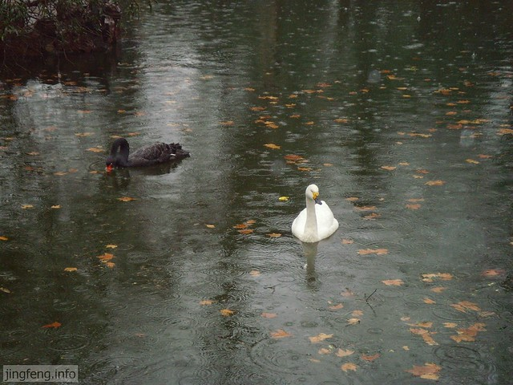

第二天一大早，我们吃饱了饭，往灵山大佛进发，听室友说在这里许愿很灵，香火很旺。

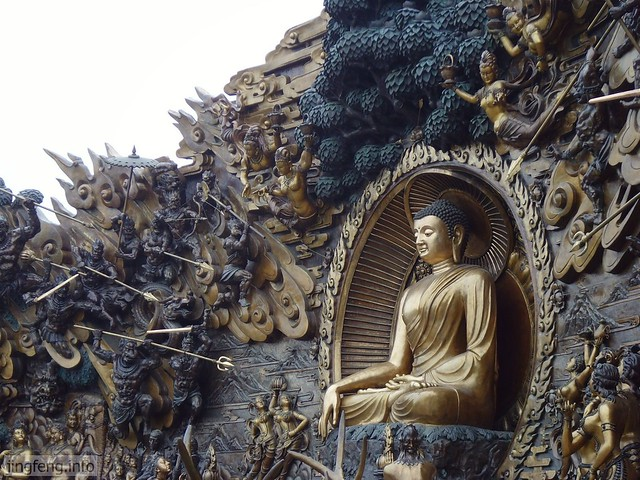

早上有“九龙灌浴”的表演，讲的是小释迦牟尼出生时，莲花打开，九条龙为其沐浴净身的情景。

相比大佛的造型，这个肉嘟嘟的小佛更加可爱。

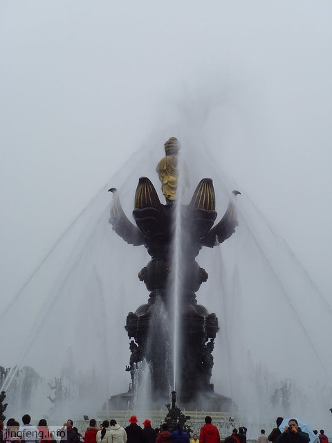

这里是灵山梵宫，那时刚修建好不久，崭新矗立。

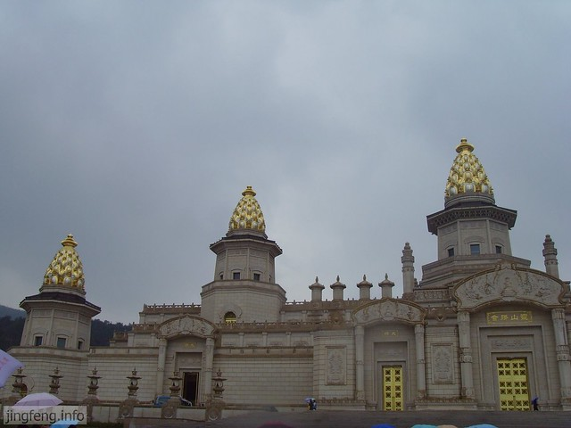

精美的房顶。据说这些绘画是画匠们踩着很高的梯子一笔一笔精心描绘出来的，花费很长时间，足见用心、用力之多。

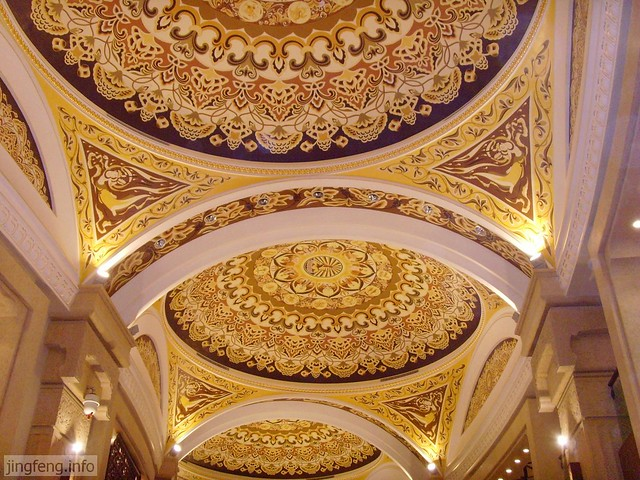

一进梵宫，就被其震撼住了。金碧辉煌、美轮美奂这等词语用在这里是再恰当不过了。

佛门圣地，奢华至极。

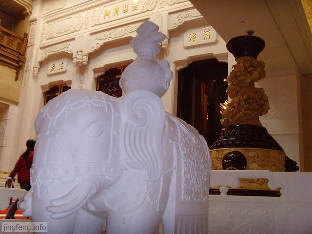

主殿的屋顶，壁画、木雕、雕塑、灯光等一应俱全。

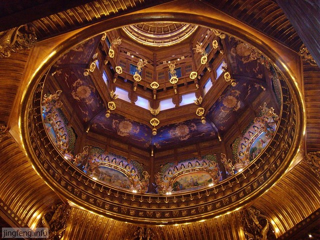

屋顶上闪烁的星光展示。

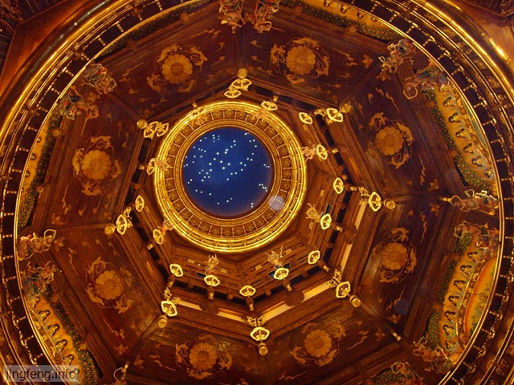

从灵山梵宫出来，雨停风止。

看见传说中的灵山大佛了，听说有八十几米高，手势表示：上天入地，惟吾独尊。我们一行人拾阶而上，熊抱佛脚，即兴而归。

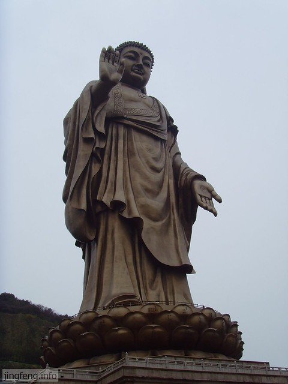
