学校科技馆建成有几年了，hillway和我说过好多次，要一起参观科技馆，前几天看网站上通知每周日上午开放，今天一大早就揣着相机前去了。参观科技馆以家长带领小朋友居多，想让孩子早早地接触科学，培养兴趣吧。

这是我第一次参观科技馆，所以一进馆内，甚觉新奇，里面分门别类展示了许多物理、生物、化学、心理等多种学科的知识，共同向我们展示了大自然的神奇与奥妙。不仅近距离地感受到了天文地理和日月星河，知道了头顶上星空变换的四季规律，看到了实体大小的动物（虽然我大多叫不上名字），而且体会到了科技发展对人类生活产生的影响。

一进门是天文展区，里面主要有天象馆、数字外投球、内投球幕电影、生日星空、八大星球、嫦娥卫星模型、长征号火箭模型以及相关知识介绍的多媒体平台等。

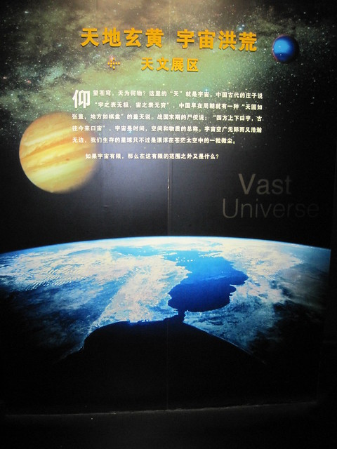

<!--more-->这是嫦娥号探月器的模型，还有火箭等其他模型。

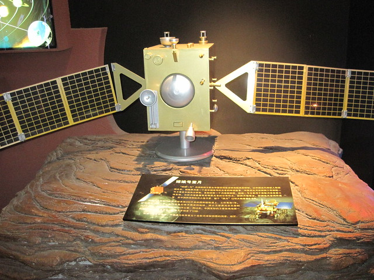

天文馆的墙上挂有好多大家的画像，智商都是非常人能及呀。

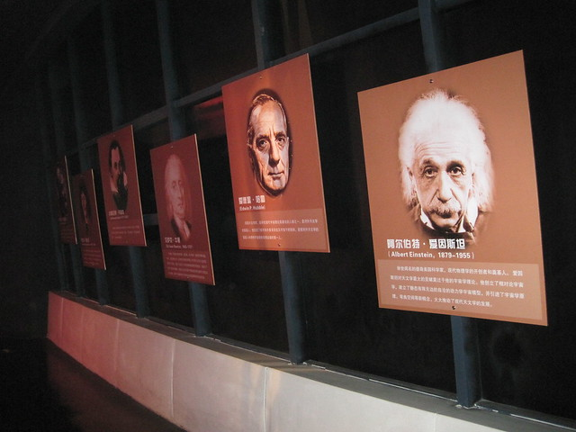

听说十点半在天象馆有放映影片，时长半个小时。便赶紧找位置坐下。里面是一个圆形的影院，房顶是凸出去的球形，中间空地放有投影仪。放映开始，灯光熄灭，球体上出现了璀璨的星空，是分成四季进行讲解的，采用男女对话的形式，女的扮演好奇的天文爱好者，男的扮演老人星爷爷，一问一答。首先是冬季星空，讲了猎户座等星系，工作人员会指出它们在星空中相对应的位置，可是我看了很久，也没有发现它们哪里像个猎人。比较有意思的是夏季星空中，我终于认识了牛郎织女星，他们两人隔河相望。牛郎还用扁担带着两个孩子，模样倒是十分的形象。hillway说那个扮演求知者的女的其实知道的东西特别多，还装作不懂的样子在那里问来问去的，一看就是闷骚型的。

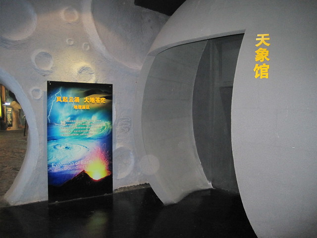

天文展区之后是地理展区，该展区以丹霞地貌与奇特的喀斯特地貌作为总体背景。

这是硅化玉、黄铁矿、孔雀石、紫水晶、翡翠、绿松石等珍稀矿物标本。

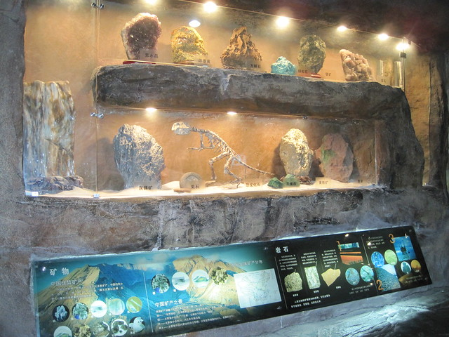

这个是火山爆发的模型。

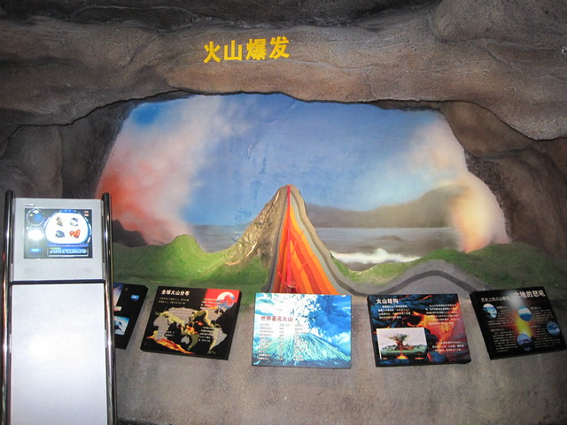

出了地理展区，便进入了物理、化学、生物以及电子信息技术类等展区，它们都是连在一起的。

这个是生物展区内的DNA模型。五颜六色的。

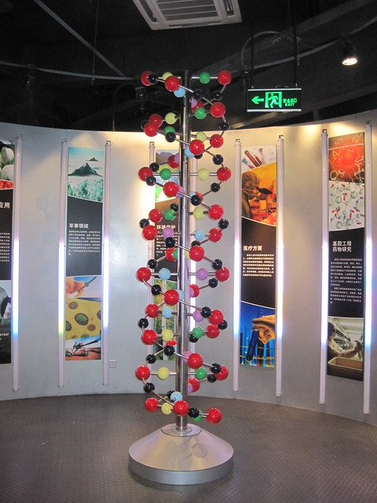

这个是趣味化学区，展示的有一些化学物质的样品等。

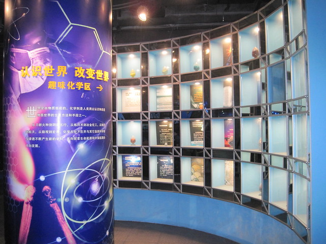

以下是众多的物理发明，这个是电磁炮。

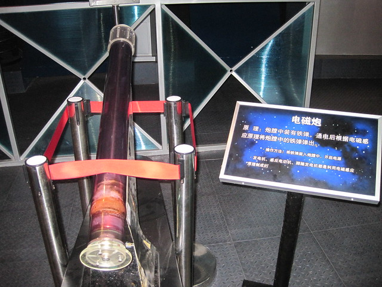

这个是雅各布天梯，我还没有弄明白是干什么用的。

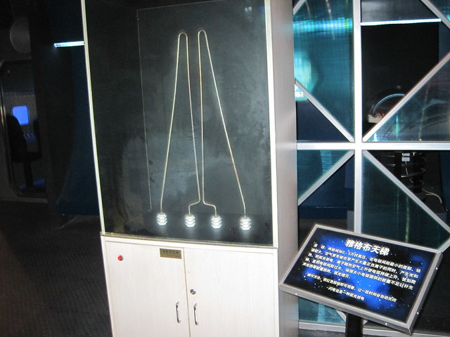

这个是椎体上滚，滚来滚去。

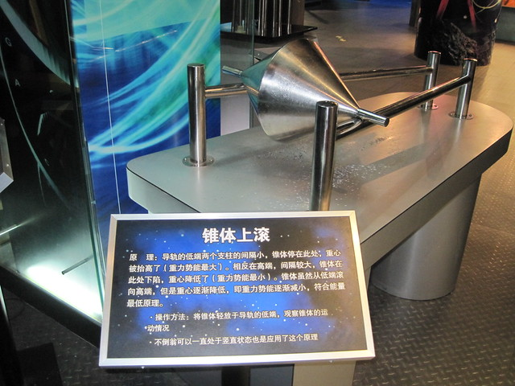

这个是完全弹性碰撞，六个球球。

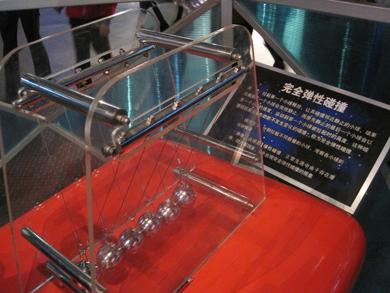

这个是击鼓共振，敲右边的鼓的时候，里面的泡沫会动。

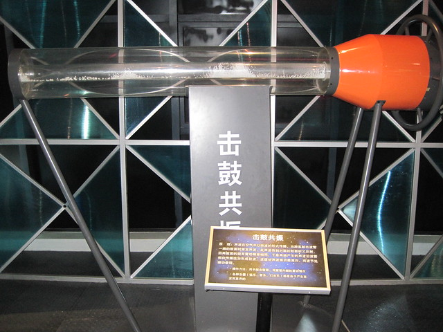

还有激光琴，说实话，这几个东西里面我觉得就属这个最好玩了，可以奏出声响，比较有意思。

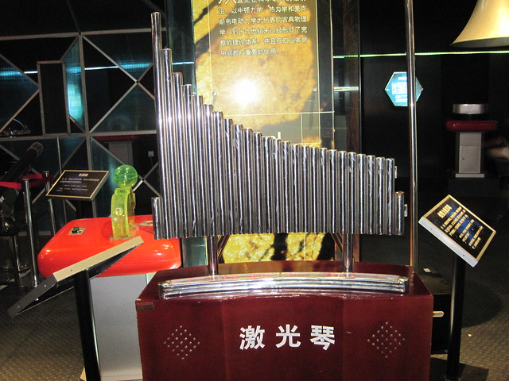

此外，这些展区里除了上面提到的可以模拟星空的天象馆之外，还有许多的体验屋，可以亲身去体验一下大自然的神奇魅力。这个是模拟龙卷风的房间，估计风刮起来，要把发型全都吹坏了。

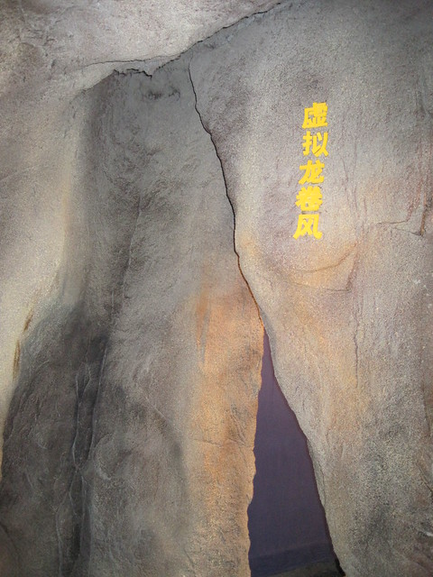

地震体验屋，保佑地震中受难的人们。

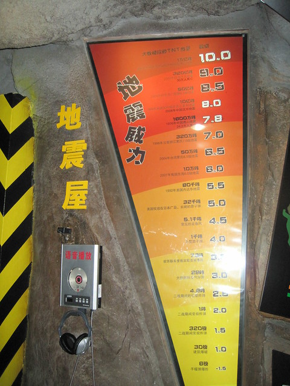

倾斜屋，顾名思义，房间十分倾斜，墙上有贴了一幅眩晕的图片，哦，晕死了。

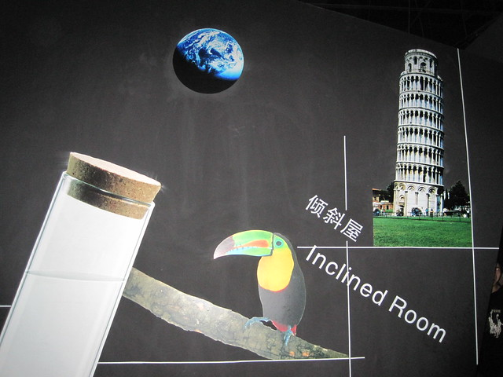

错觉屋。

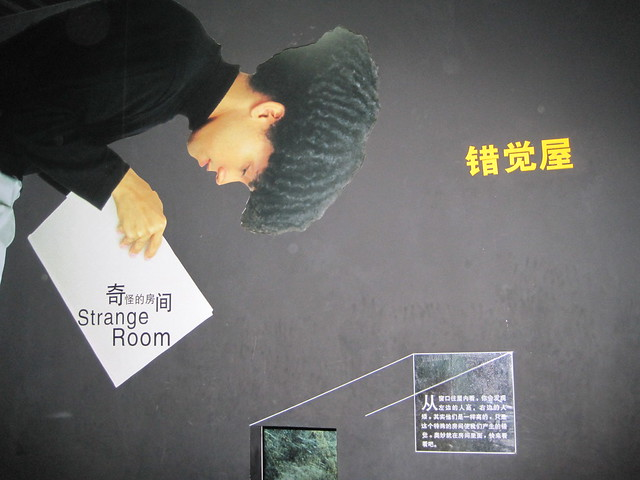

这个是错觉屋的里面，墙上有原理分析图。

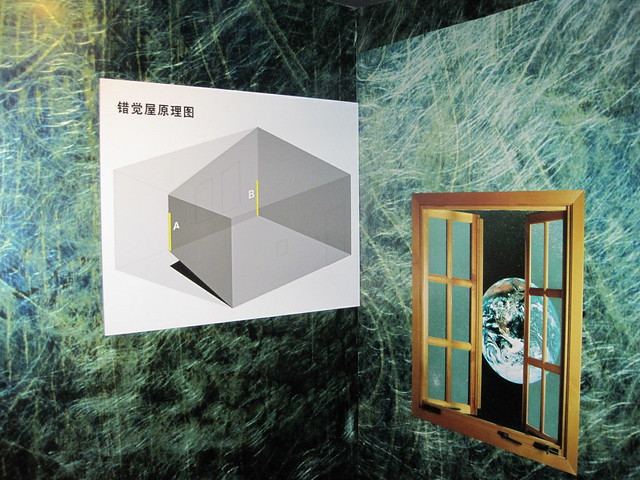
