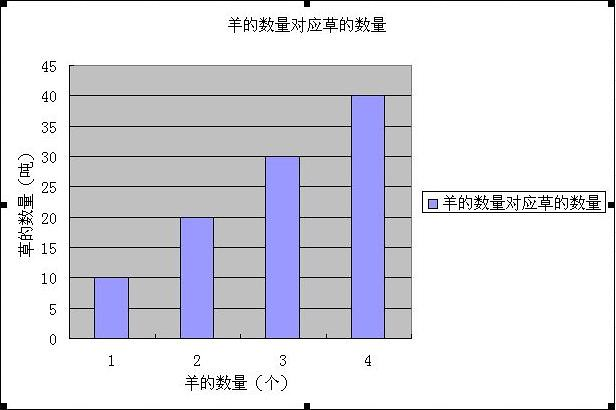
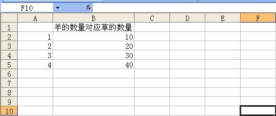
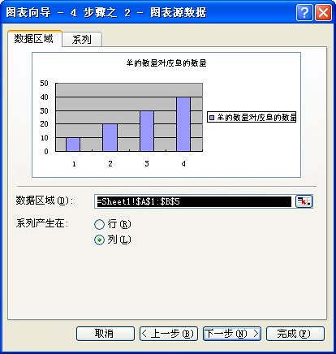
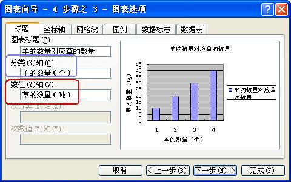
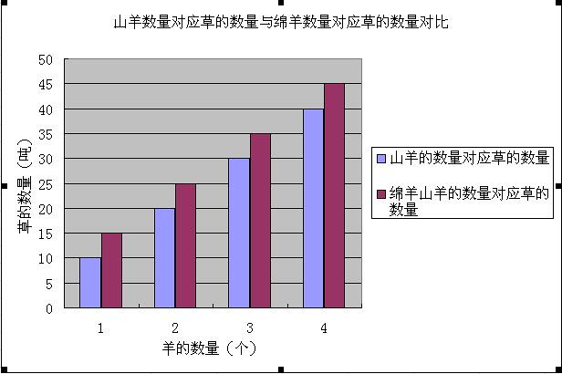
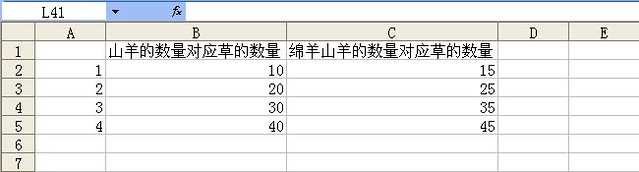
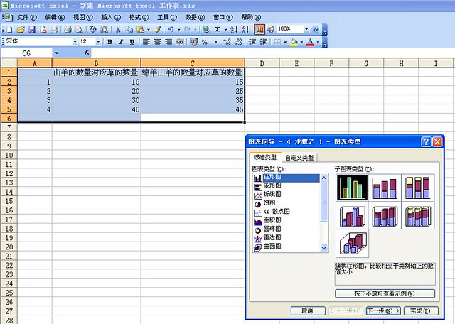
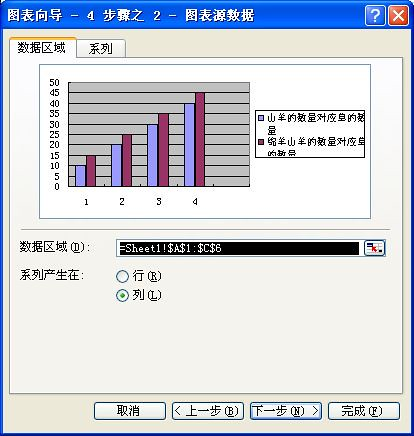
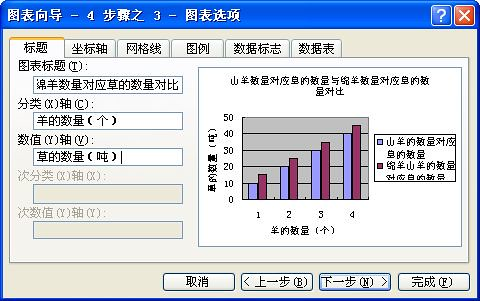

微软Office中的Excel软件可以很方便地生成图表，下面就来介绍一下使用Excel中的数据生成柱状图和柱状对比图的方法。本文以“羊吃草”做为例子，使用Microsoft Excel 2003软件来进行说明（其他版本的Excel操作类似）。

### Excel数据生成柱状图

先来看一下Excel生成柱状图的效果，如下图所示。

横坐标X轴为“羊的数量”单位个。纵坐标Y轴为“草的数量”单位吨。蓝色的柱状图为羊吃草的数量，也就是X轴羊的数量对于Y轴草的数量。

<!--more-->1、下面来讲解如何生成上述的柱状图。首先打开Excel，输入下图所示2列数据（输入2行数据也可以，方法类似）。

A列代表X轴的刻度，也就是羊的数量。B列代表X轴的某一刻度对应于Y轴的数值，也就是羊的数量对应的草的数量（柱状图的数值）。

2、数据完成之后，下面就来生成柱状图。

选中A、B两个数据列，点击工具栏“图表向导”图标，在弹出的“图表向导”的窗口中选择柱状图的图标样式。

3、点击“下一步”，预览一下将要生成的柱状图。

4、点击“下一步”，填入X轴和Y轴的文字说明。

5、点击“完成”，生成的柱状图完成。

### Excel数据生成状对比图（双柱状图）

Excel生成柱状对比图（双柱状图）的方法和上面生成柱状图的方法类似，只不过多了1列数据而已。同样先来看一下效果，如下图所示。

横坐标X轴为羊的数量，纵坐标Y轴为草的数量，蓝色柱状图为山羊吃草的数量，红色柱状图为绵羊吃草的数量。

1、首先打开Excel，输入下图所示3列数据。

2、选中数据，然后使用“图表向导”生成柱状图。

3、预览效果，这里可以更改数据区域以及产生的柱状图的行列。

4、输入X轴和Y轴的所表示的意义以及图表的标题。

5、点击“完成”，最终生成的柱状对比图。

可以发现，在Excel中输入数据时只需要输入横坐标X轴的刻度以及所对应的Y轴的数值，而不需要输入Y轴的刻度，Y轴的刻度是自动生成的。
