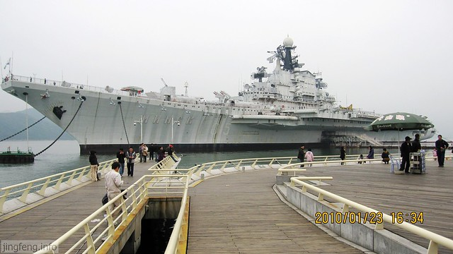
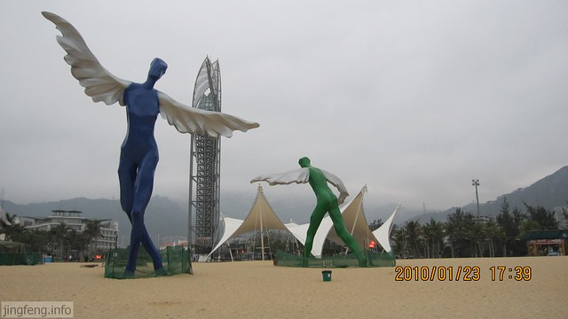
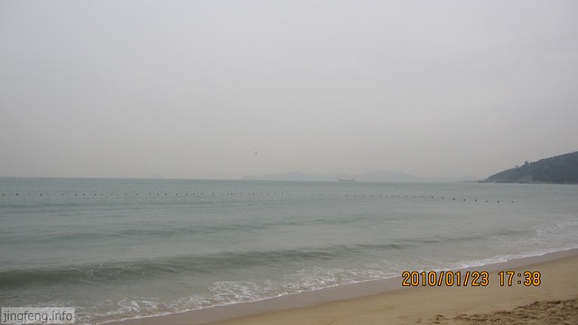
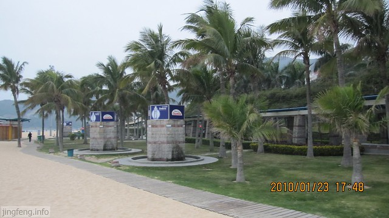

从佛山到深圳，经过几个小时的车程，让我感受了大都市的气息，虽然时处冬季，但是路边草树繁盛翠绿，加上热带作物的种植，很有特色，整个城市不仅清新而且干净整洁。

当天下午的活动就是去海边看俄罗斯航空母舰和大海。首先来到深圳明克斯航母世界，第一次看到这么大的船还是很震撼的，它是一艘前苏联退役的航空母舰，让我想起了几年前看的电影《珍珠港》里面的情形。

深圳大梅沙海滨公园，免费对游人开放，但是入口有控制游人数量的设备，主要是为了防止出现“下饺子”的场景吧。远处的山上建了不少的小别墅，依山傍水，那些有钱人可以随时面朝大海，看游人如织，潮涨潮落。进入以后首先看到的是沙滩上几处摆造型的工艺建筑。<!--more-->

见到大海了，总是渴望去海边，在沙滩上玩耍，可是身在其中却找不到感觉了。

由于现在正处冬季，游人很少，更别谈游泳的人了。

这些小房子是供游泳者冲洗淡水和换衣服使用的，估计到旺季会排起长队来。

