黄大仙的本部在浙江省金华市，海内外存在着各种大大小小的分店。黄大仙的香火繁盛连绵不断，这可能是由于他是位大仙的缘故，许愿的求签的都比较灵验吧。与我同往求拜的在事隔一年后的交谈中发现，那天在黄大仙前虔诚许愿的事后都有所实现�?
赤松黄大仙在金华山的一脉，面朝着碧波荡漾的湖水，显得格外宁静，宁也许通灵吧�?
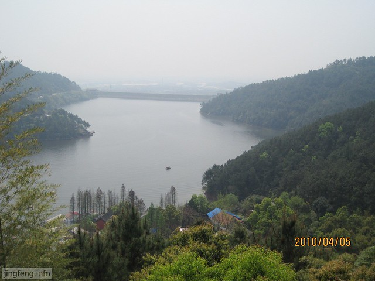

<!--more-->好清凉的湖水，湖边有人家提供竹筏烧烤供游人消遣�?
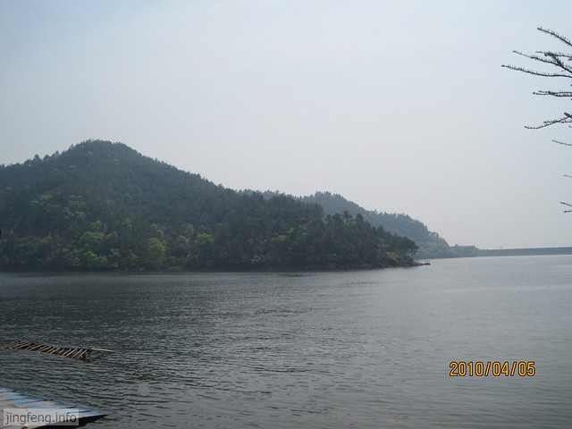

三圣殿，善男信女都来烧香许愿吧�?
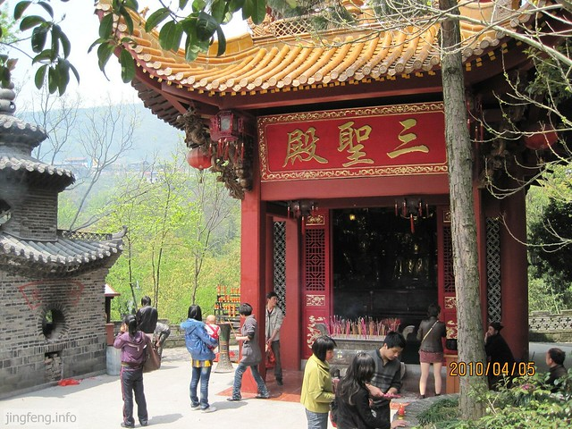

庙前的一位老道，闲来无事，略作休息�?
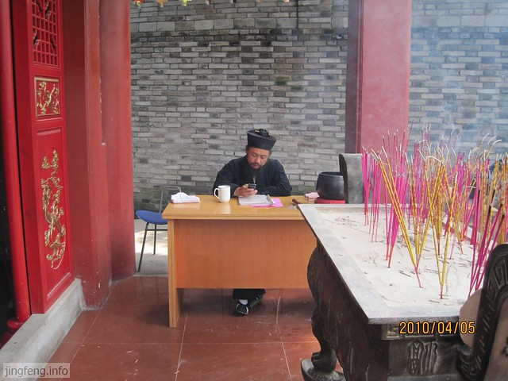

黄大仙中像这么大大小小的殿有很多，当然信众也很多，记住求神时一定要虔诚，信者则灵�?
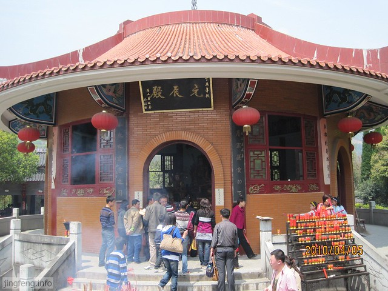

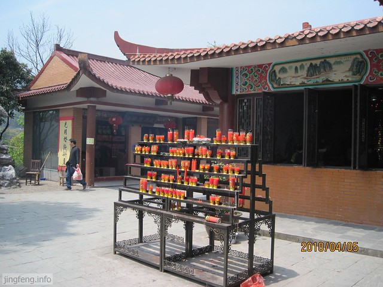

元机洞，这个应该是大殿了�?
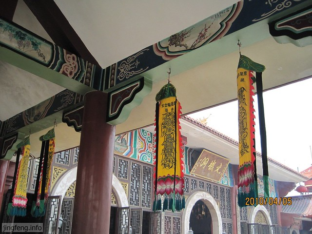

殿前有求签的地方，也有解签的道士�?
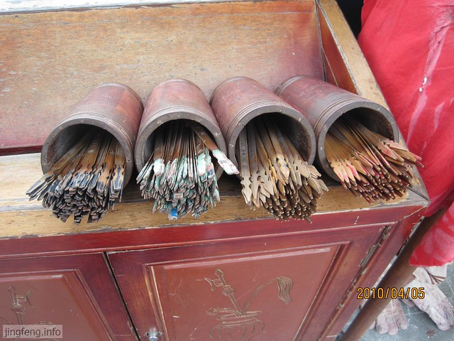

山脚下的一处万圣阁�?
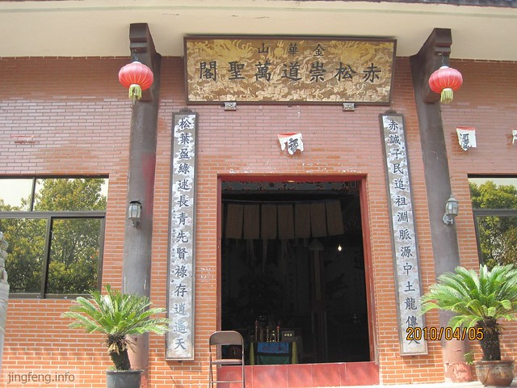

葱岭和假山，往上隐约可见山上的庙宇�?
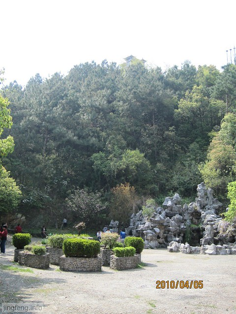

山间的人家，这里大约是道士们的住所�?
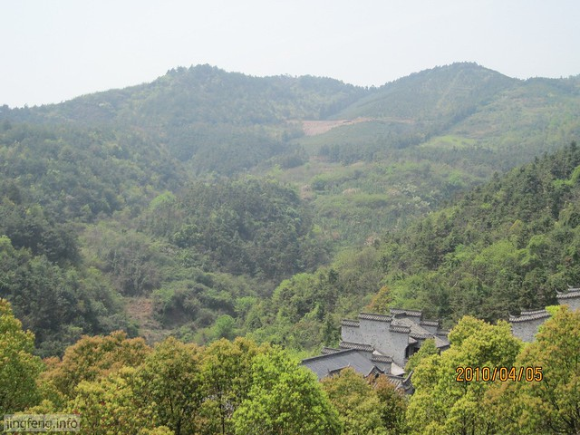

节节高的过堂�?

灰瓦灰墙灰房子，青山清水清净人�?

山道，直译为hillway.

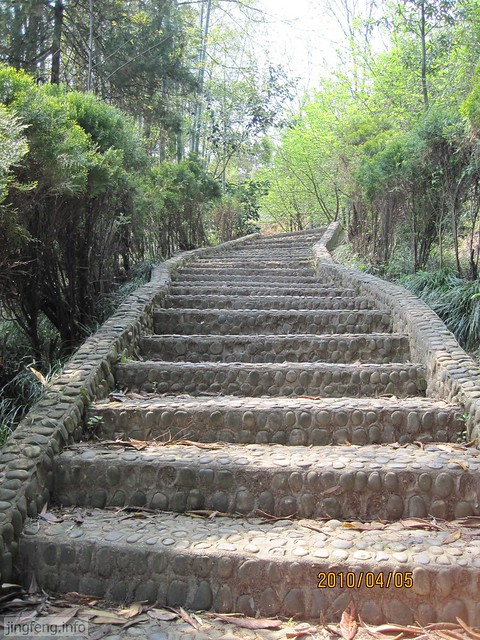

圈养动物的园子，这里有公鸡和野鸡�?
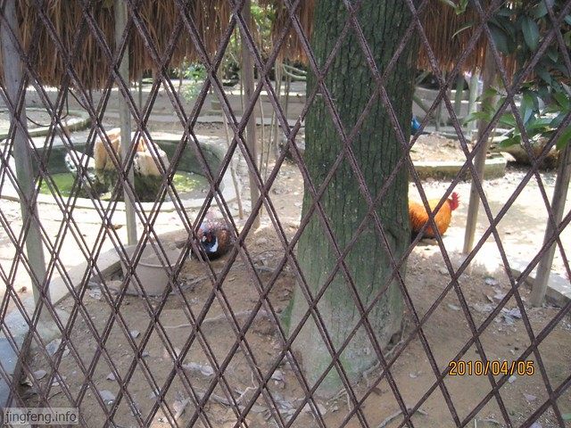

这边是孔雀�?
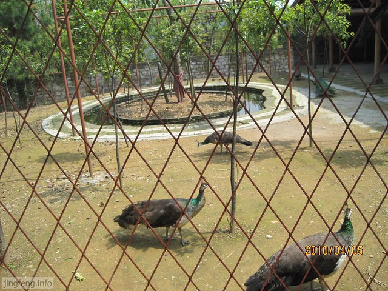

假山上的真羊�?
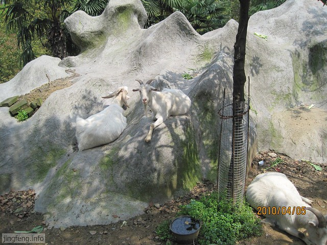

赤松黄大仙上的殿宇很多，外面卖香火的人会告诉你应该买多少才正好把他们都拜一遍。我去过两次黄大仙，每回去时人都很多，返回时山路总会被大大小小的车给堵上，堵车也是最常见的了。也许是黄大仙真的会有求必应，所以信者众多。我还是觉得，不管你信与不信，当你身在其中时请多一份虔诚与感恩，少一点欲念和务实�?