[上次游黄宾虹公园](https://www.jfsay.com/archives/164.html "金华印象——黄宾虹公园")是在金秋十月，当时一直遗憾没有能够把它繁花绽放的景致记录下来。今天和hillway一起重游，玲珑的江上小园林仍静静地立在那里，幽静而精致，入园后发现景物好像与去年相仿，除了满园的绿油油的春意，心里总是想再寻找些春天里的色彩。

在园子里转来转去，毫无所获，可能是没有遇上花期。正在失落中，穿过几棵树，一回头发现一树雪白的绣球花，一团团簇拥在一起，十分欢喜。

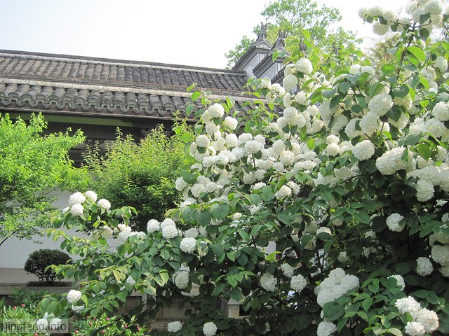

<!--more-->绣球花，花如其名，一瓣瓣洁白的小花瓣簇拥在一起，组成一个个小雪球，像极了古代闺房少女择偶用的绣球，要是红色的就更喜庆了。累累繁花，簇拥在椭圆形的绿叶中，几束阳光透过枝蔓照射进来，煞是好看。

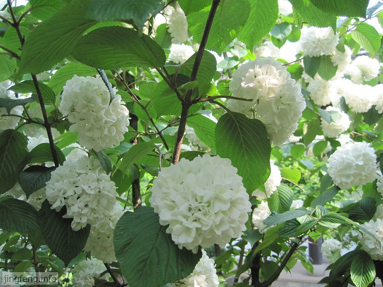

绣球花树旁，红色芍药花也为小园增添了许多鲜活的色彩，飞来一只蜜蜂在采蜜。

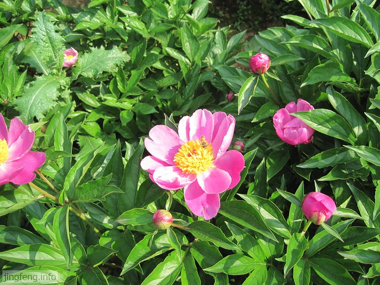

屋前庭院里的红花绿叶，生机盎然。

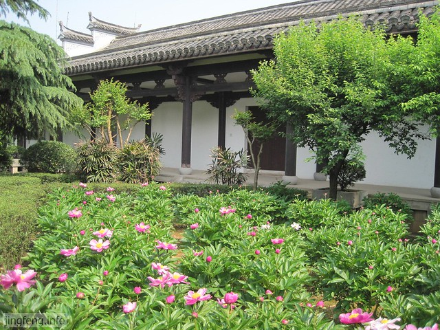

黄宾虹公园虽然面积不大，前前后后也来过几次，每次总能有新的收获，这次我们驻足在了庭院里的一处走廊里。

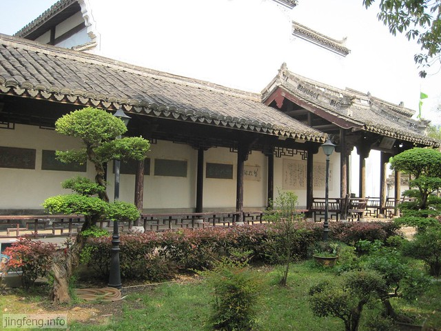

这是“前言”，自愧才疏学浅，除了“前言”两字，其他的都怎么不认识了，猜想大概是关于建园和有关黄宾虹的介绍吧。

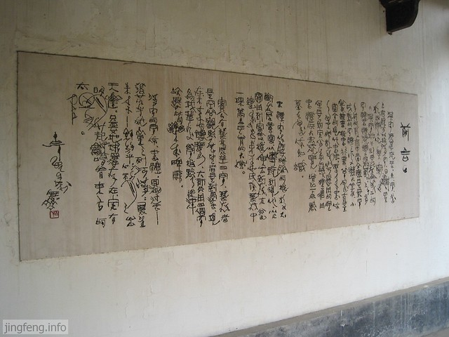

墙壁上挂有各种字体的“艺林展望”四字。

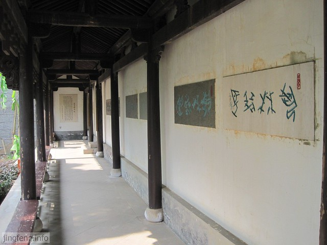

这里是“后记”。其实我们就是附庸风雅罢了，看个热闹，这里面的艺术精髓，真是知之甚少，自惭形愧呀。

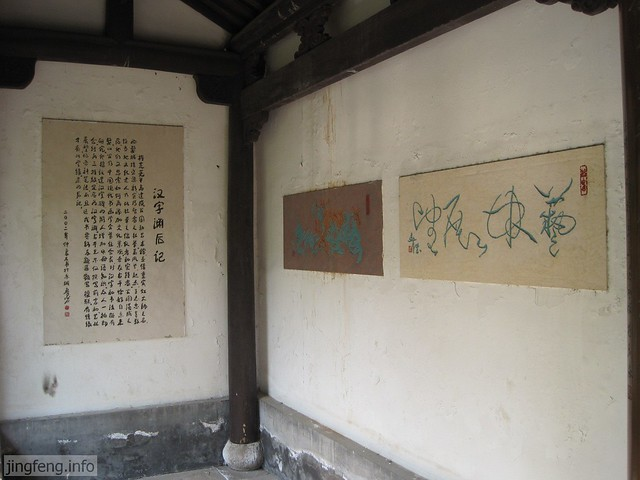

黄宾虹的雕像台上也刻有“艺林展望”四个字，远远看去，这位老人消瘦而孤独。

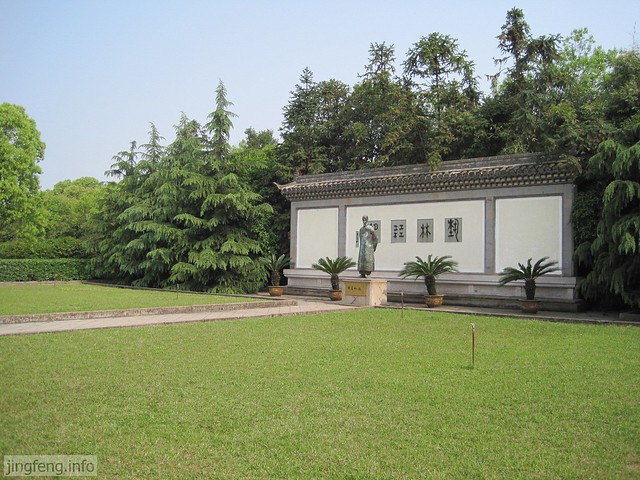

今天留意看了一下清风楼的对联，“水通南国三千里，气压江城十四洲”，女词人李清照难得如此霸气。

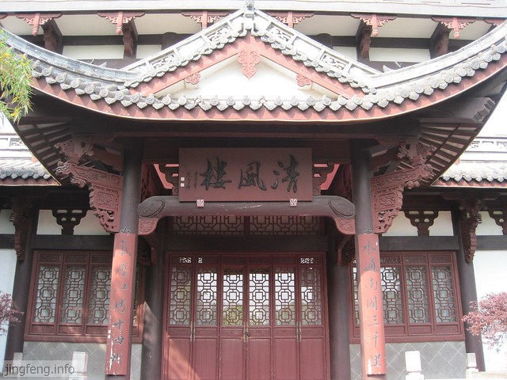

现在婺江没有什么水，有几处露出了江底的泥沙，春风伴着淡淡的水腥味吹来。

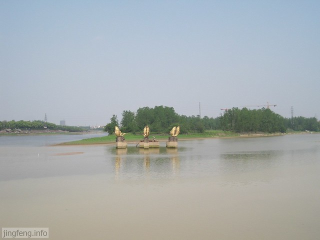

园子里随处可见有许多盘载，这个像是一尾江上的小船。

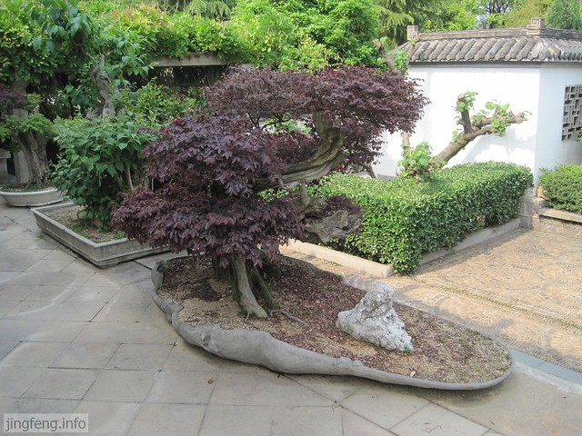

水池中正欲饮水的石牛。

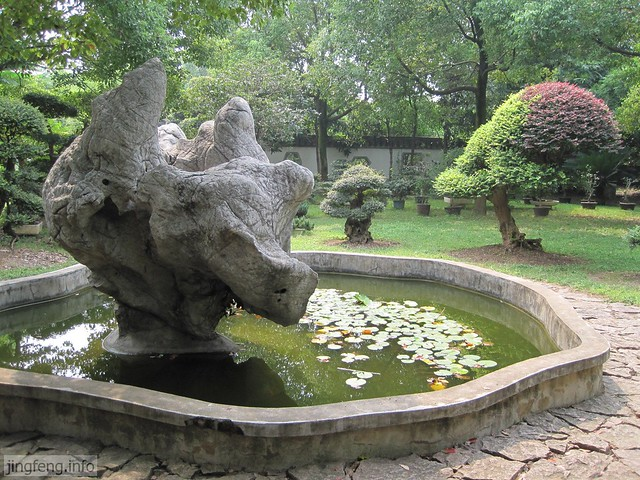

hillway说这处圆圆的空地像斗兽场，中间的石头像是一只猴子。

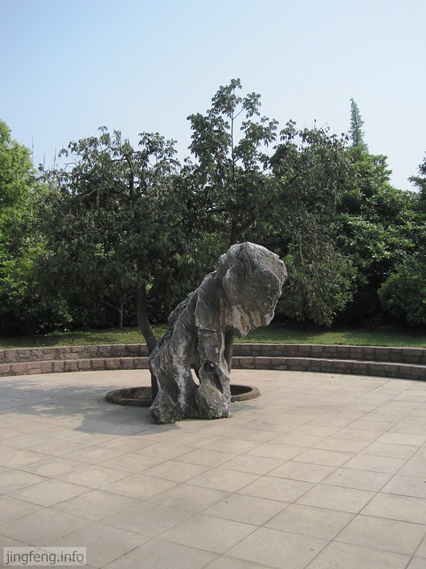

最后是黄宾虹公园的导游图，以供游览之需。

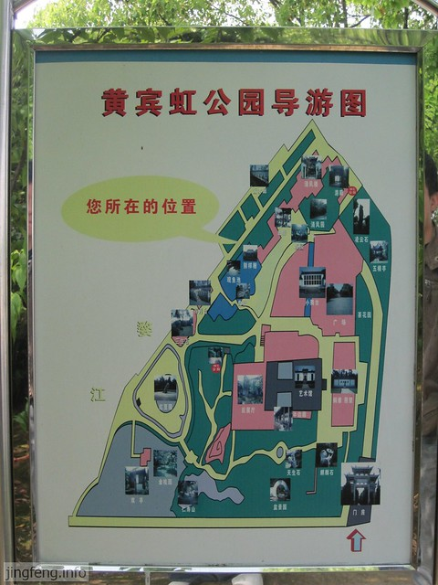
