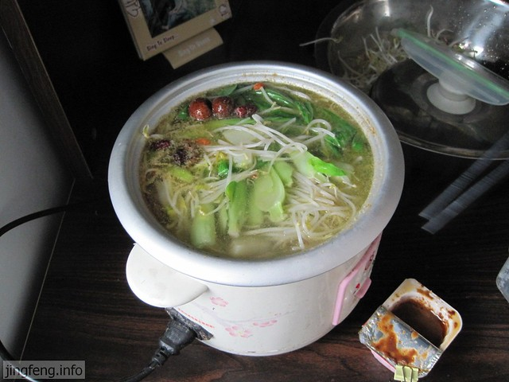

一直以来总想着能够自己做饭吃，或许有展示厨艺的抱负，或者是厌烦了食堂喂猪的饭菜。以前大学宿舍，学校可能出于安全上的考虑，只要哪个宿舍插上大功率用电器，宿舍的电源立马就会断掉。记得刚入住时，洗过头刚插上吹风机，它刚要转起来，就偃旗息鼓瘫软了下去，宿舍停电了。当时还写了保证书才要回珍贵的吹风机来。所以在宿舍做饭就成了奢望。

不过之后在校外做过几次，我们一大屋子男的，不管做过的没做过的，都分配任务齐上阵。心细认真的负责择菜洗菜，力大如牛的负责切菜，有人会做蛋系列的，像番茄炒蛋、韭菜炒蛋、黄瓜炒蛋、丝瓜炒蛋……

心情好时的做饭，其乐融融，特别温馨。吃起饭来，虽然可能不香，或者太咸，有的会糊掉，可又很享受。

央求Jasmine说，我们也做回饭吃吧。她说，我们什么也没有。之后和她商量后，我们去借了一口电饭锅，仅此而已。

下一步就去市场买菜。看到想吃的，就往购物篮里放，约莫着够吃了才出来。提起来可真重，又让我想起来在过年家时，邻居们买菜有的背着编织袋回来，有的推着架子车回来，有的装满了整个电动车缓慢地驼回来……

当然我没打算去叙说菜农的辛苦，菜价的昂贵，苛税的沉重的话题。我们考虑的是，仅有一口锅做什么饭吃好。之后决定做火锅式的菜，就是把配料、菜什么东西都放在锅里煮。为此买了一包重庆调味料。这种做菜的方式简单高效，同时也省了油盐酱醋。

水烧开了，放入调味料，切好的菜都一股脑儿地倒进去，等水再次烧开，然后就馋的不行了，开吃！

