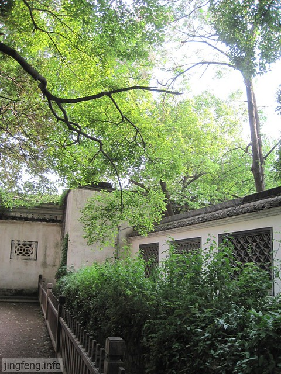

打开地图找到鲁迅故里，发现整个一个绍兴市是以鲁迅故里为环形为中心发展的，这和杭州以西湖为中心差不多，难怪绍兴市现在唯独把鲁迅故里设为免费参观（别的景点可享受不到这般待遇了），可能也是仿造杭州西湖吧�?
鲁迅故里其实是包括鲁迅祖居、故居、三味书屋和百草园这么几处大家都耳熟的景观了。他们占据着市中心的位置，排在一起形成了一条仿古的街道，而它的周围被严严实实的商业所环绕，看不到一丝古的东西留存下来。当时心里就在想，不愧是鲁迅，这么出名的名人，才得以把自己住过的玩过的老家保存下来，而一般的人家，鲁迅的邻居街坊们可就没有这份殊遇了，他们家的那些老房子早已灰飞烟灭了。也多亏是鲁迅，才得以为绍兴为后人保留一丁点儿当年的记忆。其实三味书屋和百草园里面没有什么丰富的东西，尤其是百草园也就是个荒芜的小菜园。可就是因为鲁迅的那神来之笔，让世人皆知了这些。为什么鲁迅当时不多写些邻居家的房子，街坊的事情，再或者就做个地理学家旅游学家的话，那样留存下来的东西应该会更多了吧�?
谁叫我们都是普通人呢，名人们用过的住过的那才叫古物，那才有价值的�?

学过课文都知道，三味书屋是鲁迅上课的教室的名称，那时候叫作私塾。学生们自己搬张桌子，到老师家里面上课。鲁迅的老师是寿镜吾先生，也就是因为鲁迅写的一篇文章，他家的祖宅才得以保存下来。这张图就是“寿家台门”的介绍了�?

老师会客的客厅�?

老师的书房，名为“三余斋”�?

书柜，很奇怪为什么柜子的外面会标明具体的书名，难道每一个小抽屉就放那么一本书么？其实之后在鲁迅祖居中看到了一模一样的书柜，猜想这可能是当时比较流行的吧�?

老师的卧室，看起来明显没有鲁迅祖居的豪华，看来那时的教书先生也比较清苦吧�?

有间小房子�?

屋角一景�?

这间房间开始以为就是鲁迅学习的三味书屋了，我们一张桌桌一张桌子地查看，想找到那个神秘的“早”字，之后出来一位老人说，这里是专供演习用的房间，每天在开放时间会有演出。明显我们错过了�?

绕过了一片翠绿的小道�?

这里才真的是“三味书屋”，周围被围的严严实实的，不能靠的太近。这里的摆设还有那匾额和小时候课本上的极像�?

鲁迅的座位。在一个角落里。背对着老师。难道鲁迅当年不惹老师的疼爱？

当时学生们学习用的课本，有启蒙读物百家姓和千字文，还有高级点的古文观止和神童诗�?

出了三味书屋就想去看看百草园的模样，我们左转右转，把其他的看得差不多了，偶然一抬头看到了“百草园”的标识。进去后，看到了空落落的一个园子。好多人围着那三个字在拍照，我们就没有上前去凑热闹了�?

园子中的一口古井，被罩住了�?

园子的院墙上爬满了绿叶�?

