从安昌古镇回来已有几天的日子了，我们拍的照片一直放在这里，迟迟未动。傍晚走在路上，我对hillway讲，这个古镇那么悠久的历史文化背景我知之甚少，自己能力有限，怕是也展现不出古镇的风韵，可怎么下笔呢？他说：你又不是专家，我们只是游客，写自己的感受就好。

江南一带有多处著名的古镇，之前我去过上海的七宝镇，那天去的时候已经是傍晚，有一些店铺已经陆陆续续关门了，那里的商业氛围很浓，有很多卖小吃和工艺品的店铺，记得表姐那天买了一个卤猪鼻子来吃，站在一旁啃鸡翅的我看的瞠目结舌，多么生动的两只大鼻孔呀。

这次来安昌古镇，前后还是费了一些小功夫，先是在出行的前晚因为心情烦躁和hillway大吵一架，后来又因为转车而有些昏头转向，好在总体来说还是十分顺利和愉快的。

我没有去过周庄、乌镇，不知道那里沿河是怎样的风景。安昌古镇给了我独特的印象，由于这里保存的比较原生态，没有多少商业开发的痕迹，这里村民沿河摆放的小摊位上大多是霉干菜、腊肠、麦芽糖、裙带面、乌毡帽、黄表纸、扯白糖等土产，还有一些普通的生活用品，很少见到那些千篇一律的旅游纪念品。

远离闹世的古镇里，这里的小店铺竟唤起了我些许儿时的记忆，时光在缓缓流淌，仿佛停在那里。沿街的理发店、馒头店、小商铺都是曾经的模样。在去往绍兴的火车上，邻座的一位老人家正好讲起了安昌古镇，他说他很喜欢到这里来，因为这里有他记忆中的东西。

 

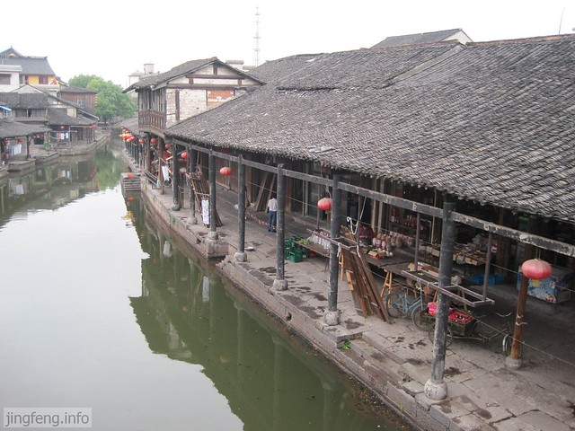

天公作美，游安昌古镇时不仅温度降了下来，还有一丝细雨飘落，更有水乡的意境了。安昌古镇给我最为突出的印象是天然古朴与静谧悠闲，它就像是一位很低调的女子，走在石板路上，看街边老太在自己门口晾晒换洗衣物，古镇百姓悠闲地过自己柴米油盐酱醋茶的生活，透露出一股淳朴散淡、本色平和的味道。

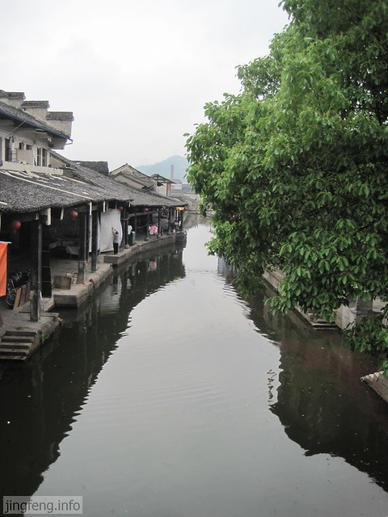

看过一些文学家们描绘江南水乡的文字，使得我对江浙一带充满了无限的向往，一直想去寻找心中构想的那个如画如烟的世界，但是真的来到这里，反而却没有想象中那种强烈的感觉了。有些东西只能在想象中生长，变成现实了，反而无味了。

戴望舒曾经描写过一位在雨巷中，打着油纸伞，像丁香一般的姑娘，走在细雨打湿了石板路上。当我们走在这个小巷里，只是依稀听到古镇居民在家中的聊天的话语，只邂逅了几位悠闲散步的小老太太。

安昌古镇风情馆旁有一条极窄的巷子。

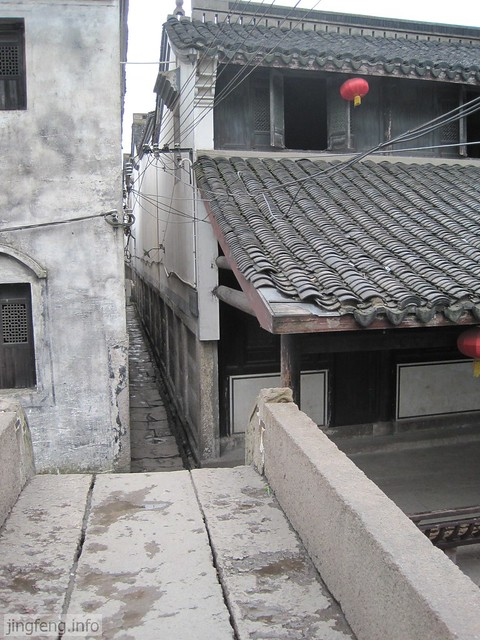

看见宣传册上这样描绘古镇的风光：碧水贯街千万居，彩虹跨河十七桥。

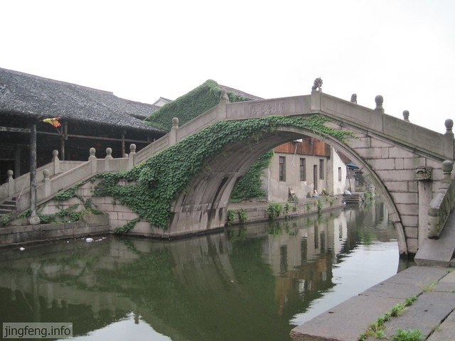

安昌古镇的桥确实很多，我们没有仔细去数是否有十七座。

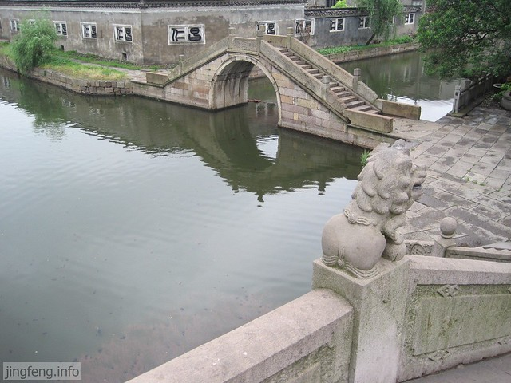

大致看来，这些古老的石桥倒也形态各异，古朴精致。

这算是一处造型相对简单的桥，倒也独特。

恰好有一只乌篷船从小桥下经过。

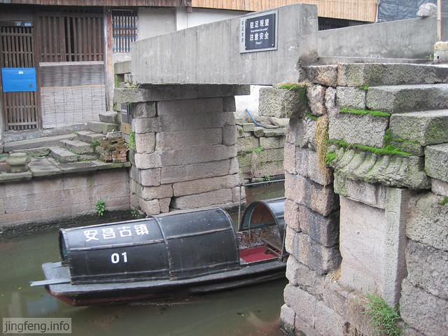

听说在安昌古镇，腊月里有很多民俗表演，是古镇最迷人、最美味的时刻。廊棚下则挂着一串串浮泛着盐霜的腊肠、酱肉、青鱼、和酱鸭，暗香飘浮、撩人肠胃。可惜现在没有“社戏锣鼓伴月升，腊肠香味随风飘”的风景，只看到一面“扯白糖”的旗。

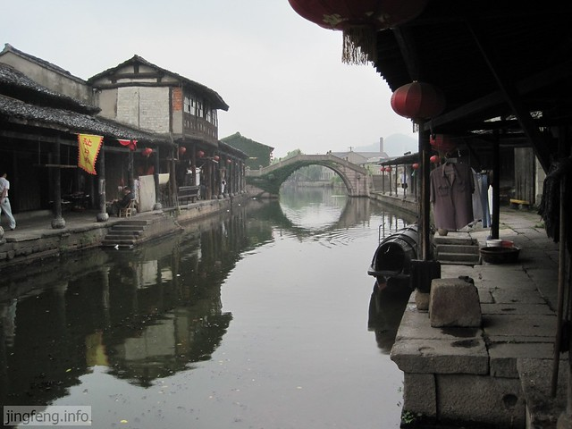

一路走去，见到白墙上有硕大的“仁昌酱园”四个字，这是始于清光绪十八年的酿造园，也是安昌古镇的特产之一。

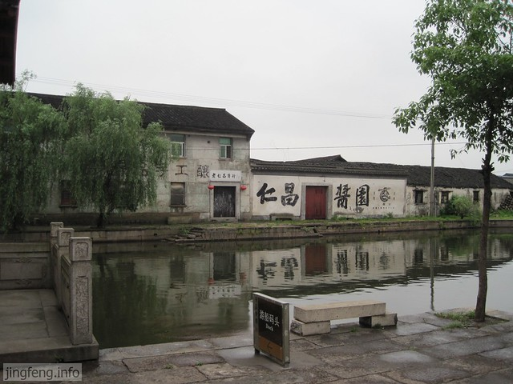

廊棚下挂了很多大红灯笼，还有晾晒的衣物。

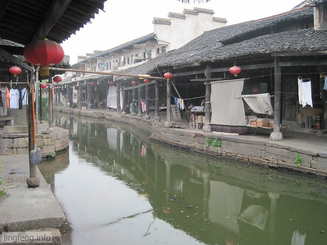

古镇宁静而悠闲，徜徉在石板路上，头戴乌毡帽、摇着乌篷船的船夫用方言招呼游人前来乘坐。

古镇安昌地方不大，游人也不多，但有着古镇居民最质朴的生活感受。

安昌也为水乡古镇，以河道为主体，一座座小桥精致的石桥，乌篷船穿梭来往。古镇沿河建街，河道两侧的店铺作坊鳞次栉比。曲折幽深的小巷里那肃穆凝重的老台门诉说着历史的沧桑与过往。

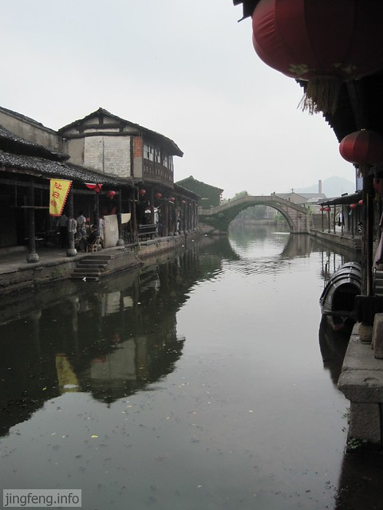

我们说，安昌古镇平时过来感受一下也好，只是习惯在繁华闹市的人真要是住在这里，倒也无趣，这里的生活真是太简单质朴了。

行走途中，我们看见河边一处饭桌上，有一位穿着土布长衫、戴着旧毡帽，留着长长的花白胡子的老头，他喝着黄酒，吃的小菜，一幅蛮享受的样子，吸引了我们的注意。后来再见到他，已是酒足饭饱，在河边来回溜达。

回来在网上看才知道原来他叫沈宝麟，还有很多人像摄影图片，因为独具特色，已成为安昌古镇对外宣传的形象大使。介绍说他在古镇开了一家宝麟酒店，只可惜我们当时没有注意到他家的酒店，匆匆而过。

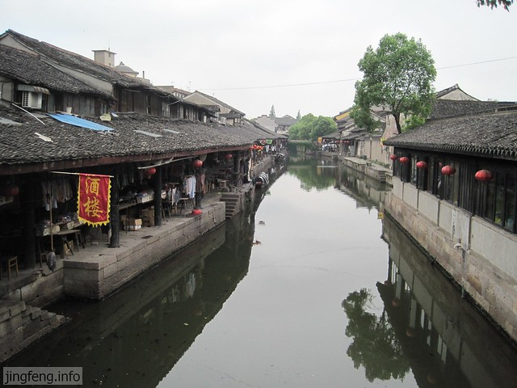

时间已到晌午，包子铺的蒸笼里冒着蒸汽，沿河店铺上的人家已经开始做饭了，还有三三两两生起的蜂窝煤炉子，虽然没有炊烟袅袅之意境，倒是有阵阵香味扑鼻，透露着浓厚朴实的市井风情，我的肚子更是咕咕叫的厉害。

于是我提议选择在一处沿河的小饭店，尝尝安昌特色腊肠，看流水人家，也算体验古镇生活吧。等了一会儿，饭菜上桌，端上来的腊肠是直接切盘的，吃起来味道还不错，肥瘦相间，原滋原味，它不同于以前在超市买的那种有很多的添加剂，只是吃到后来，剩下些许肥肉占据主导地位的腊肠片，吃起来有些腻歪了。

当时还点了一盘炒青菜，虽然不是特色菜，但是我和hillway一直赞成这是我们吃过的最好吃的炒青菜了。写道这里还是要说一句，特色小吃并不一定都符合自己的口味，要调整好心态，在[鲁迅故里](https://www.jfsay.com/archives/278.html "古越绍兴游")的时候，因为我们俩从来都没有吃过臭豆腐，就买了一份，真是闻起来臭，吃起来更臭呀，而且还有些涩涩的感觉，这辈子再也不尝试吃臭豆腐了。

吃过了午饭，我们踏上归途，再见了，安昌古镇。

有关[安昌古镇的乘车路线](https://www.jfsay.com/archives/278.html "古越绍兴游")已在上文中介绍，最后附上古镇游览图。

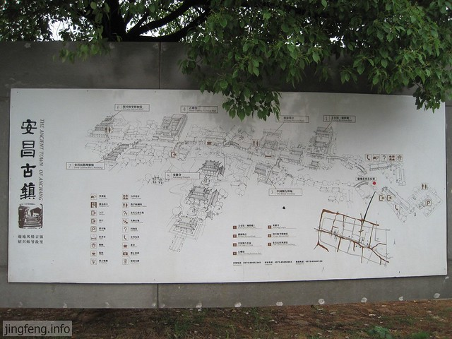
