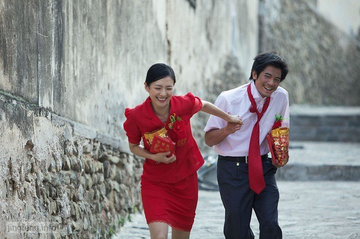

下午一个人看了《最爱》。

这是一个沉重的电影题材，众星加盟，每人都想去颠覆以往的角色，但却像是一场闹剧。最出彩的要到后来，赵得意和商琴琴住在一起的那段日子，没有恐慌，没有任何药物，没有怨恨，由于身体的疾病，死亡慢慢临近，他们看到的只有嫌弃、唾弃、恐惧，唯恐避之不及。他们是不幸的，而幸运的是最后善良的两个人走到了一起，相互依偎、相互照顾，享受生命最后的时间，从此不再孤单。

伦理不容的两个人，毫无顾忌，看似无所谓别人的眼光与唾弃，但是商琴琴心里还是想要和赵得意结婚，名正言顺地活在一起，葬在一起。在无情残忍的大环境里，两人演了一场浪漫的爱情戏。

影片最感人的地方，不是患病之人的离去，而是商琴琴拉着她的丈夫，揣着喜糖和结婚证，用心打扮，穿着喜庆的红衣服，挨家串户告诉乡亲们他们结婚的场景。

最开心的时候，也是最难过的，商琴琴近乎贪婪地，一遍又一遍地念着他们的结婚证，念着念着眼泪就下来了，她心里明白，剩下的日子不知道还有多少，弥留的日子还能有个人陪在一起，有多好，有多难，这种幸福又会是多么的短暂。

夜里赵得意热病发作，琴琴尽力守护。天亮了，琴琴却先走一步，得意也不愿意活下去了，本就离死不远，何况最在乎的她都已经离去，他用刀不断砍向自己的大腿，血流满地，他用自己的血给琴琴染了一条红裙子，也了却了自己的生命。

不是最爱，是不得已的爱，爱的如此艰难，所以绚烂。

生命完结，剧终。
