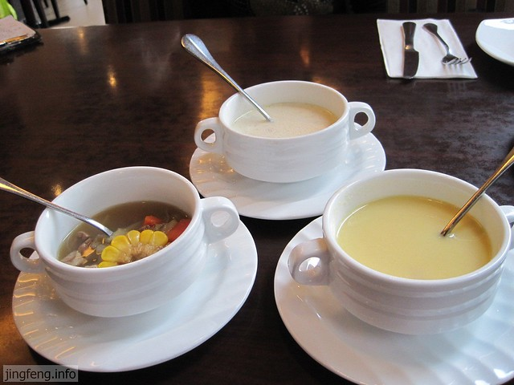
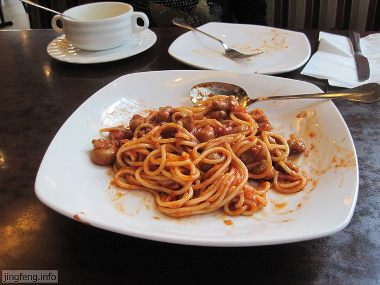
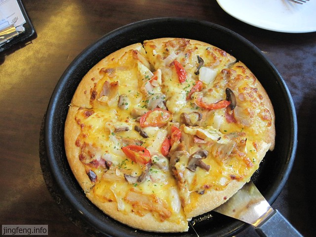
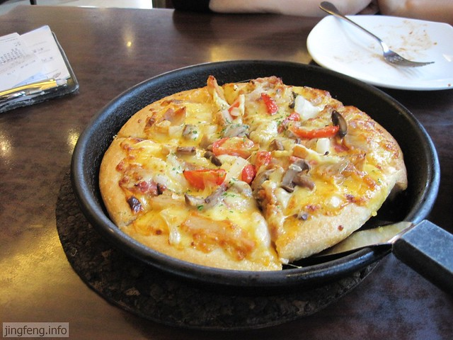
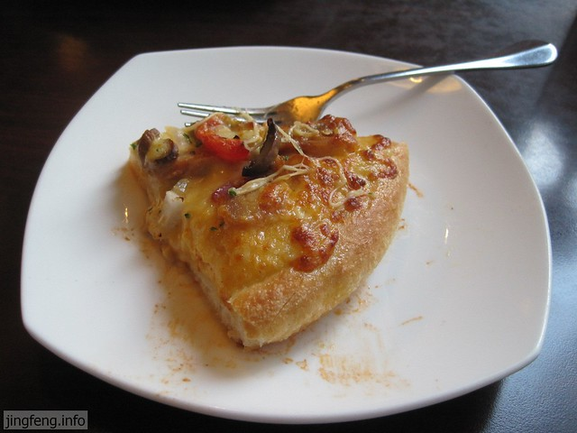
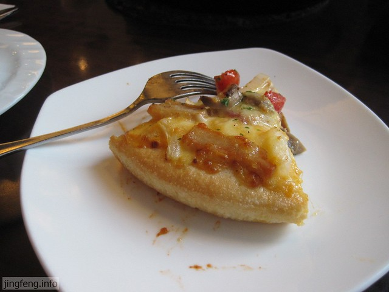
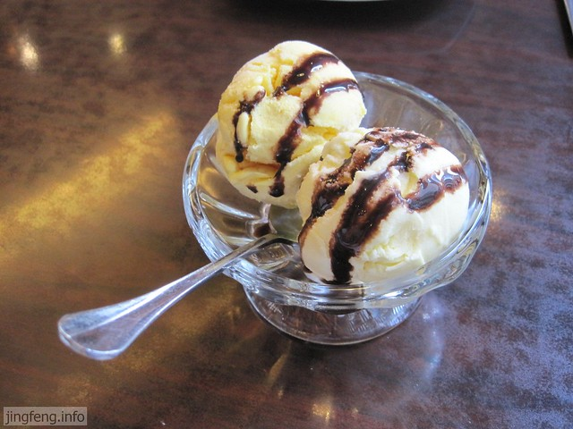

来必胜客吃批萨，是3月底室友的一个许诺。现在距离毕业仅有半月之遥，那个许诺的前提虽然没有实现，但是室友还是坚决要了却这桩心愿，她说毕竟以后在一起的机会很少了，毕业前再聚一次吧。

我和hillway从来没有进过必胜客，也不知道正宗批萨的庐山真面目，对于这家餐厅，我们是陌生的，新奇的。这让我想起两年前的时候，我们三人一起来市区体验牛排的情景，那时候也是我们俩人的第一次见识牛排。时过境迁，两年前，我和hillway初结识，缺少恋爱经验，还记得室友在饭桌上亲切“教导”我们如何正确处理学习与恋爱的时间分配，如何相互沟通与体谅……现在的我们，又要一起去面对未来的人生，有着些许不安与躁动，在饭桌上，室友还是像两年前的时候，给我们提供去新的城市生活的建议。这三年里，她就是我们身边一位亲切和蔼的姐姐，总是甜甜宽厚地笑着，虽然也经历过一些波折，总还想着为身边的人操心出主意。希望她能过得轻松开心，和懂她的人一直幸福生活下去。

说说我们的晚餐吧。

先是端上来三分汤：欧式精炖牛肉汤，培根土豆浓汤，火腿玉米浓汤。我们还以为多大的碗呢，原来只是一个小杯子，感觉好不实惠呀，这三杯汤快赶上我整整一个星期的伙食费了。嘿嘿，hillway看见又该说我抠门了，不过我认为还是要勤俭持家，这种东西还是偶尔体验一下就行了，也就是吃个感觉和气氛，不实在。

个人认为培根土豆浓汤和火腿玉米浓汤有些偏西式的口感，不是很习惯。还是最左边那碗牛肉汤比较好吃，口味和中式相似，牛肉比较多，同样的价格相对来说更实惠一些。而像我喝的那晚玉米浓汤，除了杯底的几粒玉米，也捞不出什么东西了。而且这里的餐具磨损的有些厉害，并没有想象中的精致。

经典意式肉酱面，这个也是第一次吃，不管的是肉的口感还是意大利面的味道，总觉得有些怪怪的，很像以前闻到的一种味道，总是回忆不起来。不能说这份意大利面做的难吃，只能说不合口味吧。别人称赞的东西不一定都是好的，还要自己去体验才能发现。

我们那边是以米饭作为主食的，以前在家很少吃面食，后来听hillway讲，其实郑州有很多好吃的面食，食材不在于还不好吃，而在于会不会做。后来出了那个小城，吃到学校外面的四川砂锅面，让我“口目一新”，原来面条可以有这么多的味道，配上蔬菜和肉呀，才发现家里面的白水面条不好吃的原因了。

今天的主角登场：新奥尔良风情烤肉批萨，可谓是千呼万唤始出来，差不多意大利面和浓汤都要喝光了。和之前的三碗汤一样，比我们想象的规格要小很多。

以前总是听人讲“批萨”，后来才知道是一种把馅放在外面的外国饼，心里总是很好奇，到底是什么味道？有多好吃呢？

后来走过的城市越来越多，吃到的小吃也日渐丰富起来，才发现所谓的经典与特色好像也只是just so so。大家现在物质生活水平提高了，不像以前吃的东西少，吃起啥来都觉得香了。记得前年一位永康的同学给我们带来他们那边地道的永康肉饼，猪肉霉干菜做馅（金华酥饼大多也是这个馅的）。她说以前大家日子穷，很难吃到，所以感觉永康肉饼很好吃，现在谁还买它呀，也就是拿来让你们尝一下。

室友问我，吃起来和你想象的一样不？我说，没有想象，只是期待。

之前我们在学校北门西饼店买过一次[批萨](http://www.jfsay.com/archives/104.html "第一次吃批萨")，hillway咬了两口就开始哇哇叫，他说一点都不好吃，而且很不划算。所以今天暗中比较一下，这个因为刚上来，热腾腾的口感更好一些，不过也并没有好吃很多，主要是上面的酱比较特别，下面就是一个普通的油饼。

因为是周末，来必胜客的人比较多，还有一些在门口等候座位。以个人感觉来看，这里的食物并不是很好吃的那种，大家来这里大多是吃个品牌和氛围吧。要说好吃的东西，其他地方可是多了去了。

饭后室友安排有双球冰淇淋，芒果+香草味道。个人感觉香菜味道的更好吃，很冰很甜，可惜这两个球球，还来不及怎么吃，很快就要溶化了。虽然价格不便宜，听室友讲，这比哈根达斯一个球球卖到25元还是划算一些。

总体来说，我们对西餐和日韩料理并不认同，还是喜欢地道的中国菜。饭后我们一起逛了沃尔玛和乐购，然后乘校车回校了。
