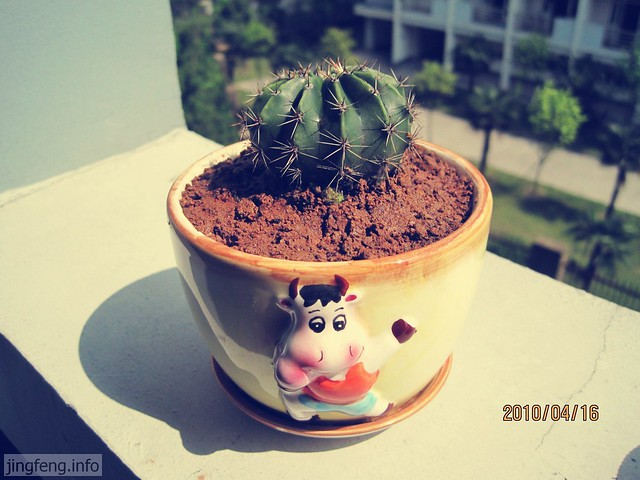
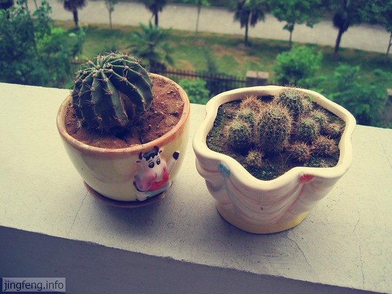
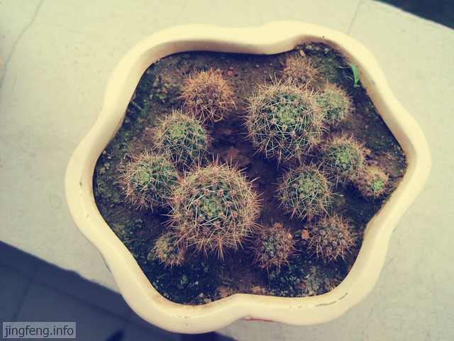

前年秋天，说是为了减少电脑辐射，买了一个[仙人球](http://www.jfsay.com/archives/148.html "盆栽和咸鸭蛋")回来。但是却一直放在窗台任其自生自灭，几乎从来没有搬到电脑旁。

其实有很多东西都是这样，后来的时候完全不是当初的样子了。现在拍下它，只是想以此为代表，来纪念这三年里陪伴我的小东西吧。我一直没有养花养草的闲情雅致，粗线条的我几乎无暇顾及它们的死活，竟然顽强的活了下来，还有些模样，真是难得。

买来以后，以为它会越长越大，结果四个月过去了，它还是原来的个头，只是在刺身上冒出几个小球球，开始没去管它，后来仔细一下小球球竟然冒出了细细的根须。一年多的时间过去了，它陆续孕育出了十几个新的生命，我把这些小球球移到另外一个盆里，簇拥在一起。

去年有一次晒被子，不小心把它碰掉了，仙人球开裂了，盆也缺了一块儿，不过还算结实。<!--more-->

这13颗小球球，中间的两个呈现出一幅茁壮生长的派头，一身的小刺，绿葱葱的很可爱。临近毕业，转手给了别人，不知道它现在是什么样子，只盼望着这些灰突突的小球球能够像他的哥哥姐姐一样快快成长起来。

