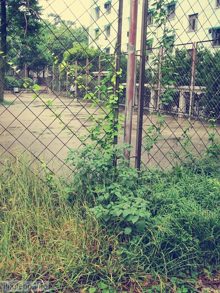

晚上，与某某聊完电话，不由想起以前的那些人情世故，心情越难以平静，五味杂陈就是如此吧。

忽然感到压力好大，很累。

一个阶段、一个阶段的慢慢走过来，不断去努力实现新的目标。然而有时候，目标达到了，还没有高兴起来，却总有一堆因素跑到面前，在脑袋里嗡嗡叫，不得安宁。于是开始患得患失，去给自己去设置一个更高的标杆，拿它和自己、和别人比较。

人总喜欢去和别人比较之后，再来界定自己的生活质量，或喜或忧，而拿来互相比较的标准却常常都是一些冷冰冰的东西。

在比较中胜出者，往往自鸣得意，沾沾自喜，冷眼旁观。有人是默默比较，偷着乐呵；有人却唯恐天下不知他的斤两，到处宣扬，逢人便讲，而且还具有超强屏蔽听众态度的能力。

天外有天、人外有人。有些时候，却是处于劣势的。或自卑、或愤愤然，勾心斗角，诋毁一番。

忽然想起《红楼梦》里，跛足道人唱的那首《好了歌》：

> 世人都晓神仙好，唯有功名忘不了；古今将相在何方？荒冢一堆草没了。
> 
> 世人都晓神仙好，只有金银忘不了；终朝只恨聚无多，及到多时眼闭了。
> 
> 世人都晓神仙好，唯有姣妻忘不了；君生日日说恩情，君死又随人去了。
> 
> 世人都晓神仙好，只有儿孙忘不了；痴心父母古来多，孝顺儿孙谁见了!

凡事看淡一些，有时候过得不痛快，不是别人的原因，而是自己没有调整好心态，羁绊太多，患得患失，不愿放下。曹雪芹在亲身体验了大家族由兴盛到衰败的苦痛，在潦倒后得以反思。看透的时候，不过是“满径蓬蒿”，“举家食粥”。曾经的荣华富贵，什么也都没有了。

常常说，自己感到知足就好了。守着小幸福，经营自己的小日子。但是“放下”二字又谈何容易呀？刚把心态摆正，总有事情发生、总有人在耳边乱哄哄，不得安宁，反反复复。那些所谓闲适之人，说什么“宠辱不惊，看庭前花开花落；去留无意，望天上云卷云舒。 ”人非草木，岂能无情？尘世之中，又岂无世俗？在羁绊时念上几句，只不过是暂缓罢了。 到头来，还是这样的生活，去争、去想、去比较……

