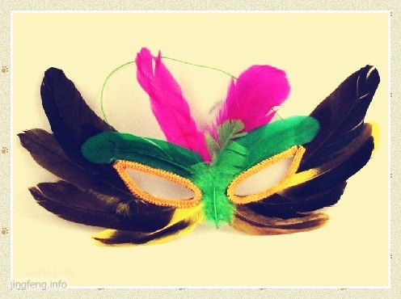

今天和我妈闲坐聊天，看着手中的羽毛扇，想起了六年前我们一起粘羽毛面具的情景来。

那年暑假，家属楼里有几位阿姨利用空闲时间，常去一个代理点领些做面具的材料，做好后按数量交上去领钱，也算贴补家用吧。负责人不要求面具做的多少、快慢，全凭自己的安排。我妈当时有些空余时间，也想试试。我看着好玩，便和我妈一起去领材料回家来做。

时隔多年，我在网上搜索“羽毛面具”，形态各异，比那时多了很多的花样。翻了一会儿图片，终于找到我们当年做的那种样式的面具了。

做面具的材料有：白纸板（就是下图面具背面的那种压制成型的纸板）、浆糊、橡皮筋、各种颜色和形状的羽毛、透明包装袋、眼线绳。

回家以后，按照面具成品的外围大小，还要再用硬纸板做一张形状模型，固定在桌子上，以免面具粘的过大或过小。在模型的眼角、眼窝处钉上四口钉，制作时，将白纸板放在形状模型上，眼睛位置重叠放好，套在四口钉子上，起到固定的作用。

我有时就容易犯眼高手低的毛病，当时领材料时兴致冲冲，也没有认真听人家的指导，心想这结构又不复杂，一看就会，不用怎么学的。开始因为只图一时好玩，也不管三七二十一，回来粘上几个之后，就厌倦掉了，而且发现粘的时候也并不顺利，速度也很慢。粘好几个面具以后，我和妈妈拿到负责人那里去，还被数落一番，说我们用料太多，别人粘一边脸就用四根毛，我们却用上五、六根。而且浆糊刷的又多又厚，眼线也贴的形状不够规整，整体看上去反正是毛病多多。

回来以后，虽然心里被数落一番，不是很痛快。看着既然领回来一堆材料，想想还是坚持下去吧，虚心向楼下阿姨请教些经验，自己又反思了一番，算是有所改进了。

粘面具看似简单，其实做起来还是有一番周折的，制作时也有一些技巧在里面。因为不是只做一个、两个，而是要求批量化，就需要先做好统筹准备工作，先做哪一步、后做哪一步都要安排好，这样才能节省时间，提高效率。

首先，要把领回来的一堆橡皮筋按照长短剪成若干段，穿在白纸板上。要是等到前面羽毛都粘完，就不容易穿橡皮筋了。

接下来，为了提高粘羽毛时的速度，就要做好羽毛分类整理工作。这些染成五颜六色的羽毛，只是按颜色分别装在几个大袋子里，但是却形状各异，要加以整理，以免在粘的时候还要在一堆乱糟糟的羽毛里找来找去。

1. 左右朝向：将羽毛正面朝上，按照左、右朝向不同分两个袋子装好，以便粘面具左、右脸的时候取用。
2. 弯曲程度：弯曲程度比较大的适宜放在眼睛下方的位置，平直一些的适宜放在眼睛上方周围。
3. 柔软程度：一般来说，硬度大的不适宜作为眼睛上方的那根羽毛，要选用柔软、稍大一些的，有时还要略作修剪。
4. 完整程度：有些残缺破损的羽毛是不适宜粘在面部和眼睛上方的，但是修剪一下，用来做头顶上两支装饰羽毛，或是贴在鼻子的部位还是不错的。这样可以充分利用，减少浪费，让形态各异的羽毛都发挥一定的价值。

分类整理好羽毛之后，就开始粘了。用小刷子刷取适量浆糊，均匀涂在白纸板上，将功能不同的羽毛贴在相应的位置上就可以了。贴的时候也是要注意先后顺序的，比如说先贴左右脸部的羽毛，然后是头顶上的两根，其次是眼睛上方和鼻子部分的。

羽毛全部贴好以后，就可以贴眼线了。做眼线的绳子比较宽，一大团，拿回来要自己用剪刀从中间裁成两段窄线条，然后再按照眼睛外沿的周长剪成小段。最后，将这些剪好的眼线涂上浆糊，沿着眼睛的形状粘上去就算做好一个面具了。

粘好之后，再将每个面具分别装入透明的包装袋里面，就这样，一个羽毛面具才算真正完工。

那个暑假里，从开始的好奇到后来耐着性子，才发现赚钱真的不易。整个一个羽毛面具做下来，也就是几毛钱。真正体会到钱是一分一分、一角一角赚出来的那种感觉。我后来和同学讲到此事，有人说我们为什么去做这么廉价的劳动力，以我所学到的知识，完全可以去做别的事情，赚钱也更快、容易。这样讲也不无道理，我们已经上了这么多年的学，应该去从事脑力劳动才更能发挥价值。但是通过这个实践，我也明白了平常老百姓的不易，要是没有技术、没有学历，他们只能去从事这种简单、机械的体力劳动，有些甚至十分繁重，早出晚归、披星戴月，拿着低廉的报酬，一点点地积攒维持着生计。我想，我们应当更多一份关怀，当在享受他们的劳动成果的时候，应当更多一份尊重与珍惜。
