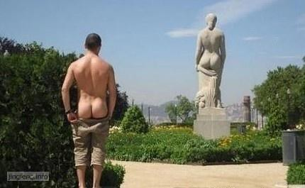

终于下班了，以最快的速度跑到公交车站牌处。有几次我等了近一个小时才等到我要的公交车，这么小的城市还会出现堵车的现象真的是不可思议。不过今天还好，等了几分钟就看到傻傻的公交车从远处缓缓地驶过来了。

爬上车，同样以更快的速度往车尾跑，一般尚留的座位会在车尾，即使没有座位了，那里也会最先出现空位。还好，看到了一个空位，可能是速度跑得太快，来不及刹车往前多跑了一站。

等我坐下，等待笨重的公交车启动。可是它扑哧扑哧地“欲走还留”，这时我发现前门处上来一位头发花白的老头从车厢底部冒了出来，他颤颤巍巍地掏出公交卡，刷卡之后往我这边走来。我以为他要坐在我旁边，不过还好他坐在我前排了。这时车终于启动了。

又过了几站路，车上上了些人，最后只剩下这位老头傍边的一个座位存在了。这时上来位同样是头发斑白的老太太，她朝老头的方向走过来。老头坐在外面的座位，却没有往里挪动的意思。老太可能看出了他的心思，没有强求，死命地抓住了旁边的护栏，可能太过用力，身体扭了个弧线，差点摔倒。

又从前门上来位花枝招展的女的，打扮地光彩鲜艳，两条修长的雪白大腿在夏日的阳光里更显耀眼。这时老头往里面的座位挪了进去，把外面的座位空了出来，然后用僵硬的头直勾勾地向该女行注目礼。此女往这边走来，就在她快要走到空座位时戛然而止地站到了门口处的钢杆处，此时老头子怒放的心忽的被浇灭了。

