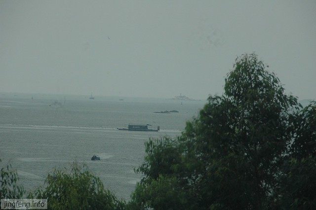
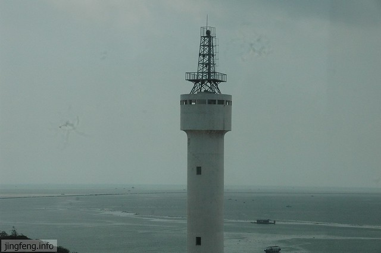
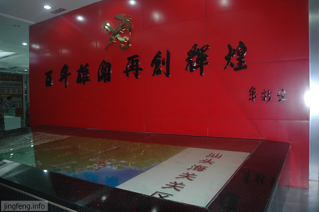
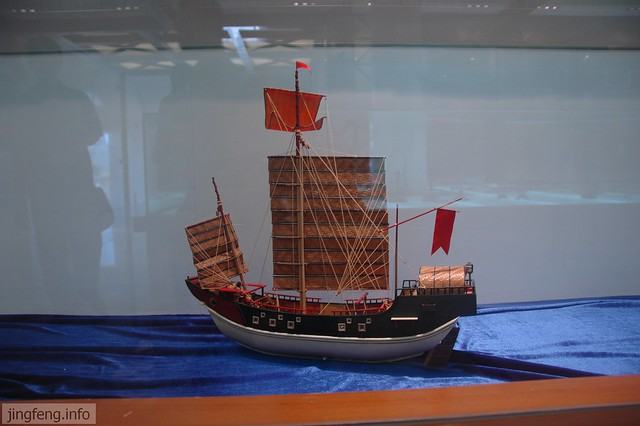
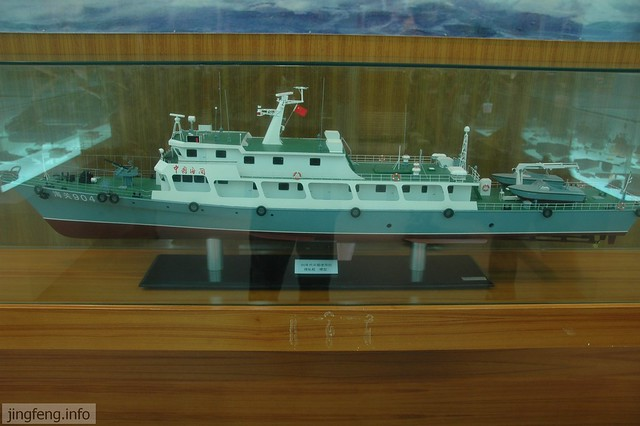
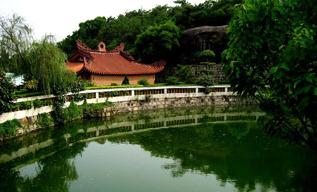
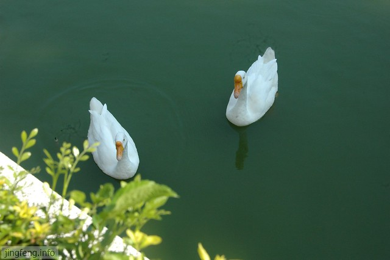
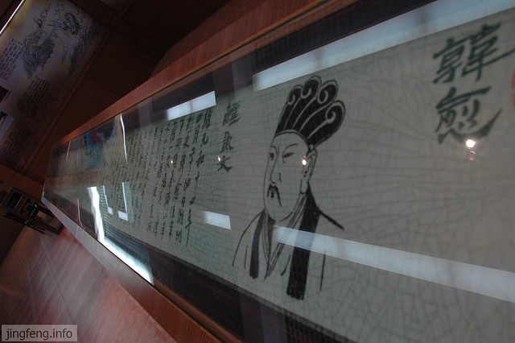
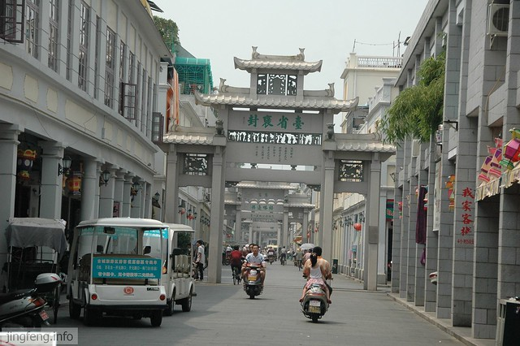
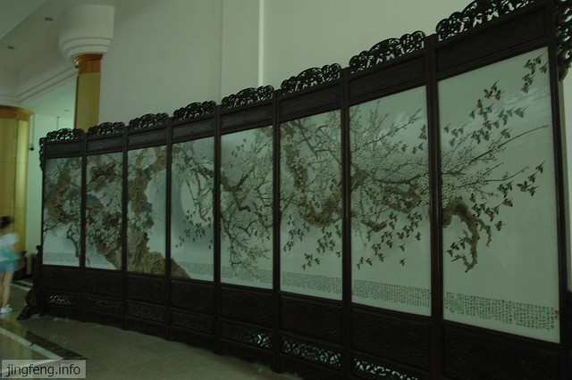

夏天确实不是个好的游玩季节，热乎乎的天气还是呆在冷气房间里舒坦，外出除了戏水其他的真的提不起什么兴致。可就是在这个夏天，游了汕头的几个地方。

汕头是个海滨城市，离市区不远就能看到海的踪迹了。我第一次看海是在去年去海盐的时候，虽然那天的天气阴沉沉的，虽然那天的海水浑浊地泛黄，虽然那其实不是海而只是杭州湾。

海，一大片的水，望不到边，偶尔有大的或小的船停留在水面，远处或许能看到雾气。

<!--more-->

1、汕头关史陈列馆

汕头的历史是和开埠分不开的，也可以说正是汕头的开埠经商成就了以往汕头的繁荣。今年年初我去了[汕头开埠陈列馆](http://www.jfsay.com/archives/242.html "汕头的老房子")，那里主要是介绍汕头的历史，当然离不了被迫开埠既屈辱又掩饰不住兴奋的娇羞。

这次去了关史陈列馆，它主要是汕头海关的历史过往的展示，几乎没有提到汕头的以往繁荣。这里也是汕头海关（前身潮海关）钟楼的旧址。

2、巨峰寺

巨峰寺是个山不高、寺不大、佛很杂、人不多的寺庙。这里大大小小的佛散落在各个角落。到处是在树荫下休息打牌的人群，给本来就没有“神气”的寺庙减少了灵气。

但是，巨峰寺的风景还是相当不错的，可能是因为游人不多的缘故吧。如果不为拜佛只为赏心，这里也确实是个不错的地方。

往背山处上去，可以发现许许多多的景点指示牌，告诉东南西北的旮旯里有神奇的东西。可是当找来找去找到那里才感觉被骗的感觉，根本就没什么嘛，为什么被描述成那样。或许有人会说，你没有慧眼，看不出这里的妙处。

3、韩文公祠

唐朝韩愈的祠堂，在门口看到这里是、AAA的景区而且门票二十元，心想着里面肯定大有好玩。

等到出来才知道这里完全是个图片加碑刻的陈列馆，从唐代到清代到处的碑记，从民国到现在保存的图片。

不过亮点可能是里面的“廉政建设馆”，极其丰富的图片介绍，极大地凸显韩愈的廉政。这时我才知道原来这里的韩愈就是廉政的代表，或者可以反过来说这里的人们用廉政形象来利用韩愈。古往今来的为官者无不以廉政为荣对外树形象。

4、牌坊街

来牌坊街之前想着那牌坊是什么东西呢，早就听说过“是个妓女还想立个贞洁牌坊”的说法。来到后才发现，牌坊就像一座大门刻上字，牌坊街和普通的街的不同是街面上有许多的刻字大门。

不过这里的牌坊都是现代人做的，古代的牌坊早就不存在了。

5、瓷都博物馆

我真的不知道潮州是个瓷都，我以前只听说过景德镇的传说。不过这里的瓷都博物馆是个大大的地方，陈列了大大小小的瓷器，虽然我看不懂也看不明白，只是走马观花地看了一遍，没有太大的映象。

