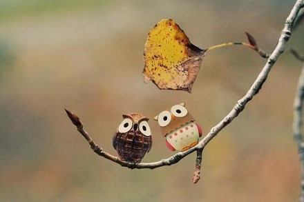

我的师弟是湖北黄冈人，当他自我介绍时，我们都很惊讶地说，黄冈考试很厉害的呀。他笑笑地说，没有以前厉害了。

师弟的行为举止十分低调，不好夸谈，喜安静，懂养生。他的大部分时间是独自在宿舍看书，做研究。有次和他一起吃饭，满大桌子的菜他只略微吃了点青菜和鱼。之后才知道，他从不吃辛辣，不吃鸡，爱吃鱼。

我有事托付给他办的，他都会办好，也不会计较。当然，我自己能办的事情还是会自己去办的。

毕业时匆匆地要走，留下了一大摊子的东西没有收拾。师弟到我宿舍把所有的东西打了五个大大包裹，搬到自己狭小的宿舍里，一放就是三个月。

我私下里想着，如果是谁放这些东西在我宿舍，我会不会看着他们就来气，然后踢上几脚呢？

等我安顿下来，赶紧让师弟把包裹寄过来。等他寄来，我才发现，当时走时给他留下的钱根本不够邮费的。

一辈子能遇到些好人，能真诚相待就好。师弟也该毕业了，但愿他论文能早日做好，找到一份好工作。

