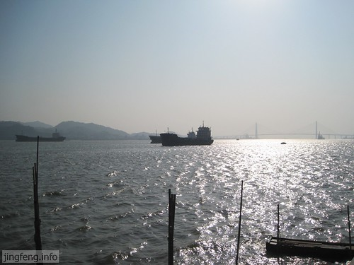

以前在学校想着以后要是上班了就可以每天和Jasmine在一起了，到现在上班也有一个月了，总觉得和Jasmine在一起的时间好少好少。每天下班回来做饭吃饭后差不多就八点了，然后我们或者看看电视或者上上网，约莫到十点钟就要睡觉了。第二天醒来就要上班离开，直到下午下班才能见到Jasmine。

周末的早上我俩都想好好休息一下，不愿起来，想好好把上班早起的觉给补上来。第二天的周日，不想再在屋子里度过了，于是我提议到海边去玩玩。Jasmine开始并不同意，她说那里有什么好玩的，还不如去逛逛街呢。

在我们上公交车之前，Jasmine还是决定去海边。其实我们要去的海边，我每次早上上班都会经过那里，都能看到好多人穿着裤衩用毛巾擦着身子，也能看到更多的人在那里做肢体运动。但是旁边的海水我一直都没有见过。

今天领着Jasmine到了海边，一阵阵凉爽的海风迎面而来，吹走了在车厢中捂的热气。

我们沿岸而走，看着海中的大轮船Jasmine兴奋不已，照了不少照片。

看过海，我们要去超市购物。凭我的直觉感觉超市应该离我们不远，于是我提议我们走路去吧。可是走来走去，就是看不到超市的边。不知不觉走了好远的路，身体吃不消，又累又饿的。

最让我欣慰的是Jasmine一直陪着我的身边，虽然嘴里一直在嚷着，可是还是和我亦步亦趋的。我当时想到以前和Jasmine在一起走漫漫长路的情景，一股暖意直达心底。能有一个傻妞无怨无悔地陪着你漫无目标地往前走，这就是幸福。

又走了好远的路，Jasmine对我说：“你今天要是能带我到达目的地，我就佩服你。”

可能是她走得太远了，开始怀疑我的能力了。我鼓足勇气地说：“没问题，再走一会儿就到了。”

我带着她穿街走巷，走了八站路，在我们转角的时候遇到了超市。

