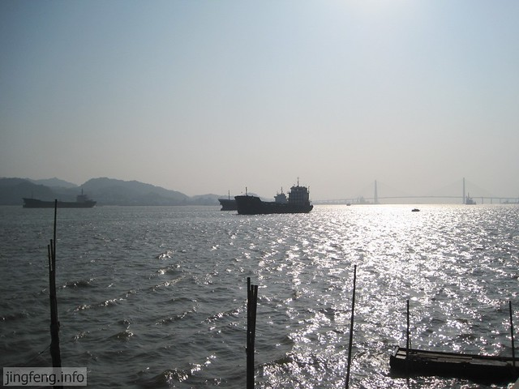
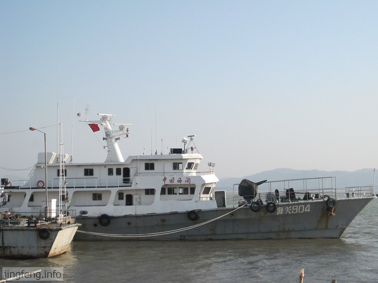
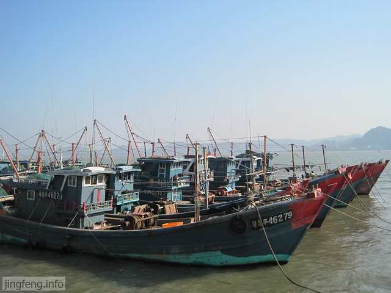
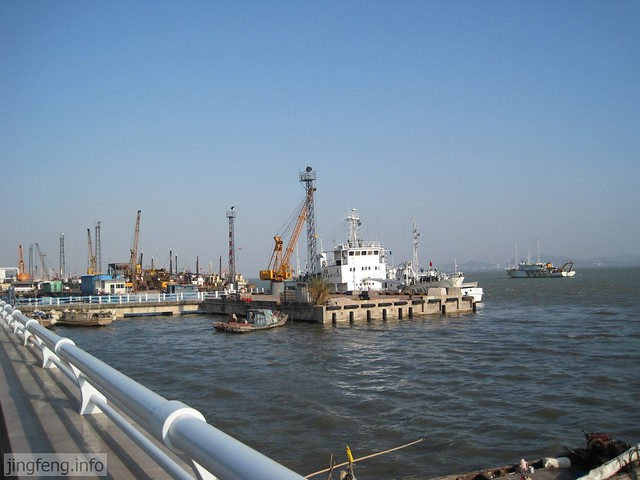
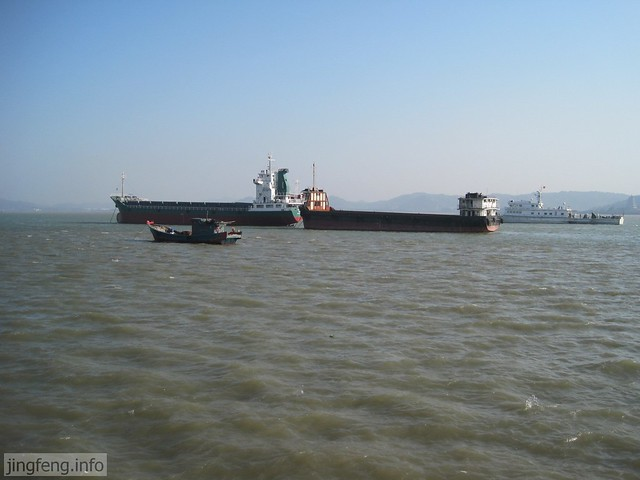
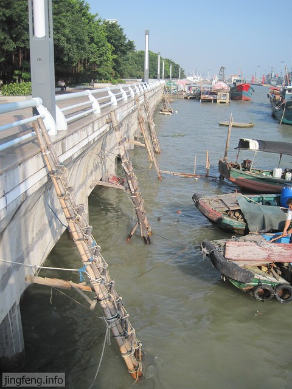

不知怎么了，这篇日记对于我来说，像是要完成的一篇作业。事情总是不能像预想的那样发展，总有一些情况会扰得我心神不宁，不知所措，也没有什么可去写。本来准备的好好的，现在好像又要去打破计划，重新开始实行另一种我不太情愿的方案，但是权衡利弊之后，也只有眼前这两条路可走了。

晚上在超市我们买了两块生牛排，回到家饥肠辘辘，我往锅里倒油开始煎牛排。还不忘模仿那些西餐店的服务生，问hillway要几成熟。他说：“这不是我想要几成熟的问题，估计怕是你没有那个技术，自己都不知道煎到了几成了，说了也没有用。”

好在拍了图片，来填补我文字的空白。我们周末去了海滨路看海，这是hillway的提议。虽然我对于下午三点出门去看海的提议不太情愿，但是又不想扫人家的兴，就跟去了。

当我走上台阶，感受迎面而来的凉爽的海风时，心情也愉悦了起来。到这里一起吹吹海风，也值了。当视野很开阔的时候，整个人像是被打开了一般，轻松了起来。

虽然我一个人来过这里好几次了，和hillway一起来看大轮船，还是第一次。

顺着这些自制的竹梯，开船的师傅可以爬到岸上来了。相对于后面的那些大船，他们的小木船相对来说比较简陋。其实渔民的生活也有很多的艰辛，总觉得我以前思考问题太过简单了，去羡慕别人的时候，只是看到了光鲜了一面。

hillway说这里离沃尔玛很近，我们顺着海滨路走走就到了，结果一走就走了好久，大概都有[八站路](http://www.jfsay.com/archives/402.html "八站路")的样子，走的我又累又渴。好在他的方位感很强，我们终于走到了目的地，就当周末锻炼下身体吧。我们开玩笑说：要是某某人的话，估计都要大哭一场了。

