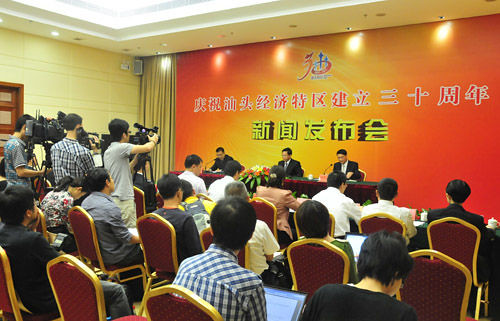

下午，我被派以记者身份到市委参加汕头特区三十周年的新闻发布会，这是我平生第一次。因为有写新闻报道的任务在身，之前我还一直担心自己速度太慢，在没有录音设备的情况下，记录跟不上领导讲话的速度。后来和有经验的同事聊天，他们告诉我其实不需要现场记录的，因为之前会给每一位记者分发领导讲话的通稿，只要把通稿拿回来就可以了，发布会就随便听听，不要做出格的事情就好。我顿时恍然大悟，原来以前在电视上看到的新闻发布会还有这一环节呀。

今天的发布会上，记者席坐的满满当当。快要开始的时候，一个政府的工作人员在我们之间穿梭，找到熟悉的几个人，往他们手中塞一个小纸条。这个环节也有听同事讲过，这些小纸条上是他们之前准备好的题目，到了记者提问的环节，就照着纸条上面的问题来问。记者纷纷举手的时候，内部的工作人员只会将话筒递向他们事先安排好的那几个人。提问环节小记者是轮不上的，首先就是中央电视台那位穿着低胸紧身小黑裙、挎着不知是真是假的lv包包、脖子上戴着金闪闪大吊坠项链的女记者。我想他们是出于万无一失的考虑，场面一派和谐，领导也能十分体面，但是总觉得像是在排演一场戏。

漫长的通稿朗读、又空又大的提问，一分一秒驱散了我刚开始的小紧张，变成了一种倦怠。我的大脑开始放空，漫无边际，很奇怪自己为什么会在这里，在这个半年前几乎与我完全无关的城市，参加一场地方意味很浓的新闻发布会，仿佛自己已经是这里的一员，好像又在漂浮，命运真的是太奇妙了，冥冥之中不知道我又会在哪里了。

晚上我们坐在小板凳上吃饭，调到地方台时新闻里正在报道下午的这场发布会，我故作兴奋地趴在电视机前面给hillway指出哪个就是我，他比较平静，其实我也很平静，只不过是想演演戏罢了。

生活中，大家都在以不同的角色演出不同的戏。

