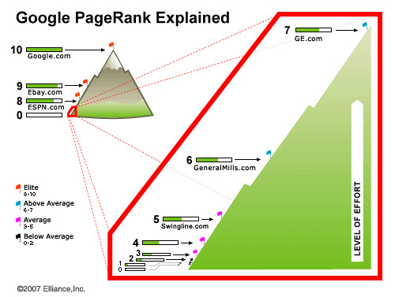

博客写到现在近一年半了，留下了425篇原创文章，今天偶然发现博客的PR值变成了3.不管怎么说还是略有兴奋的。

从一开始写博客，文章数量很少，来看的人也很少。每天就想着怎么能让更多的人来看呢，于是上网查些解决方法，一窝蜂的都是些SEO技巧的东西。说实话也曾痴迷过SEO的方法，想着法子优化再优化。什么上各大网站留言，发文章，撒链接，以及游窜于知道、问答、微博集散地等。在这些苦劳之后，确实也带来了个把流量，但体力有限难以维持，也就罢了。

也曾想着做个采摘站和垃圾站，这两者差不多，都是把网络上的文章放到自己的站上，只是垃圾站采摘的更杂乱更垃圾些，什么狗的猫的都不拒绝，文章格式混乱、错别字满篇、链接满天飞，让人看了就想去死。

拉来Jasmine一起写博客，刚开始她发布的文章有“Windows快捷键技巧”、“水煮鱼的做法”、“如何做美白面膜”……这些一看都知道是摘抄别人的，而且她发布时从来不加原始链接。在我苦口婆心的告诉她原创的重要性之后，她再也没有做采摘的事儿了，也把之前复制别人的文章用自己的文章替换掉。从这以后我们的博客中再也没有别人的文章，哪怕人家写得像天仙似的。

写作是有瘾的，在一篇篇的积累下达到了目前的数量。我和Jasmine有个爱好，就是打开[所有文章列表](http://www.jfsay.com/archives-index "所有文章列表")，回忆那时那刻的心情和事情。在看的时候，Jasmine总是说：“我发现那时候写得好烂。”我们也会复制文章的题目到SE中搜索，看看这样的题目会排在那里。可能是原创的缘故，一般搜索的结果都排在第一。

[我说过](http://www.jfsay.com/archives/311.html)，我们写文章不是为了流量、为了赚钱、为了搜索引擎。现在的PR值是3，虽然还是很菜，但是有进步就行。
