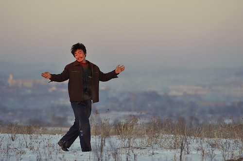

因为对王宝强演技提高的一丝期待，看了《Hello！树先生》。形象有所改变，但是还是矮矬穷的底层路线。

前面大半部分感觉不到什么特点所在，树先生就是一个邋遢烟酒不离的农民，自己不思进取，也不能怪人家看不起。令我不解的是，小梅竟然愿意嫁给他，就因为不能说话，竟然自己主动地一步步走进树先生，也许她太渴望一个男人了，但是终归还是离开。

后面的几十分钟，一改之前的农村现实主义作风，而变得相当诡异，人格畸形，进入荒诞又苍凉的魔幻中，让人想起了莫言作品超现实主义的风格，其丑态与愚昧又与韩少功《爸爸爸》中的丙崽异曲同工，这一段是前面大半部分的提升吗？总之感到很奇怪，它反映底层生活又加上上世纪八九十年代文学的味道，这到底定位给谁看呢？

