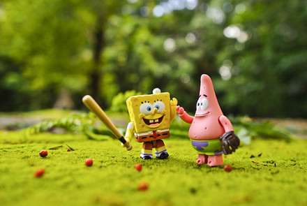

《海绵宝宝历险记》，hillway说这是小熊仔那个年纪才比较适合的电影，但是在我的坚持下，被迫陪着看了一晚上。

海绵宝宝和派大星不仅是童真未泯的孩子，而且智商也不是很高。当巨大的任务落到他们这两个小人物的头上，竟然稀里糊涂的就成功了，说明善良的小男孩在历经险阻以后，向大家证明自己是个男人的时候，又收获到了职称与赞誉。

这种故事情节是经不起推敲的，也不想去推敲。抱着消遣的目的来，就是为了一乐。不得不说，电影的很多细节十分搞笑。

最出彩的人物，在我看来，不是海绵宝宝，反而是他的死党派大星，这位同样智商不高，傻头傻脑的胖嘟嘟，总是会出现在朋友的身边，光着屁屁从天而降为他庆功，安慰受到打击的海绵宝宝，陪伴他经历凶险的贝克城……在困难面前，他质疑过是否需要前进，但是从来没有质疑过陪伴海绵宝宝的决定。最搞笑的是，在愚蠢的吸引杀手的注意力之后，竟然在混乱中令人意想不到地拿到了锅铲。

平凡而普通的小人物能够得一位如此缺心眼的朋友，一起犯傻，一起疯狂，一起面对人生的失意与困难……也是一件很幸运的事情。

