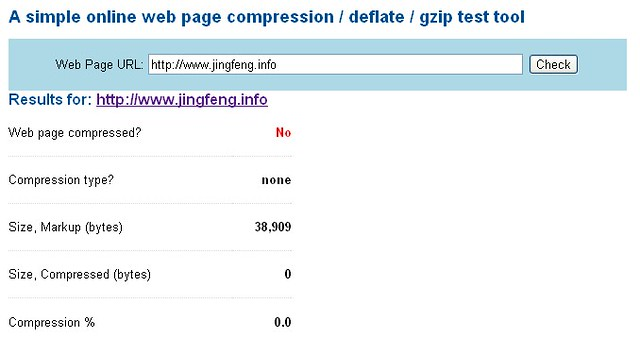
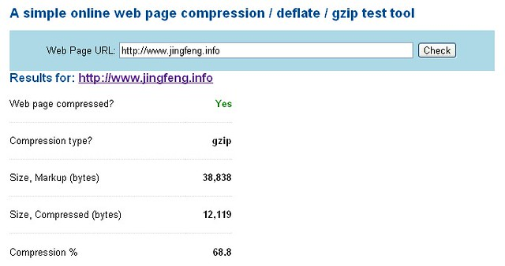

上个月末静风博客因为[流量超标被主机运营商挂起](http://www.jfsay.com/archives/437.html "静风博客流量超负荷，被管理员挂起")，这个月初启用了“缓存插件” Cos-html-cache，以求来降低流量。

通过每日的流量观察发现使用缓存插件并没有得到应有的效果，或者说效果不明显。之后使用网页Gzip压缩，效果出奇得好。

可以把Gzip看作是我们普遍使用的压缩软件的一种，比如Zip和Rar。一般的网页传输是把信息以非压缩的方式传送到浏览器中，而启用Gzip压缩之后，网页信息首先被压缩成压缩信息，然后传送到浏览器后解压缩成原始的信息。无疑，信息被压缩，数据量减小，在传输过程中流量必然减少（流量的单位是B，也就是传输的数据量大小）。

Gzip压缩可以降低网页传输流量，减少网页加载时间，但是会增大主机内存与处理器时间消耗。所以是否开启Gzip压缩应该因人而异。

启用Gzip压缩的前提是主机支持Gzip。对于WordPress可以使用Gzip相关插件，如：Gzippy。

Cpanel面板中本身提供了Gzip压缩的功能，启用的具体步骤是：

1\. 登录Cpanel, 点击"优化网化"。

2.选择“压缩所有内容”。

完成之后可以在在线查询网站是否启用了压缩，以及网页压缩的情况。Gzip一般可以压缩50%-80%的数据量，有效节省您的流量，提高访问速度。

下面是[静风博客主页](https://www.jfsay.com)使用Gzip压缩前后的效果对比：

1.压缩前的主页是38909字节。

2.压缩后的数据是12119，压缩率68%.

