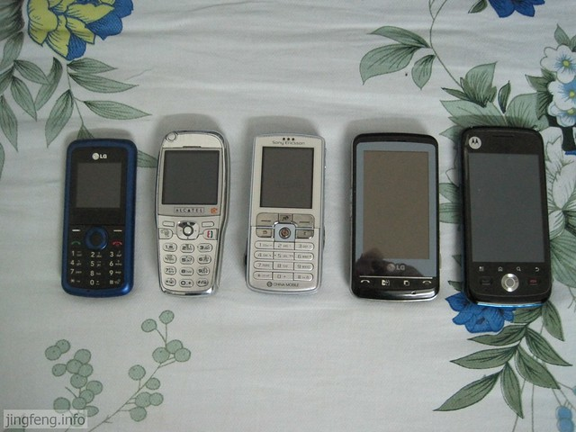
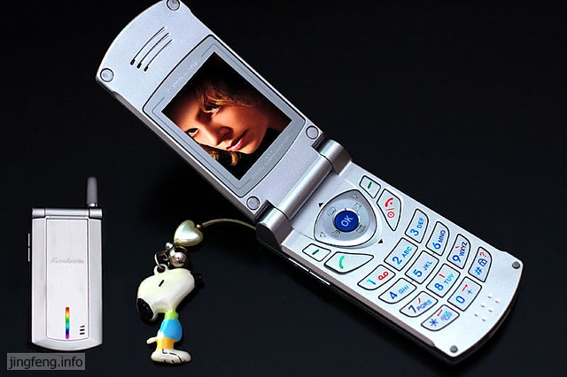
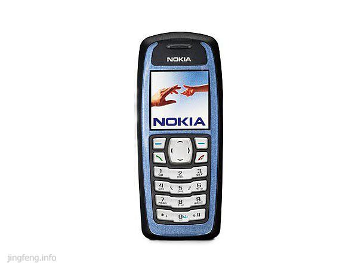
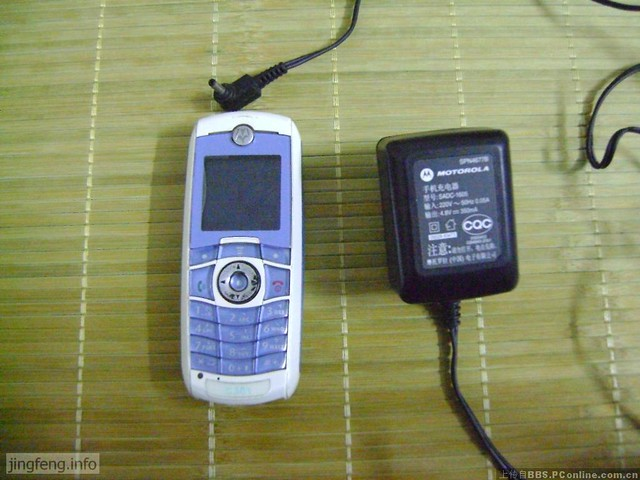
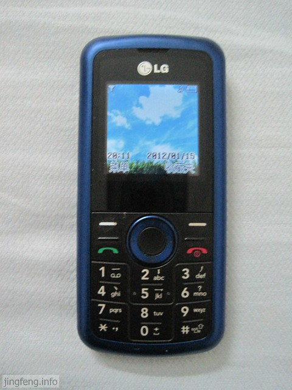
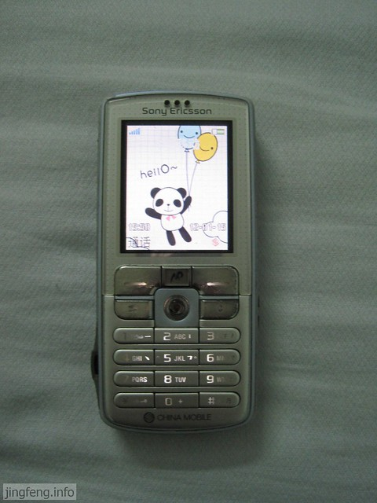
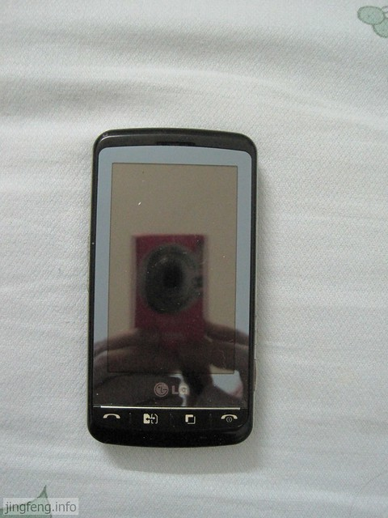
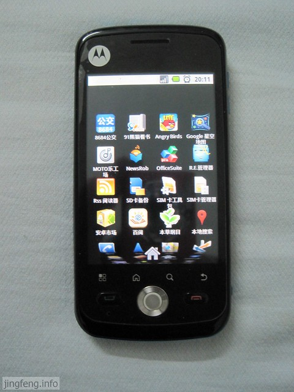

四天前到手了一台新的手机，这应该是我使用的第九个手机了。下面来回忆一下自己使用过的手机们。

**夏新A6**

2004年上大学，家里给我买了款国产的手机，那时手机还不算普遍，也可以说刚刚在我们县城兴起，用手机的不多。家人想着我要出远门上学，好联系我，于是给我买了手机。

这款手机并不便宜，要一千二百多块，几乎和家里的大型家用电器差不多钱，对我来说极其重要，因为我家的大型电器并没有几件，所以我也加倍爱惜。这也可见父母对我的不放心与牵挂。

夏新A6是一款外型看着还不错，几乎没什么功能，只能接个电话发条短信，而且屏幕色彩是单一的蓝色，而不是彩色。最让我记忆最深的是，本来在手机上设置好了妹妹的生日，等生日那天告诉她，她却说生日是昨天的。拿出手机那个狠啊，真想到法院去告夏新，万一别人有更重要的事情因为它的日历程序错误给耽误了，这损失就应该由谁来负责。

用了半年之后，这个手机在县城去火车站买票回来的路上被偷了，当时真的好伤心，一件大型的家用电器没有了。

**诺基亚3100**

接着就在郑州市的二手市场买了一部诺基亚的手机，当时看到它的外型真的好喜欢，一狠心就买下了。

说实话这个手机用起来真的很好，可以上网，可以下MIDI铃声，可以更换屏幕图片，可是就是电池不耐用。这时才知道，因为是二手的原因，手机的外壳是全新的，而机身却是旧的，电池当然不耐用。

无奈，同样在市二手市场把它给卖了。

**摩托罗拉C381**

卖了3100的钱又加了些钱，在学校买了部二手的C381，这应该是我目前用的时间最长，使用感觉最好的手机了。

买到手机不久，在摩托论坛中发现了“刷机”的乐趣，从此爱上了玩机。C381被我刷了不知道多少次，每次刷机过之后就有种买了新手机的感觉。

C381支持Java，机身有1.8M的内存，可以更换图片，下载MP3铃声等等。尤其在我刷机过后，把机身内存扩大到3M，又可以装好多自己喜欢的东西了。

这部手机我用了四年多，几乎没有出现什么问题，我也一直没想过要换。只是后来手机的后盖扣不上了，市面上也没有可以更换的配件，我被迫又要换手机了。

**阿尔卡特OT735**

就在我买新的手机之前，我用上了Jasmine的大头手机。这款手机我用了有几个月，感觉也不错。虽然没有什么功能，但是用着舒服。可能是“头大”，手机握着手感很好。

**LG KP108**

这就是接下来买到的手机，只有接电话和短信功能。因为Jasmine觉得，上网有电脑，照相有相机，看书到图书馆，反正把我能想到的理由她都一一反驳。

这款手机用着还不错，小巧，重量轻，就是有些时候出现电话打不进来，总是提示“无法接通”或者“正在通话中”。

**索尼爱立信 k758c**

其实这是Jasmine的专用手机，我只是偶尔用过，但是我觉得很不错，就拿出来晾晾。

**LG ks660**

[揪心的660](http://www.jfsay.com/archives/306.html "LG KS660刷机资料与过程")，也就是从这款手机起我恨透了LG，注重表面，不注重内在，尽花些心思在外表上，功能上极不实用，也很不人性化。最后直接就面瘫了——触摸屏失效。

**摩托罗拉 XT502**

在买这款手机之前，好多人建议我买诺基亚、LG的，因为不喜欢塞班系统，更是排斥LG产品，而且由于用过C381的良好体验，我决定买MOTO手机。

到手至今，感觉到很是满意，我爱上了Android系统，原来手机还有这么多玩法，手机的功能不只是打电话发个短信而已，它能做的事情还有很多。

