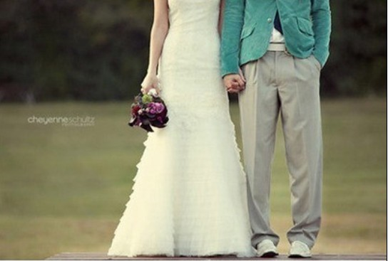

**大学相识**

2008年10月19日  初次见面

2008年11月21日  实验室

2008年12月12日  [婺江公园](https://wws.jfsay.com/archives/tag/婺江公园 "婺江公园") KFC

2008年12月24日  孔明灯 毛绒熊 苹果

2008年12月27日  初次看电影 非诚勿扰 18排15、17座

**定情**

2009年02月15日  玫瑰花 数理学院

2009年02月20日  定情物 戒指 红绳

2009年02月24日  [黄宾虹公园](https://www.jfsay.com/archives/tag/黄宾虹公园)

2009年03月04日  同学聚餐 见面

**校园生活**

2009年03月09日  西区 叠翠园

2009年03月25日  烧烤 [尖峰山](https://www.jfsay.com/archives/tag/尖峰山)下 单车 兜风 郊外

2009年03月28日  KTV 陀陀 状元楼

2009年04月10日  永康之行 婺剧 斗牛

2009年08月15日  膝盖摔伤

2009年11月06日  西园记

2010年10月12日  自炊

2010年10月30日  [非洲展](http://www.jfsay.com/archives/tag/非洲)

2011年04月10日  [科技馆](https://www.jfsay.com/archives/tag/科技馆)

2011年05月22日  自炊

2011年06月15日  一起[毕业](http://www.jfsay.com/archives/tag/毕业)

**游山玩水**

2010年03月11日  买相机

2010年04月05日  清明 [黄大仙](https://www.jfsay.com/archives/tag/黄大仙)

2010年05月06日  义乌 [国际小商品城](https://www.jfsay.com/archives/57.html)

2010年06月02日  杭州 [河坊街](https://www.jfsay.com/archives/275.html) [西湖](https://www.jfsay.com/archives/tag/西湖)

2010年10月04日  [大佛寺](https://www.jfsay.com/archives/tag/大佛寺)

2010年10月07日  [婺江公园](https://wws.jfsay.com/archives/tag/婺江公园)

2010年10月08日  [黄宾虹公园](https://www.jfsay.com/archives/tag/黄宾虹公园)

2011年05月12日  [绍兴](http://www.jfsay.com/archives/tag/绍兴) [鲁迅故居](https://wws.jfsay.com/archives/tag/鲁迅故里) [安昌古镇](http://www.jfsay.com/archives/tag/安昌古镇)

2012年09月07日  [厦门鼓浪屿](http://www.jfsay.com/archives/626.html "我眼中的鼓浪屿")蜜月之旅

**记录俩人生活**

2009年10月20日—2010年11月5日   日记 十二万字

2010年06月09日  [创建两人博客](http://www.jfsay.com/archives/1.html) 茉莉花香博客

2010年10月05日   博客易名 静风博客

**来到汕头**

2011年06月24日  鮀浦

2012年01月14日  买房

**婚礼筹备**

2012年01月19日  互见家长

2012年04月30日  订婚纱照

2012年06月01日  拍结婚照

2012年10月01日  举行婚礼
