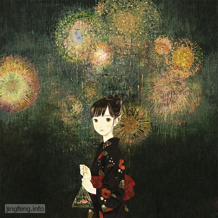

之前有意无意看了些《金陵十三钗》的宣传，之后又有韩红不顾形象的怒骂，虽说有人怀疑她为新出专辑炒作，但我想能激起一个人满腔的愤怒，影片里的日本人估计是天良丧尽，罪恶滔天了。刚上映的时候，单位同事去电影院看完回来说比较沉重，有些类似于《南京 南京》。日本人在侵华时的罪行是不能忘记的，然而在下班之后，睡觉之前，我还是倾向轻松的题材。

hillway劲头却很大，不仅要看，还非要我陪着一起看，听了我的理由之后，他又说：“我们单位的好吃妹说这个电影也没有想象中的那么沉重，最多像《色戒》，我觉得没有问题呀。你就是人云亦云，没有一点自己的想法和主见。”

两个人都没有看过，为什么他听信了人家的话就是正确的，而我分析自己不愿意看的原因就成了错误和没有主见呢？就算两个人兴趣有别，为什么总是逼迫人家去顺从一方的意愿呢？何况上次在临睡之前看完《色戒》之后昏昏沉沉做了一晚上的梦，睡的很累。

…………

晚上九点十分，我坐在电脑前和他一起看了这个片子，近十二点结束。影片前面是类似于《拯救大兵瑞恩》的枪战，后来就是一些漏洞与偶然结合的剧情，穿插着对死亡的恐惧和侵略者的罪恶。结束之后，伴着催促声，赶紧洗洗刷刷，上床睡觉。

不知道是几点睡着的，临睡前接收影片很多信息而十分活跃的脑细胞在睡着以后并没有停下来，不停地做梦，伴着紧张的神经，昏昏沉沉又有些战战兢兢，又梦到了近乎魔咒般的附体……

两年前几乎每晚都会梦到的时候，我总是问自己是不是又做错了事情，附体的人是在给我暗示吗？是不是要顺应梦境做出决定呢？这里面有我最担心发生的事情，内心纠结挣扎很久，但是我一直没有勇气做决定。

我很久没有做这种附体的梦了，总以为没有事情了，但是偏偏昨晚，我又梦到了。

温和的一张脸，没有责怪，没有怨言，看似和静的空间里，恐怖的附体却发生着更让人痛苦的悖离与折磨……

闹铃在响，我拼命从很沉的梦境里醒来，大脑还在迷迷糊糊地继续，睁开眼睛看看昏暗的房间，双脚发冷……

自己都不肯原谅的错误，没法去修复的伤害，没有人回去提及，在梦境里也没有呈现，但为何索性不来个直接？

命运是这么的不公平啊！

