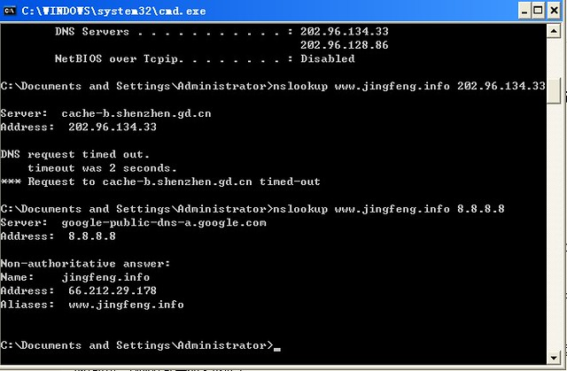

Jasmine抱怨说，这几天博客总是不能访问。可我在公司打开却正常，晚上回家后尝试也没有问题。周末白天在家试着上博客就上不去了，晚上又恢复了正常。今天早上又不能访问了。

猜想是DNS的问题，于是来验证一下：

1、点“开始”-“运行”-输入CMD，再输入 ipconfig /all  ，在下“DNS SERVER”里找到你使用的DNS服务器地址。

2、再输入 nslookup www.jingfeng.info 你的DNS服务器IP ，来查看是否能解析。

3、再输入 nslookup www.jingfeng.info 8.8.8.8 使用Google的DNS服务器验证。

可以看到，默认的本地DNS地址返回的是“DNS request timed out”，Google的DNS返回了正常的结果。

静风博客的域名解析一直使用的是Godaddy的，因为域名在那里寄存着，而且觉得“树大好乘凉”。

本机客户端的解决方法是：

1、修改本地的DNS服务地址，如OpenDNS、谷歌DNS或114DNS等。

2、修改hosts，使域名直接指向IP，省去DNS解析的中间环节。

3、使用国内的域名解析服务，如DNSPod。

对于用户推荐方法1，毕竟现在无耻的运营商DNS劫持得太厉害，乱弹广告。对于网站站长，推荐方法3，找个稳定的域名解析服务商，别强迫用户多做一丁点儿的事情，毕竟你的网站没那么出名。
