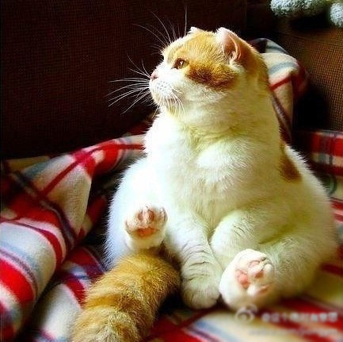

上周意外地看到邮箱面试的通知，都已经忘记是什么时候投的简历了。赶紧查看已发送邮件，原来应聘的是办公室文员一职。

周一下午，我来到教科楼八楼，电梯门打开，很惊讶地看到原来已经来了这么多人，后来得知，符合条件发出面试通知的有110多个人，实际参加面试的有八十几个，而他们的录取人数是2人。

这让我想起暑假里报考的汕头职业技术学院的辅导员一职，也是竞争激烈，1:120人。本来不打算参加笔试的，估计希望也渺茫，但是小蜜瓜认为这个一个机会不能错过，就乖乖跑去交了100块钱的考试费。后来就没有后来了，拿到试卷的时候我开始后悔自己一点也没有复习，好歹看看相关资料也好呀，完全是裸考，相关国家辅导员的条例一概不知，问答题临场发挥。小蜜瓜知道我没有考上，说了句：“你根本就没有拿它当回事，不好好对待，所以没有考上吧。”

好在这次附属医院没有要求收100块的考试费。满满一个教室的人，先是拿着签到表慢慢签到，等到三点多，有个负责人说先开始面试，不算做成绩，仅作为筛选，排除五官不端正和口吃者。本以为面试是对着一排考官，在自我介绍之后回答一些诸如：为什么会选择我们医院，为什么会报考这个职位，怎么理解这个职位，职业规划是什么等等。结果什么也没有问，仅仅是一分钟的自我介绍。

等到所有人过了一遍，已经是五点钟，我们开始了一个小时的笔试。一共两道题：第一题，汕大商学院金融系有5名08级学生要去中国银行汕头分行实习，作为学校人员，写一篇公文给银行，形式不限，以促成此事。第二题，假如是大学校长，写一篇毕业欢送稿，800字左右。

笔试结束后，赶紧出门找了附近的快餐店吃了晚饭，转到住院大楼的二楼，准备七点钟的计算机上机考试。

早到了一会儿，我就沿着楼梯走上去，看到手术室门口的地上坐了很多人，一脸的疲倦与愁苦。电梯门口还有一些人推着躺在床上的老人等电梯。医院里总发生着这些生老病死的故事，让人看到着实揪心，倘若整天面对这些，是越来越麻木呢，还是对生命越来越敏感呢？

到七点十分的时候，那个负责人过来，由于电脑有限，我们几十人不得不进行分组，好在我排在第一组，考试时间是半个小时。第一题是将纸上的字打到word里并进行排版。第二题，列出五个诊所的三季度成绩，制作统计表，算平均数。第三题，在ppt中制作三张统计图。平时在报社经常打字，盲打还算可以，但是换了一个键盘之后，总觉得别扭，速度也没有平时快了。做第二题的时候，抬头看右前方的男生已经做好第三题的第一个统计图了，一下子紧张起来，急急忙忙制作表格等。考试时间结束的时候，我的第三题只完成了一张统计图，心里感到很懊恼。

考完这些，还并不算结束。通知第二天上午还有英语和普通话的考试。

hillway说要是不想去就不去了，我想既然已经参与一半，尽管没有把握，还是要坚持下去。第二天上午所以人被分为两部分，一部分考英语，一部分考普通话，然后相互对换。普通话考试相对简单，就是随机抽取一张，用普通话将纸上的四句话念出来。英语考试也是随机抽取一张纸，上面有一段英语，和医学有关的，大概一百多个单词，快速浏览后用英语复述一篇，看正确率。

最后的成绩是公文写作，计算机水平，普通话和英语四项相加，共计100分。

所有的笔试和面试结束之后，相关负责人通知说当天下午四点，还是在教科楼八楼公布考试成绩和录取名单。我也乖乖的去了，虽然只录取两个人，看看周围来看结果的也有三、四十人的样子，看来大家心中还是抱着一线希望的，大部分都是各个专业在校的大四学生。

听到负责人按照分数从前往后连名字，前两个名里没有我。

等到念完，我上去看了下成绩单，和第一名比起来，这四项考试的成绩和她们俩都差那么一点点，都差了一点点，也就没有戏唱了。

